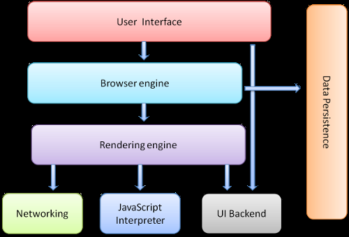
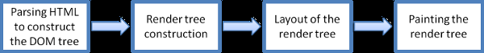
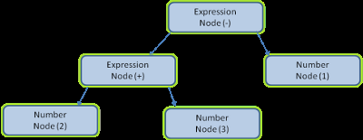
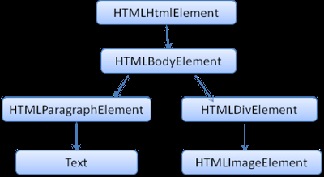
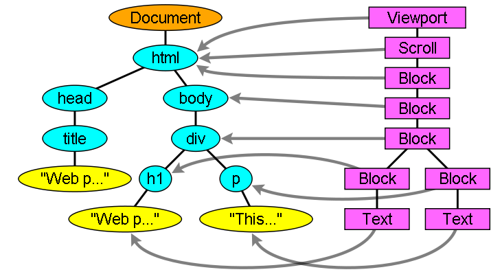
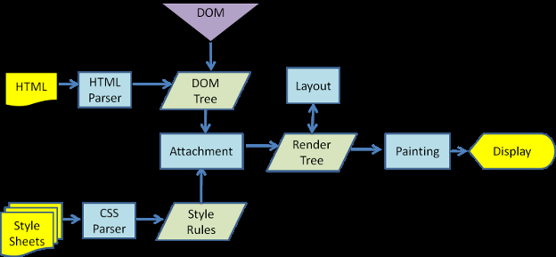
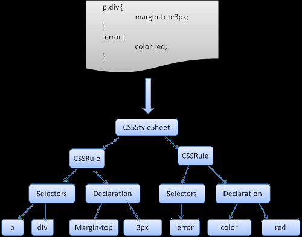

사이트: edwith

강의: [\[부스트코스\] 웹 프로그래밍](https://www.edwith.org/boostcourse-web/) 챕터 1, 웹 프로그래밍 기초

학습일: 2020년 2월 26일

---

# 1\. Web 개발의 이해 - FE / BE

웹 프론트엔드와 백엔드

- 웹 프론트엔드
  - 담당 분야
    - 사용자에게 웹을 통해 다양한 콘텐츠(문서, 동영상, 사진 등)를 제공
    - 사용자의 요청이나 요구사항(마우스, 키보드, 음성 입력 등)에 반응해서 동작
  - 프론트엔드 개발자의 역할
    - 웹 콘텐츠 종류에 적합한 구조를 설계
      - 신문, 책 등의 레이아웃 생각해보기
    - 적절한 배치와 일관된 디자인으로 시각적으로 보기 좋게 만듦
    - 사용자의 요청을 잘 반영할 수 있도록 설계
      - 즉각적인 소통처럼 느껴지도록 반응이 빠르고 부드럽게 이루어져야 함
  - 사용되는 언어
    - HTML(HyperText Markup Language): 구조 설계
    - CSS(Cascading Style Sheets): 웹 디자인 요소 결정
    - JavaScript: 동적 요소를 제어
  - Google Chrome 개발자도구
    - 단축키 F12, Ctrl + Shift + I로 사용 가능
    - Elements 탭
      - HTML 코드를 계층별, 단락별로 조회할 수 있음
      - HTML 요소 각각에 대한 CSS 코드를 조회할 수 있음
    - Sources 탭
      - 웹페이지를 이루고 있는 HTML, CSS, JS 등의 소스 파일을 조회할 수 있음
- 웹 백엔드
  - 담당 분야
    - 클라이언트의 요청을 받아 일을 처리하고 결과를 전송
    - 클라이언트가 제시한 문제를 해결
  - 프론트엔드와의 차이
    - 프론트엔드: 사용자에게 보여지는 부분
      - 클라이언트 사이드(Client Side): 프로그램의 앞쪽, 클라이언트의 입장에서 개발
        - 비유) 백조의 몸통 중 수면 위에 보이는 부분
    - 백엔드: 사용자에게 보이지 않는 부분
      - 서버 사이드(Server Side): 프로그램의 뒷쪽, 서버의 입장에서 개발
        - 비유) 백조의 몸통 중 수면 아래 보이지 않는 부분
  - 백엔드 개발자가 알아야 하는 내용
    - 프로그래밍 언어
      - 적어도 한 가지는 자유자재로 다룰 수 있어야 함
        - 예시) Java, Python, PHP, JavaScript 등
    - 웹의 동작 원리
    - 알고리즘(algorithm), 자료구조 등 프로그래밍 기반 지식
    - 운영체제, 네트워크 등에 대한 이해
      - 만들어진 프로그램은 보통 서버에서 설치되어 동작
      - 서버 운영체제는 주로 리눅스가 사용됨
    - 개발을 도와주는 프레임워크에 대한 이해
      - 예시) Spring 등
    - 데이터를 사용할 때 데이터를 쉽게 관리할 수 있게 도와주는 DBMS에 대한 이해
      - 예시) MySQL, Oracle 등

브라우저의 동작원리

- 참고자료: [How Browsers Work: Behind the scenes of modern web browsers](https://www.html5rocks.com/en/tutorials/internals/howbrowserswork/)
- 배워야 하는 이유
  - 개발자의 개발 의도와 브라우저의 해석 결과가 다르게 나올 경우 원인을 분석해야 함
  - 프로그램이 브라우저에서 좀 더 빠르게 동작하고자 할 때 필요함
- 브라우저의 구성요소
  - 
  - UI: 사용자에게 직접적으로 보이는 요소
  - 브라우저 엔진: 브라우저라는 소프트웨어를 동작시켜주는 엔진
  - 렌더링 엔진: 화면의 위치를 잡고 픽셀 단위로 색을 표현
    - 
      1.  HTML 코드 Parsing
          - Parsing: 문자 단위로 해석하여 의미를 파악하는 것
            - 예시) How to parse '2 + 3 - 1'
            - 
      2.  DOM(Document Object Model) tree를 형성
          - 
      3.  Render tree의 레이아웃(배치도) 형성
          - 
      4.  Render tree를 화면에 표시
    - HTML 문서에 CSS가 적용되는 과정
      - 
    - CSS 코드 Parsing
      - 
    - 렌더링 엔진의 예시) Firefox의 Gecko, Safari의 WebKit, Chrome/Opera의 Blink 등
  - 데이터 저장소: 데이터를 캐싱, 저장하는 영역
  - 네트워킹: HTTP를 통해 웹 서버, 특정 인터넷 주소로의 통신을 담당
  - JavaScript Interpreter: JavaScript 코드를 해석
  - UI Backend: UI 영역을 백엔드에서 처리하는 영역

브라우저에서의 웹 개발

- 브라우저별 개발자도구를 적극적으로 활용함
- HTML 문서의 특징
  - html 태그로 시작, html 태그로 끝남
  - head 태그: 화면에 표현되지 않는 문서에 대한 정보를 포함
  - body 태그: 화면에 표현되는 정보를 포함
  - 계층적 구조로 이루어짐
  - 여러 태그를 사용해 표현함
  - CSS 및 JavaScript 코드가 혼합될 수 있음
- 웹 개발 시 작성한 코드를 바로 테스트하기 좋은 웹사이트: [JS Bin](https://jsbin.com/?html,css,js,output), [Repl.it](https://repl.it/~)
- HTML 문서 내 CSS 코드
  - head 태그 안에 쓰는 것이 일반적
  - 내용이 길어지면 .css 확장자의 외부 파일로 분리한 뒤 href="파일경로" 속성을 가진 link 태그로 연결
- HTML 문서 내 JavaScript 코드
  - 작성 위치: body 태그 뒤가 일반적
    - html 코드 중간에 있으면 html 렌더링을 간섭할 수 있음
    - head 태그 안에 쓰면 html 코드 불러오기 이전에 실행됨
    - **※ 속성을 이용하면 선언한 위치와 스크립트 실행 시점을 분리할 수 있어 작성 위치에 대한 제한은 사라짐**
      - 다만 IE9까지는 지원되지 않는 점을 주의
      - 참고자료: [<script>: 스크립트 요소 - HTML: HyperText Markup Language | MDN](https://developer.mozilla.org/ko/docs/Web/HTML/Element/script)
  - 내용이 길어지면 .js 확장자의 외부 파일로 분리한 뒤 src="파일경로" 속성을 가진 script 태그로 연결
- 브라우저의 코드 해석 순서
  - 위에서 아래로 한 줄씩 순차적으로 해석

#HTML #웹 프로그래밍 #웹 브라우저 #인터넷 강의 #내용 정리 #웹 백엔드 #웹 프론트엔드 #edwith #부스트코스
