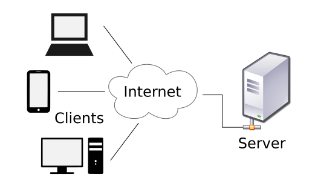
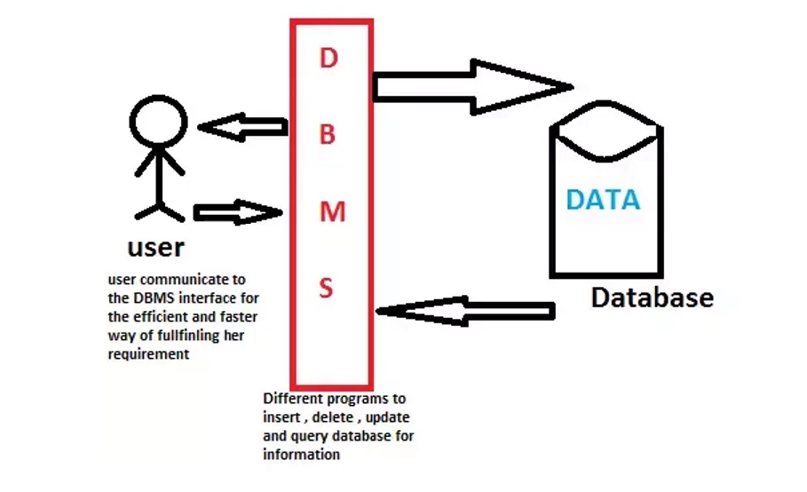
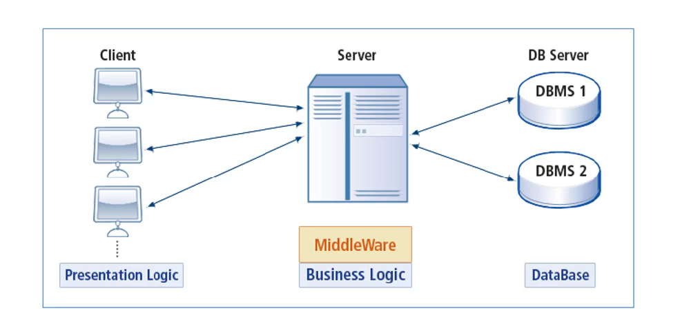
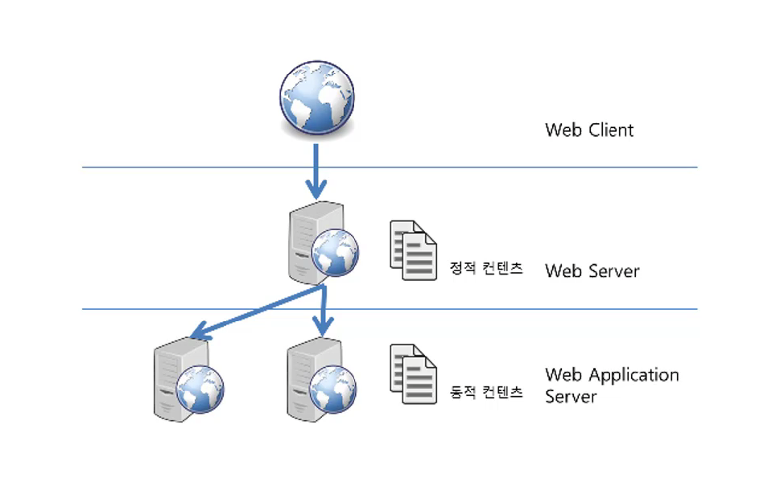

사이트: edwith

강의: [\[부스트코스\] 웹 프로그래밍](https://www.edwith.org/boostcourse-web/) 챕터 1, 웹 프로그래밍 기초

학습일: 2020년 2월 27일

---

# 1\. Web 개발의 이해 - FE / BE

웹 서버

- 일반적으로 소프트웨어를 지칭하나, 소프트웨어가 동작하는 컴퓨터를 지칭하기도 함
- 가장 중요한 기능: 클라이언트가 요청하는 HTML 문서나 각종 리소스를 전달
  - 클라이언트: 일반적으로 웹 브라우저를 칭하지만 웹 크롤러도 포함됨
    - 웹 브라우저, 웹 크롤러가 요청하는 리소스는 정적인 데이터, 동적인 결과 모두 될 수 있음
      - 정적(static) 데이터: 이미지, HTML 파일, CSS 파일, JavaScript 파일 등 컴퓨터에 저장된 파일
      - 동적 결과: 웹 서버에 의해 실행되는 프로그램을 통해 만들어진 결과물
- 웹 브라우저와 웹 서버
  - 클라이언트와 서버는 일반적으로 HTTP를 통해 통신: URL 주소가 http로 시작
  - 개발자 도구의 Network 탭에서 통신한 기록을 조회할 수 있음
    1.  클라이언트가 서버에 접속하여 기본 HTML 문서를 요청
    2.  서버가 요청받은 기본 HTML 문서를 클라이언트에 전송
    3.  웹 브라우저가 기본 HTML 문서를 해석
    4.  웹 브라우저가 기본 HTML 문서 내 리소스(이미지, 동영상, JavaScript 등)의 URL을 추출
    5.  웹 브라우저가 서버에 위 리소스들을 요청
    6.  서버가 요청받은 리소스들을 클라이언트에 전송
    7.  웹 브라우저가 기본 HTML 문서와 리소스들을 합쳐 화면에 표시(렌더링)
- 웹 서버 소프트웨어의 종류
  - 가장 많이 사용되는 웹 서버: Apache, Nginx, Microsoft, Google 웹 서버
  - Apache 웹 서버
    - 오픈소스 소프트웨어
    - 대부분의 운영체제에서 설치, 사용할 수 있음
  - Nginx 웹 서버
    - 오픈소스 소프트웨어
    - 차세대 웹 서버로 불림
    - 더 적은 자원으로 더 빠르게 데이터를 서비스할 수 있음
  - 2017년 기준 전 세계 웹 서버 시장 점유율 by Netcraft: 1위 Apache, 2위 Nginx

DBMS와 미들웨어, 그리고 WAS

- 클라이언트/서버 구조: 클라이언트는 서비스를 제공하는 서버에 정보를 요청한 뒤 응답받은 결과를 사용
  - 
- DBMS(DataBase Management System)
  - 다수의 사용자들이 데이터베이스 내의 데이터를 접근할 수 있게 해주는 소프트웨어
  - 
  - DBMS 등장 이전과 현재
    - 이전: 개발자들이 파일의 데이터를 저장하고 읽어들이는 기능을 함께 구현해야 했음
    - 현재: 개발자들의 데이터 관리가 상대적으로 쉬워짐
    - 메모장으로 데이터를 관리하다가 Excel로 관리하게 된 것 수준의 큰 발전
  - 대표적인 DBMS: MySQL, MariaDB, Oracle, PostgreSQL 등
- 미들웨어(MiddleWare)
  - 등장 기원
    - 일반적으로 DBMS는 서버 형태로 서비스를 제공
    - DBMS에 접속해서 동작하는 클라이언트 프로그램이 많이 만들어졌으나, 문제가 많았음
      - 대부분의 로직이 클라이언트에 포함되어 프로그램의 크기가 크고 보안이 나쁨
      - 프로그램의 로직이 변경될 경우 모든 클라이언트를 다시 배포해야 함
    - 위와 같은 클라이언트 프로그램의 문제점을 해결하기 위해 미들웨어가 고안됨
  - 미들웨어란?
    - 클라이언트와 DBMS 사이에 위치한 제2의 서버
    - 
  - 미들웨어의 동작 방식
    - 클라이언트는 미들웨어에 요청을 보내고 미들웨어가 대부분의 로직을 수행
      - 데이터를 조작할 필요가 있는 경우에만 미들웨어가 DBMS에게 요청
    - 미들웨어가 로직의 결과를 클라이언트에게 보내고 클라이언트는 결과를 화면에 표시
  - 미들웨어의 장점
    - 프로그램 크기 최소화: 요청을 보내고 결과를 전달받아 화면에 표시하는 것으로 단순화되어 클라이언트의 역할이 최소화됨
    - 프로그램 로직이 변경될 경우 미들웨어만 변경하면 됨
- WAS(Web Application Server)
  - 등장 기원
    - 초창기의 웹 브라우저는 정적 데이터만 표시했으나, 웹이 널리 사용되며 데이터 입력/조회 등 사용자들의 요구사항이 다양해지기 시작함
    - 동적 기능은 CGI라는 이름의 웹 서버 내 프로그래밍 기능으로 가능했고, 단순한 프로그래밍 로직도 문제 없이 처리할 수 있었음
    - 그러나 웹의 발전에 따라 프로그래밍의 복잡도가 올라가며 클라이언트와 DBMS 사이의 복잡한 프로그래밍을 수행할 미들웨어가 고안됨
  - 클라이언트와 웹 서버, 그리고 WAS
    - 
  - WAS의 기본 기능
    - 프로그램 실행 환경과 데이터베이스 접속 기능을 제공
    - 여러 트랜잭션(논리적 작업 단위)을 관리
    - 업무를 처리하는 비즈니스 로직을 수행
  - WAS의 부가 기능
    - 웹 서버
    - **※ 부스트코스에서는 Apache Tomcat이라는 WAS를 사용함**
- 웹 서버 vs WAS
  - WAS는 보통 자체적으로 웹 서버 기능을 내장하며, 정적 데이터 처리에도 성능 차이가 크게 없음
  - 그러나 서비스의 규모가 커질수록 장애 극복 기능(failover)을 위해 웹 서버와 WAS를 분리하게 됨
    - 이런 경우 일반적으로 웹 서버는 정적 데이터를, WAS는 프로그램의 동적 결과를 클라이언트에게 전송 
    - 장애 극복 기능: 대용량 웹 어플리케이션을 중단 없이 계속 운영할 수 있게 하는 기능
      - 여러 WAS를 묶어 운영하면서, 앞단에 웹 서버를 배치
      - WAS 중 일부가 문제가 생겨 다시 시작해야 할 때가 생김
      - 웹 서버는 사용자가 정상적인 WAS에 연결되도록 조정하며, 이 때 문제 생긴 WAS를 재시작

