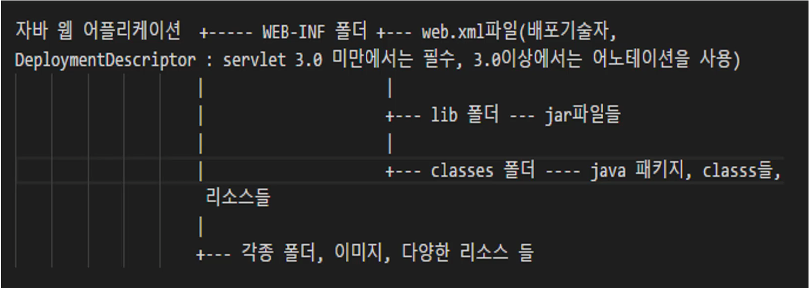

사이트: edwith

강의: [\[부스트코스\] 웹 프로그래밍](https://www.edwith.org/boostcourse-web/) 챕터 1, 웹 프로그래밍 기초

학습일: 2020년 3월 6일

---

## 5\. Servlet - BE

Servlet이란?

- Servlet의 정의
  - Java 웹 어플리케이션의 구성요소 중 동적 처리를 하는 프로그램
    - WAS에서 동작하는 Java 클래스
    - HttpServlet 클래스를 상속받아야 함
    - 동적 처리: 동적으로 응답결과를 만들어 냄
      - 응답할 페이지가 미리 있지 않고, 요청이 들어오면 Servlet이 실행되어 만들어진 코드를 응답
  - 웹페이지 개발 시 JSP와 함께 적절하게 혼용하여 더 좋은 결과를 얻어냄
    - 예시) 웹페이지 구성화면(HTML)은 JSP, 복잡한 프로그래밍은 Servlet으로 구현하는 등
- Java 웹 어플리케이션: WAS에 설치(deploy)되어 동작하는 어플리케이션
  - 구성요소
    - HTML, CSS, 이미지, Java 클래스(Servlet, package, 인터페이스 등), 설정 파일 등
    - 웹 어플리케이션이 복잡해질수록 구성요소가 많아짐
      - 예시) 쇼핑몰, 블로그, 카페 등
  - 디렉토리 구조
    - 웹 어플리케이션이 혼자서 모든 것을 다 한다면 별도로 규칙을 따를 필요는 없음
    - Java 웹 어플리케이션은 WAS라는 미들웨어를 사용하므로 그에 맞는 규칙을 따라야 함
      - WAS를 사용하려면 아래의 이미지에 나타나는 디렉토리 규칙을 따라야 함
      - 추후 다른 프레임워크를 사용할 때도 그에 맞는 규칙을 지켜야 함
      - 
    * WEB-INF: 제일 중요한 폴더
      - web.xml(배포 기술자): 웹 어플리케이션에 대한 모든 정보를 가진 파일
        - Servlet 3.0 미만에서는 필수, 3.0 이상에서는 어노테이션으로 대체 가능
      - lib: 자료 파일이 저장되는 폴더
      - classes: Java package, 클래스가 저장되는 폴더
        - Servlet도 클래스의 일종이므로 이 폴더에 저장됨
    * 리소스들
      - HTML, CSS, JavaScript 등 Front End 작업물
      - 이미지, 오디오 등의 리소스

  - 동적인 웹페이지가 필요한 이유
    - 정적 웹페이지(Static Web Page): 서버에 미리 저장된 파일이 그대로 전달되는 웹페이지
      - 서버는 사용자의 요청(request)에 해당하는 저장된 웹페이지를 보냄
      - 사용자가 보게 되는 웹페이지는 서버에 저장된 데이터가 변경되지 않는 한 변하지 않음
    - 동적 웹페이지(Dynamic Web Page): 서버 내 데이터를 가공해서 생성된 후 전달되는 웹페이지
      - 서버가 사용자의 요청을 해석하여 데이터를 가공하여 생성된 웹페이지를 보냄
      - 사용자가 보게 될 웹페이지는 상황/시간/요청 등에 따라 변함
      - 참고자료: [정적인 페이지와 동적인 페이지의 차이점이란?](https://titus94.tistory.com/4)

Servlet의 작성 방법

- Servlet 3.0 spec 미만: 관련 정보를 web.xml 파일에 입력해줘야 함
  - 형태: <servlet>...</servlet><servlet-mapping></servlet-mapping>
    - Java 어노테이션보다 입력해야 하는 코드의 양이 많음
  - web.xml 파일의 역할
    - 클라이언트의 URL 요청은 Servlet의 이름과 항상 동일하게 들어오는 것이 아니므로, web.xml 파일의 정보를 통해 대응하는 Servlet과 연결됨
  - web.xml 파일의 동작 과정
    - <servlet-name>에서 요청된 URL과 매핑된 servlet-name을 확인
      - 매핑된 servlet-name이 없을 경우에는 404 오류 출력
    - 매핑된 servlet-name이 <servlet>의 servlet-name과 일치하는 지 확인
    - 일치할 경우 <servlet>에 입력된 servlet-class를 찾아 실행
  - 매핑된 URL 수정: web.xml의 <servlet-mapping> 안 <url-pattern>의 내용을 수정
  - web.xml 파일 수정 시, 수정사항이 적용되려면 서버를 재시작해야 함
- Servlet 3.0 spec 이상: web.xml 파일의 역할을 Java 어노테이션(annotation)이 대체함
  - 형태: @WebServlet("url")
  - Servlet과 매핑된 URL 수정: 괄호 안의 url 수정
  - 다만 Spring 등의 프레임워크를 사용할 경우 web.xml에 기타 설정도 저장되므로 web.xml 파일을 만들어주는 것이 좋음

- Servlet에서 만들어지는 객체
  - 클라이언트의 요청을 받는 객체 HttpServletRequest와 클라이언트에게 응답을 하기 위한 객체 HttpServletResponse가 만들어짐
    - HttpServletRequest: 요청에 대한 정보가 추상화되어 포함된 객체
    - HttpServletResponse: 응답에 대한 정보가 추상화되어 포함된 객체
  - 어떤 데이터를 응답하고 싶으면 HttpServletResponse 객체에 포함시켜줘야 함
- Servlet에서 HTML 코드 작성 시의 주의점
  - 클라이언트의 서버와 charset이 동일하지 않으면 호환 이슈가 발생
    - 비유) 다른 언어를 쓰는 사람끼리는 의사소통 이슈가 발생
  - HTML 출력 시 Java의 print()와 println()은 실질적으로 차이가 없음
    - HTML에서 줄바꿈을 하기 위해선   태그 또는 block 요소를 사용해야 함
  - 사용이 끝난 PrintWriter 객체는 close() 메서드를 통해 종료해주면 좋음

**※ Servlet 작성 시 HttpServlet 상속(extends)이 필요한 이유**

- doGet, doPost 등 HttpServlet 객체에 포함된 메서드를 사용하기 위함

