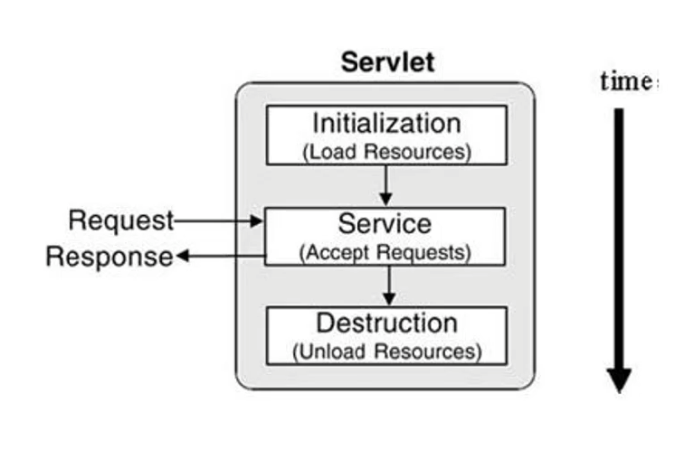
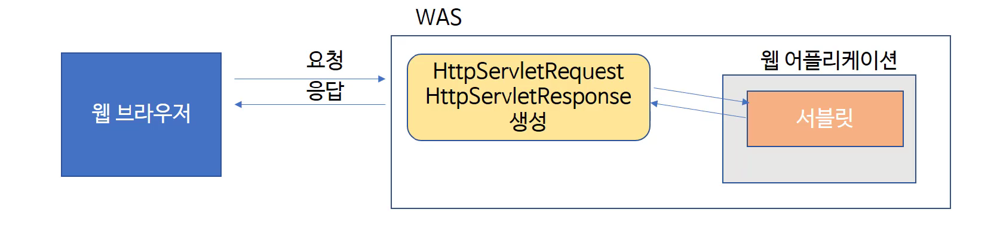

사이트: edwith

강의: [\[부스트코스\] 웹 프로그래밍](https://www.edwith.org/boostcourse-web/) 챕터 1, 웹 프로그래밍 기초

학습일: 2020년 3월 7일

---

## 5\. Servlet - BE

Servlet의 생명주기(Life Cycle)

- 생명주기: Servlet이 언제 생성되고, 어떤 메서드가 언제 어떻게 호출되는지의 메커니즘
- Servlet의 동작 순서
  - 
    1.  클라이언트의 URL 요청 (링크 클릭, 직접 URL 입력 등)
    2.  WAS가 URL과 매핑된 Servlet을 찾아 실행시킴
        - 해당 Servlet 클래스가 메모리에 이미 존재하는지를 먼저 확인
        - 만약 존재하지 않을 경우, 생성자 메서드를 호출해 새로 Servlet 클래스를 생성하고 메모리에 올림
    3.  init( ) 메서드 호출
    4.  service( ) 메서드 호출
        - 페이지를 새로고침하는 경우(요청된 Servlet이 메모리에 이미 존재할 경우) 이 메서드만 다시 호출
    5.  destroy( ) 메서드 호출
        - WAS가 종료되거나, 웹 어플리케이션 수정 시 기존 Servlet을 더 이상 사용할 수 없을 때 호출
        - destroy( ) 메서드로 기존 Servlet을 없앤 뒤, 다시 생성자, init( ), service( ) 메서드를 순서대로 호출

- 서버의 응답 내용은 원칙적으로 service( ) 메서드 내에 구현
  - WAS는 init( ), service( ), destroy( ) 메서드만 호출하나, 실제 Servlet에서는 doGet( ) 메서드만 있어도 작동
    - 이는 service( ) 메서드의 특이한 동작 방식 때문
      - 부모 클래스인 HttpServlet에서 이미 구현되어, 다른 클래스에서 override하지 않았다면 부모 클래스의 메서드가 대신 실행됨
    - Servlet에서 service( ) 메서드를 입력하지 않더라도 HttpServlet의 service( ) 메서드가 자동 실행
  - HttpServlet 클래스 내 service( ) 메서드의 구현 방식
    - 템플릿 메서드 패턴(Template Method Pattern)
      - 알고리즘의 구조를 통일시키면서도 상속받은 클래스에 따라 메서드의 기능을 유연하게 변경 가능
      - 예시
        - 클라이언트의 요청이 GET일 경우: 자신이 갖고 있는 doGet(request, response) 메서드 호출
        - 클라이언트의 요청이 POST일 경우: 자신이 갖고 있는 doPost(request, response) 메서드 호출
      - 참고자료: [템플릿 메소드 패턴(Template Method Pattern)](http://jdm.kr/blog/116)
  - doGet, doPost를 override하는 예제
    - ```
      @Override
      	protected void doGet(HttpServletRequest request, HttpServletResponse response) throws ServletException, IOException {
      		response.setContentType("text/html");
      		PrintWriter out = response.getWriter();
      		out.println("<html>");
      		out.println("<head><title>form</title></head>");
      		out.println("<body>");

              // form 태그: type='submit'이 입력되었을 때 action='/firstweb/LifecycleServlet'의 URL로 method='post'를 요청
      		out.println("<form method='post' action='/firstweb/LifecycleServlet'>");

              // 입력상자에 입력된 값이 name='lastname' 매개변수(parameter)로 저장됨
      		out.println("name : <input type='text' name='lastname'>");
      		out.println("<input type='submit' value='ok'>");
      		out.println("</form>");
      		out.println("</body>");
      		out.println("</html>");
      		out.close();
      	}

      	protected void doPost(HttpServletRequest request, HttpServletResponse response) throws ServletException, IOException {
      		response.setContentType("text/html");
      		PrintWriter out = response.getWriter();

      		// request 객체에서 lastname이란 매개변수로 저장된 값을 찾아 lastname이란 String 변수에 저장
      		String lastname = request.getParameter("lastname");
      		out.println("<h1> hello " + lastname + "</h1>");
      		out.close();
      	}
      ```

      - 동적 웹페이지: 사용자가 입력상자에 입력하는 값에 따라 페이지의 내용이 달라짐
      - GET, POST 등 요청 방식에 따라 같은 URL로 접근했더라도 다른 페이지를 보여줄 수 있음
      - Eclipse에서 메서드를 override하는 방법: Source → Override/Implement Methods → 메서드 선택

HttpServletRequest와 HttpServletResponse

- WAS가 클라이언트의 요청을 받았을 때의 동작
  1.  HttpServletRequest와 HttpServletResponse 객체 생성
  2.  클라이언트의 요청에 포함된 정보를 HttpServletRequest 객체에 저장
  3.  클라이언트에게 응답하는 데 필요한 정보를 HttpServletResponse 객체에 저장
  4.  두 객체를 path에 매핑된 Servlet에 전달
      - path: 클라이언트가 요청한 정보에 포함되어 있음
      - 두 객체는 service( ), doGet( ), doPost( ) 등의 Servlet 내 메서드에서 인자로 사용됨

* 

- HttpServletRequest: 클라이언트가 서버에게 보낸 요청을 추상화한 객체
  - http 프로토콜의 request 정보를 Servlet에게 전달하는 역할
  - 요청에 포함된 정보(header, parameter, 쿠키, URI, URL, body의 stream 등)를 읽어들이는 메서드를 갖고 있음
- HttpServletResponse: 서버가 클라이언트에게 응답하기 위한 정보를 추상화한 객체
  - 클라이언트에게 응답하는 데 필요한 정보: 어떤 클라이언트가 요청을 보냈는지, content type, 응답 코드, 응답 메시지 등
- Servlet 생성 실습
  - headerServlet: 클라이언트의 요청에 포함된 헤더 정보를 읽어 화면에 출력하는 Servlet
    - request.getHeaderNames( ): 헤더의 이름들을 문자열로 반환하는 메서드
    - request.getHeader( ): 각 헤더의 값을 알아내는 메서드
    - 출력 메시지의 형태: "headerName: headerValue"
    - 참고자료: HTTP headers - HTTP | MDN
  - parameterServlet: 요청에 포함된 매개변수 값을 읽어 화면에 출력
    - Servlet의 URL mapping 뒤 ?가 매개변수의 시작점
      - 매개변수가 여럿일 경우 &으로 구분
      - 예시) http://localhost:8080/firstweb/param?name=kim&age=5
    - HTML form > input 태그 안의 값도 매개변수로 전달됨
  - InfoServlet: 요청에 포함된 기타 정보(URI, URL, path, Remote host 등)를 읽어 화면에 출력
    - request.getRequestURI( ): 요청한 URL 중 도메인과 포트 번호 이하의 값을 반환하는 메서드
    - request.getRequestURL( ): 요청한 URL 전체를 반환하는 메서드
    - request.getContextPath( ): 웹 어플리케이션과 mapping된 path를 반환하는 메서드
      - path: 기본값은 프로젝트명과 동일하나, 다르게 지정할 수 있음
    - request.getRemoteAddr( ): 클라이언트의 주소 값을 반환하는 메서드
      - 로컬 컴퓨터로 접속할 경우 운영체제에 따라 출력되는 값의 형태가 달라짐

