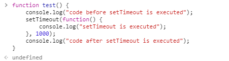
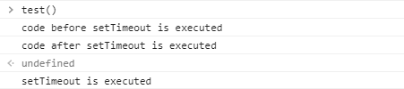
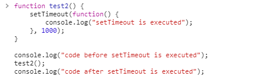
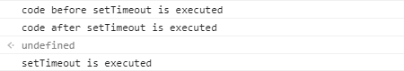
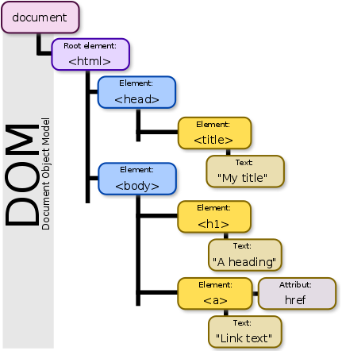

사이트: edwith

강의: [\[부스트코스\] 웹 프로그래밍](https://www.edwith.org/boostcourse-web/) 챕터 2, DB 연결 웹 앱

학습일: 2020년 3월 23일

---

## 2\. Web UI 개발 - FE

Window 객체와 setTimeout

- window 객체: 브라우저 개발 시 자주 활용되는 객체로, 많은 메서드를 포함하고 있음
  - 형태: window.메서드( ), 메서드( )
  - window 객체는 전역 객체이므로 생략하더라도 메서드가 동작
  - 예시) alert, setTimeout, setInterval 등
- setTimeout(callback, delay)
  - 비동기(asynchronous)로 실행되는 함수로, 다소 낯설게 동작함
  - 인자로 즉시 실행되지 않고 나중에 실행되는 callback 함수를 받음
  - 작동되는 순서
    - setTimeout 실행
    - 브라우저(Web API)가 callback 함수를 hold
    - delay만큼 기다린 후 callback 함수가 event queue로 이동
    - call stack이 비게 되면 callback 함수가 call stack으로 이동(push)
    - callback 함수 실행(pop)
  - 예시) 일반 함수, setTimeout, 일반 함수의 실행 시 출력 결과

DOM과 querySelector

- DOM(Document Object Model): 브라우저가 HTML 코드를 저장하는 객체 형태의 모델

    *   참고자료: [Document Object Model - Wikipedia](https://en.wikipedia.org/wiki/Document_Object_Model)
    *   HTML 코드가 한 번만 표시된다면 필요 없을 개념이나, HTML 코드가 변경될 경우 편의성을 크게 높여줌

- DOM Tree: tree 형태로 저장된 HTML 요소(element) 정보를 지칭
  - 브라우저는 복잡한 DOM tree를 쉽게 탐색하기 위해 다양한 DOM API를 제공
  - DOM API 예시
    - getElementById( ): ID를 이용해 HTML 요소를 반환하는 메서드
    - querySelector( ): CSS Selector 문법을 통해 HTML 요소를 반환하는 메서드
    - querySelectorAll( ): CSS Selector 문법을 통해 해당하는 '모든' HTML 요소들을 NodeList 형태로 반환하는 메서드
    - createElement( ): HTML 요소를 새로 생성하는 메서드

브라우저 이벤트(event), 이벤트 객체, 이벤트 핸들러

- 브라우저에는 다양한 이벤트(화면 스크롤, 마우스 이동, 마우스 클릭, 키보드 입력 등)가 발생
  - 참고자료: [Event reference | MDN](https://developer.mozilla.org/en-US/docs/Web/Events)
  - 특정 HTML 요소에 대한 이벤트가 발생할 때 브라우저가 어떤 작업을 실행하라고 명령할 수 있음
    - addEventListener(event, event handler): 이벤트를 등록하는 대표적인 메서드
      - 참고자료: [Introduction to Events - JavaScript | MDN](https://developer.mozilla.org/en-US/docs/Learn/JavaScript/Building_blocks/Events#addEventListener_and_removeEventListener)
      - element 객체의 메서드
      - Event handler: 이벤트 발생 시 실행되는 callback 함수로, 이벤트 리스너라고도 칭함
    - 방법: getElementById( ), querySelector( ) 등으로 HTML 요소를 찾고, 해당 요소에 addEventListener 메서드로 이벤트 핸들러 함수를 등록
- 이벤트 객체: 사용자로부터 발생한 이벤트에 대한 정보를 담은 객체
  - 브라우저가 이벤트 리스너 함수를 호출할 때 이벤트 객체를 함께 전달
  - 이벤트 리스너 함수 안에서 이벤트 객체를 활용해 추가적인 작업을 할 수 있음
    - 예시) event.target: 이벤트가 발생한 HTML 요소에 대한 정보를 담은 객체를 반환

