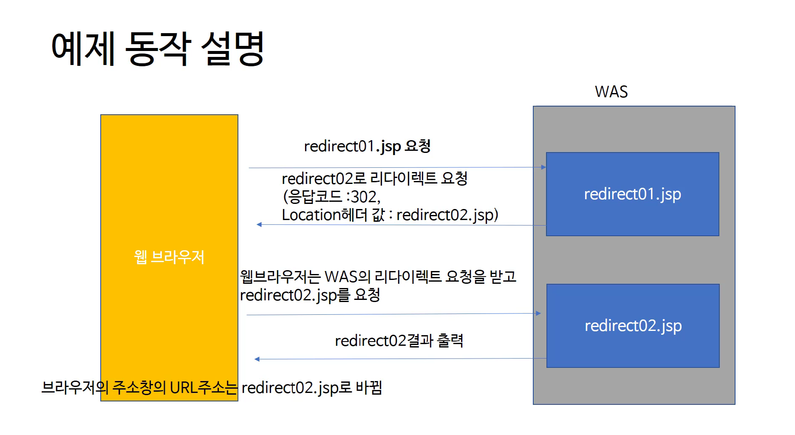
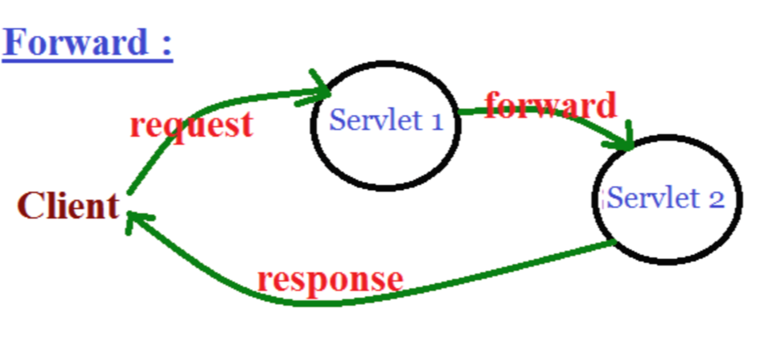
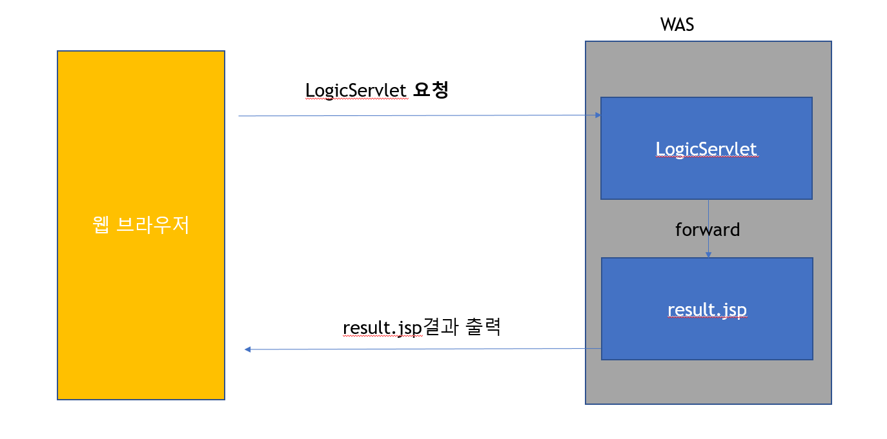

사이트: edwith

강의: [\[부스트코스\] 웹 프로그래밍](https://www.edwith.org/boostcourse-web/) 챕터 2, DB 연결 웹 앱

학습일: 2020년 3월 27일

---

## 4\. redirect & forward - BE

리다이렉트(redirect)

- 클라이언트의 요청이 들어왔을 때, 서버가 클라이언트에게 특정 URL로 이동하도록 요청하는 http 프로토콜의 규칙
- 리다이렉트의 메커니즘

        *   클라이언트가 서버에게 요청을 전송
        *   서버는 클라이언트에게 302 상태코드와 이동할 URL 정보를 Location 헤더에 담아 응답
        *   클라이언트는 서버에게 받은 상태코드를 확인하고, 302이면 Location 헤더의 URL 정보로 다시 요청
            *   이 때 브라우저의 주소창은 새로운 URL로 바뀜

- sendRedirect( ): Servlet, JSP에서 리다이렉트할 때 사용하는 메서드로, HttpServletResponse 객체에 속해 있음
- 리다이렉트의 특징: **클라이언트가 요청을 두 번 전송함**
  - 첫 번째와 두 번째 요청의 request, response 객체는 서로 다름
- 참고자료
  - [Redirections in HTTP - HTTP | MDN](https://developer.mozilla.org/ko/docs/Web/HTTP/Redirections)
  - [Bitly URL Shortener](https://bitly.com/): 리다이렉트를 이용, URL을 줄여주는 서비스
  - [Abitly](http://abit.ly/): Bitly의 클론 서비스로, UX가 편리하고 페이지 전환속도가 빠름
  - [Google URL Shortener 개발 블로그](https://developers.googleblog.com/2018/03/transitioning-google-url-shortener.html)

포워드(forward)

- 클라이언트의 요청이 들어왔을 때, 하나의 Servlet이 아닌 다수의 Servlet에서 백엔드로 처리가 된 후 응답하는 방식
- 포워드의 메커니즘

        *   클라이언트의 서버의 Servlet1에 요청을 보냄
        *   Servlet이 요청을 처리한 후 결과를 HttpServletResponse에 저장
        *   Servlet은 HttpServletRequest와 응답을 위한 HttpServletResponse를 Servlet2에게 포워드
        *   Servlet2는 받은 HttpServletRequest로 요청을 마저 처리하고 HttpServletResponse에 결과를 담아 클라이언트에게 응답

- Servlet1과 Servlet2를 통한 포워드 구현 실습
  - Servlet1
    - Java 코드로 변수를 선언하고 값을 저장
      - 변수에는 문자열, 숫자, 객체 등 다양한 타입의 값이 저장될 수 있음
    - request.setAttribute(String name, Object o) 메서드로 request 객체에 결과를 저장
    - RequestDispatcher 객체를 선언하고 request.getRequestDispatcher(String path)로 포워드할 경로를 설정
      - 같은 웹 어플리케이션 안에서만 가능하므로, 경로는 반드시 '/'(콘텐트 루트 이하 값)로 시작
    - requestDispatcher.forward(request, response)로 포워드를 실행
  - Servlet2
    - request.getAttribute(String name)으로 Servlet1에서 request 객체에 저장된 Object를 불러옴
      - getAttribute( ) 메서드의 인자는 Servlet1에서 setAttribute( ) 메서드에 사용된 인자와 같아야 함
    - Servlet2 코드에 불러온 Object를 활용해 코드 작성
- 리다이렉트와의 차이점
  - 리다이렉트: 클라이언트가 요청을 두 번 하므로 URL이 바뀌며, 클라이언트가 리다이렉트를 알 수 있음
    - request, response 객체가 두 번 만들어짐
  - 포워드: 클라이언트가 요청한 내용이 백엔드에서 처리되므로 클라이언트는 포워드가 이뤄진 사실을 알 수 없음

Servlet & JSP 연동

- Servlet과 JSP를 연동하는 이유
  - Servlet은 프로그램 로직을 수행하기 쉬우나, HTML 출력이 번거로움
  - JSP는 HTML 출력이 쉬우나, 프로그램 로직을 작성하기가 번거로움
  - Servlet에서 프로그램 로직을 수행하고 JSP에서 결과를 출력하게 하여 개발의 편의성을 높일 수 있음
- Servlet & JSP 연동 방법

**※ 게시판의 다양한 기능들과 같이, 여러 URL을 하나의 Servlet으로 연결하는 방법**

- 와일드카드 문자인 \*를 Servlet의 URL mappings에 활용
- 참고자료: URL Patterns

