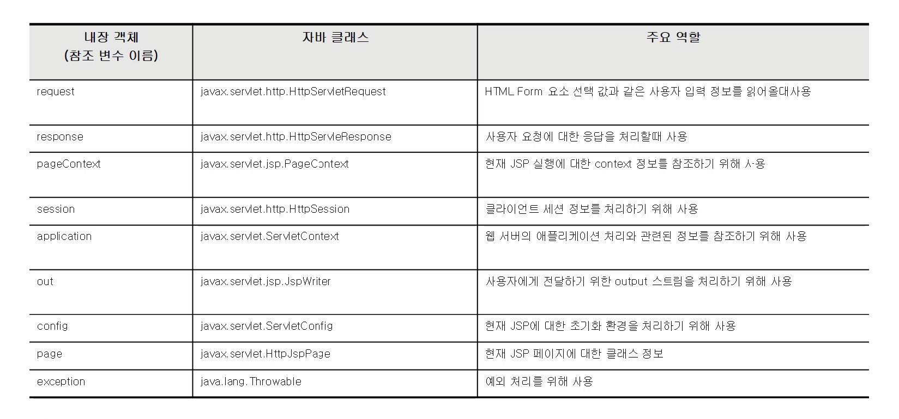

사이트: edwith

강의: [\[부스트코스\] 웹 프로그래밍](https://www.edwith.org/boostcourse-web/) 챕터 2, DB 연결 웹 앱

학습일: 2020년 3월 26일

* * *

## 3\. JSP - BE

JSP의 문법

*   JSP는 3가지의 스크립트 요소를 제공
    *   선언문(Declaration): 전역변수 및 메서드 선언에 사용
        *   형태: <%! 코드 %>
        *   문서 내 위치와 관계 없이, jspService( ) 메서드 내부가 아닌 외부에 변환됨
    *   스크립트릿(Scriptlet): 프로그래밍 코드를 기술하는 데 사용
        *   형태: <% 코드 %>
        *   HTML 코드 안에서 프로그램을 실행시키는, 가장 일반적인 스크립트 요소
        *   스크립트릿에서 선언된 변수는 지역변수가 됨
        *   하나의 코드를 여러 스크립트릿으로 나눠 작성할 수 있음
    *   표현식(Expression): 화면에 출력할 내용을 기술하는 데 사용
        *   형태: <%= 코드 %>
        *   스크립트릿 등 Java 프로그래밍의 결과를 HTML 코드로 나타냄
        *   Servlet의 out.print( )과 동일
*   JSP는 3가지의 주석(Comment) 방식을 제공
    *   HTML 주석
        *   형태: <!-- 주석 -->
        *   웹 브라우저 상에서는 보이지 않으나, '소스 보기'로 볼 수 있음
        *   Java로 변환되고, 주석 안에 실행 코드가 있을 경우 실행되며, 응답 결과에도 포함됨
    *   Java 주석
        *   형태: /\* 여러 줄 주석 \*/,    // 한 줄 주석
        *   웹 브라우저 상에서는 보이지 않으며, '소스 보기'로도 볼 수 없음
        *   Java로 변환되나 실행 코드가 있어도 실행되지 않음
    *   JSP 주석
        *   형태: <%-- 주석 -->
        *   웹 브라우저 상에서 보이지 않으며, '소스 보기'로도 볼 수 없음
        *   Java(Servlet)으로 변환되지 않으며, 실행 코드가 있어도 실행되지 않음

JSP 내장객체

*   내장객체란?
    *   JSP 실행 시 Servlet으로 변환되는 소스 코드는 일반적으로 \_jspService( ) 메서드에 삽입됨
    *   삽입된 코드와 별도로 미리 선언된 객체들을 내장객체라고 함
        *   예시) response, request, application, session, out 등
*   내장객체의 종류

*   내장객체의 특징
    *   JSP 파일 내에서 별도 선언 없이 사용할 수 있음
        *   기본적으로, Java의 모든 변수는 선언이 되어야만 사용할 수 있음
        *   JSP는 스크립트나 표현식에서 out, request 등의 객체를 미리 선언하지 않고도 사용할 수 있음
        *   해당 객체가 \_jspService( ) 메서드에 내장되어 미리 선언되었기 때문에 오류가 발생하지 않는 것
    *   JSP 선언문에서는 사용할 수 없음
        *   선언문에서 선언된 소스 코드는 Servlet의 \_jspService( ) 메서드의 외부로 변환됨
        *   내장객체는 \_jspService( ) 메서드 내부에서 선언된 지역변수이므로, 메서드 외부에서는 사용할 수 없는 것

  

#Java #jsp #자바 #servlet #웹 프로그래밍 #인터넷 강의 #내장객체 #내용 정리 #edwith #부스트코스