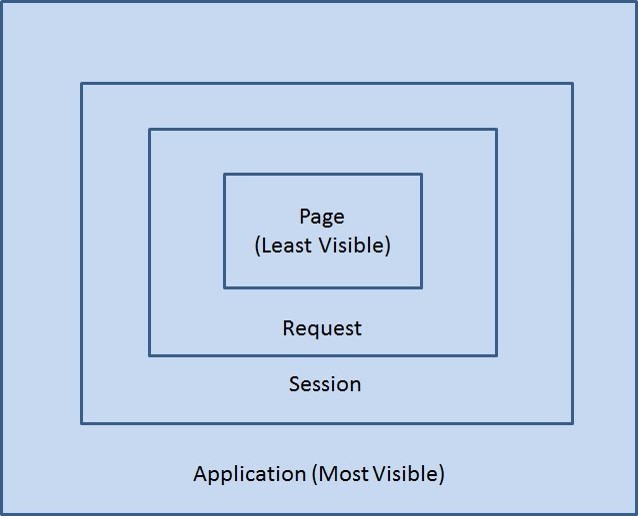

사이트: edwith

강의: [\[부스트코스\] 웹 프로그래밍](https://www.edwith.org/boostcourse-web/) 챕터 2, DB 연결 웹 앱

학습일: 2020년 3월 28일

* * *

## 5\. Scope - BE

Scope란?

*   Scope의 정의: 변수를 사용할 수 있는 범위
*   JSP Scope의 종류

Page Scope

*   PageContext 추상 클래스를 사용하는 Scope
*   특정 페이지에 한정해서 변수값을 유지
*   사용 방법
    *   JSP의 pageContext 내장객체로 사용
    *   pageContext.setAttribute( ) 메서드로 값을 저장하고 .getAttribute( ) 메서드로 값을 읽어들임
        *   **다른 Scope도 값을 저장하고 읽어들이는 메서드는 같음**
*   다른 Scope와의 차이점
    *   Page Scope는 지역 변수처럼 사용됨
        *   JSP나 Servlet이 실행되는 동안에만 정보를 유지
        *   지역변수는 특정 구역에, Page Scope는 특정 페이지에 한정되어 사용되는 점이 유사
    *   포워드를 하는 경우 페이지의 범위를 넘어가기 때문에 Page Scope에 지정된 변수를 사용할 수 없음
*   특징
    *   페이지 자체에서 변수 선언하는 것과 큰 차이가 없음
    *   JSP에서 pageScope에 값을 저장한 뒤, 해당 값을 EL 표기법, JSTL 등으로 활용할 수 있음

Request Scope

*   클라이언트가 보낸 Http 요청을 서버가 받아 응답할 때까지 변수값을 유지
*   사용 방법
    *   Servlet: HttpServletRequest 객체를 사용
    *   JSP: request 내장객체를 사용
*   특징
    *   포워드를 하더라도 변수값을 유지할 수 있어, 포워드와 함께 자주 사용됨
    *   리다이렉트할 경우, 새로운 페이지에서 생기는 request 객체는 이전 페이지의 request 객체와 다르므로 주의

Session Scope

*   HttpSession 인터페이스를 구현한 객체를 사용하는 Scope
*   세션 객체가 생성되어 소멸될 때까지 변수값을 유지
    *   클라이언트별, 사용자별로 세션을 관리해야 될 때 등의 경우에 사용
    *   예시) 온라인 쇼핑 장바구니, 사용자별 로그인 유지
*   사용 방법
    *   Servlet: getSession( ) 메서드로 반환된 session 객체를 사용
    *   JSP: session 내장객체를 사용
*   특징
    *   세션이 소멸될 때까지 변수값이 유지되므로, 여러 요청에 걸쳐서 사용할 수 있음
    *   웹 브라우저 하나에 속한 탭들은 세션정보를 공유하므로, 탭이 다르더라도 사용하는 정보는 같음
*   쿠키(Cookie)와의 차이점
    *   세션 정보는 서버에 저장되고, 쿠키는 클라이언트에 저장됨
    *   서버에 저장되기 때문에 보안성이 좋고 저장 한계가 없음
*   참고자료: [세션(session)](https://chrismare.tistory.com/m/41?category=1019271)

Application Scope

*   ServletContext 인터페이스를 구현한 객체를 사용하는 Scope
*   웹 어플리케이션이 켜져 있는 동안 변수값을 유지
    *   모든 클라이언트가 공통으로 사용하는 값이 있을 때 등의 경우에 사용
    *   웹 어플리케이션의 예시) Eclipse의 프로젝트
*   사용 방법
    *   Servlet: getServletContext( ) 메서드로 얻은 application 객체를 사용
    *   JSP: application 내장객체를 사용
*   특징
    *   웹 어플리케이션 하나당 하나의 application 객체가 사용됨
    *   어플리케이션이 켜져 있는 동안 객체가 유지되므로 적절한 데이터 관리가 필요
        *   List 등 데이터가 지속적으로 추가되는 상황이 생기면,  
            application 객체의 크기가 커지면서 어플리케이션의 속도를 떨어트림 (= 무거워짐)
    *   데이터 관리가 적절하게 되지 않을 경우,  
        데이터 양이 임계점을 넘으면 웹 어플리케이션 자체가 작동하지 않을 수 있음 (= 죽어버림)

