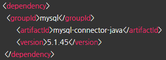
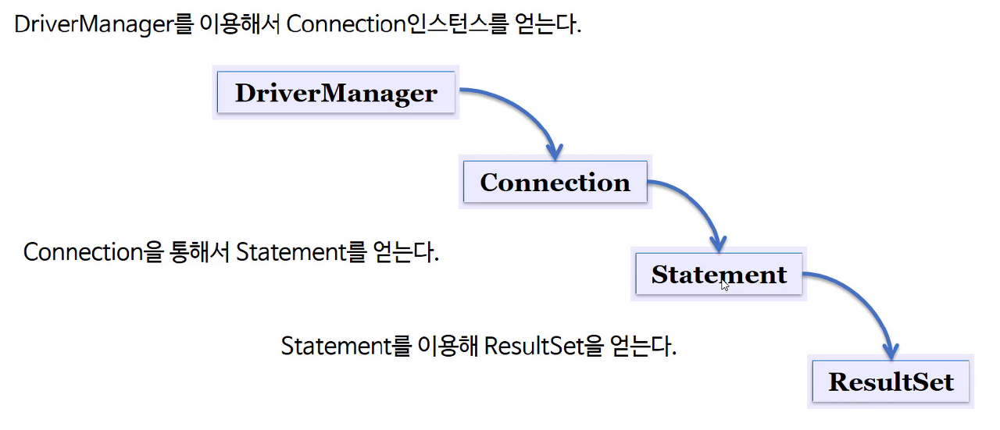
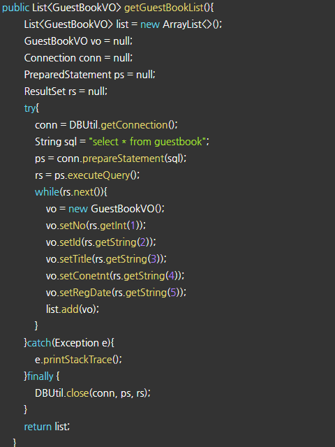
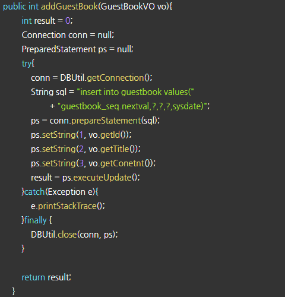
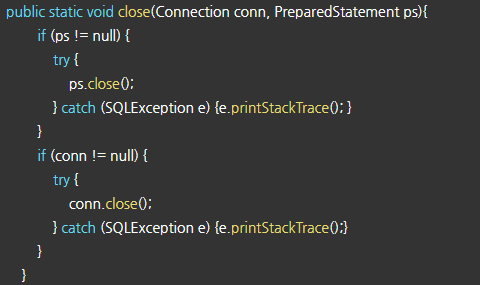

사이트: edwith

강의: [\[부스트코스\] 웹 프로그래밍](https://www.edwith.org/boostcourse-web/) 챕터 2, DB 연결 웹 앱

학습일: 2020년 4월 4일

---

## 10\. JDBC - BE

JDBC(Java Database Connectivity)란?

- JDBC의 정의
  - Java를 이용해 데이터베이스에 접속, SQL 구문을 실행하고 결과 데이터를 핸들링하는 방법 및 절차에 대한 규약
  - Java 프로그램 내에서 SQL 구문을 실행하기 위한 Java API
  - SQL과 프로그래밍 언어의 통합 접근 형태 중 하나
- JDBC가 제공되는 방식
  - Java는 자체적으로 표준 인터페이스인 JDBC API를 제공
  - 데이터베이스 벤더나 기타 서드파티에서 표준 인터페이스를 구현한 드라이버를 제공
    - **! 쓰이는 데이터베이스에 따라 드라이버가 다르므로 주의해야 함**
- 환경설정
  - JDK 설치
  - JDBC 드라이버 설치
    - 제공된 드라이버 및 라이브러리를 다운받아 '/WEB-INF/lib' 폴더에 저장
    - Maven에서 사용할 경우 의존성 부분에 해당 JDBC를 추가
      - 예시) Maven에 MySQL JDBC 추가하기
      * 

  - 참고자료
    - [Java SE 8 API Specification](https://docs.oracle.com/javase/8/docs/api/)
    - [Lesson: JDBC Basics](https://docs.oracle.com/javase/tutorial/jdbc/basics/index.html)

- JDBC를 이용한 프로그래밍: 데이터베이스 사용방법과 유사
  - SQL 패키지 불러오기: import java.sql.\*;
  - 드라이버 로드: Class.forName(드라이버 객체);
    - Class.forName(객체): 객체를 메모리에 올리는 메서드
    - 데이터베이스 벤더에 따라 드라이버 객체의 형식이 달라짐
    - 드라이버는 Connection 객체를 생성하는 데 필수적
  - Connection 객체 생성: 데이터베이스에 접속할 때 얻어내는 객체
    - Connection con = DriverManager.getConnection(dburl, id, pw);
      - dburl을 정하는 방식도 데이터베이스 벤더에 따라 달라짐
        - 예시) MySQL의 경우 jdbc:mysql://localhost/dbName 의 형태를 띔
      - DriverManager 객체를 통해 Connection 객체를 얻어냄
    - 클라이언트가 쓰는 Connection 객체는 인터페이스의 역할만 할 뿐, 벤더별로 구현된 객체가 실체이며,  
      이를 위해 벤더별 라이브러리를 사용해야 하므로 벤더가 제공하는 드라이버가 필요
  - Statement 객체 생성: 쿼리문 실행을 위해 필요한 객체
    - 형태: Statement stmt = con.createStatement;
  - Statement 객체로 질의 수행: 쿼리문을 생성하고 실행
    - 형태: ResultSet rs = stmt.executeQuery("select no from user");
    - 실행할 쿼리의 종류에 따라 메서드가 달라짐
      - 모든 SQL: stmt.execute("query");
      - SELECT: stmt.executeQuery("query");
      - INSERT, UPDATE, DELETE: stmt.executeUpdate("query");
  - (SQL 구문의 결과가 있을 경우) ResultSet 객체를 생성: 쿼리문의 결과를 받아오는 객체
    - 형태: while (rs.next( ))    System.out.println(rs.getInt("no"));
      - next( ): 결과값이 있다면 다음 레코드로 커서를 이동하고 true를, 없다면 false를 반환하는 메서드
  - 모든 객체를 닫음: 열었던 순서의 역순으로 객체를 닫아줘야 함
    - rs.close( ); → stmt.close( ); → con.close( );
  - JDBC 클래스의 생성관계
    - 

- JDBC 예시 코드
  - guestbook 테이블의 모든 데이터를 꺼내오는 코드
    - 

  - guestbook 테이블에 데이터를 추가하는 코드
    - 

  - 객체를 닫는 코드
    - 

  - 특징
    - Connection, Statement 객체, 접속 등의 같은 역할을 하는 코드가 반복적으로 등장

**※ JDBC 프레임워크**

- 프레임워크를 이용해 예시 코드와 같은 반복적인 작업을 최소화시킬 수 있음
- 사용자가 꼭 필요한 정보(쿼리문 등)만을 프레임워크에 전달하면 반복적인 작업을 자동으로 실행시켜 줌
- JDBC 프레임워크를 사용한다면 JDBC를 직접 만들 필요는 없음
  - 부스트코스에서는 Spring JDBC를 사용
  - 그러나 JDBC의 기본적인 실행 원리를 알면 프레임워크에서 문제가 발생했을 때 더 적절하게 대처할 수 있음

