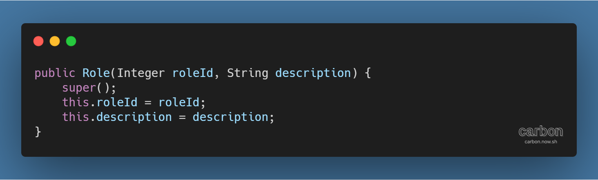
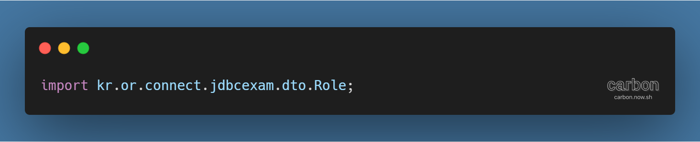
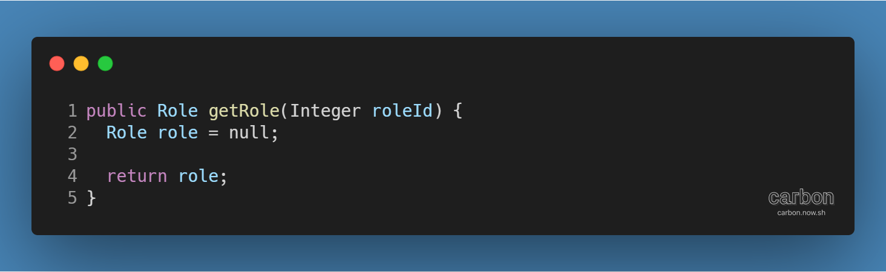
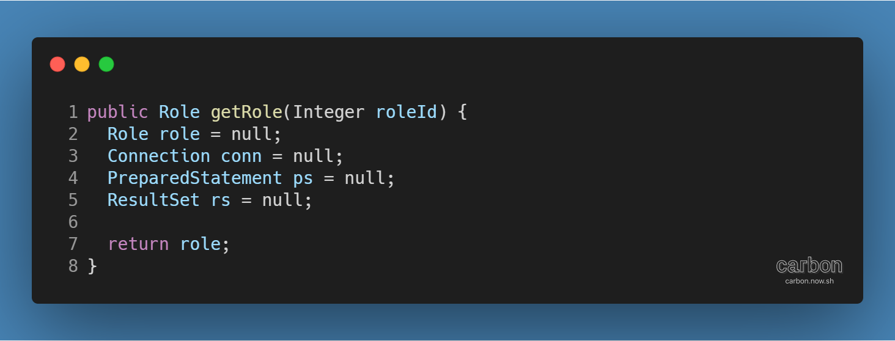
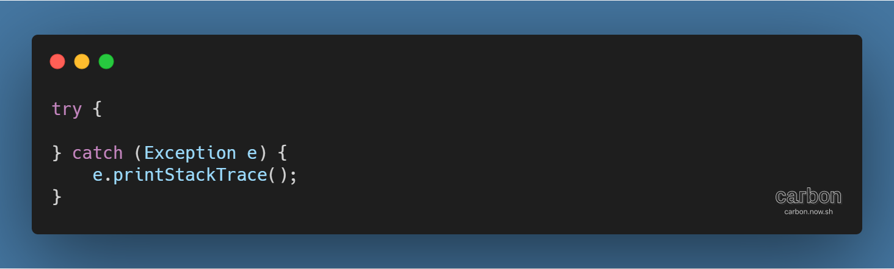
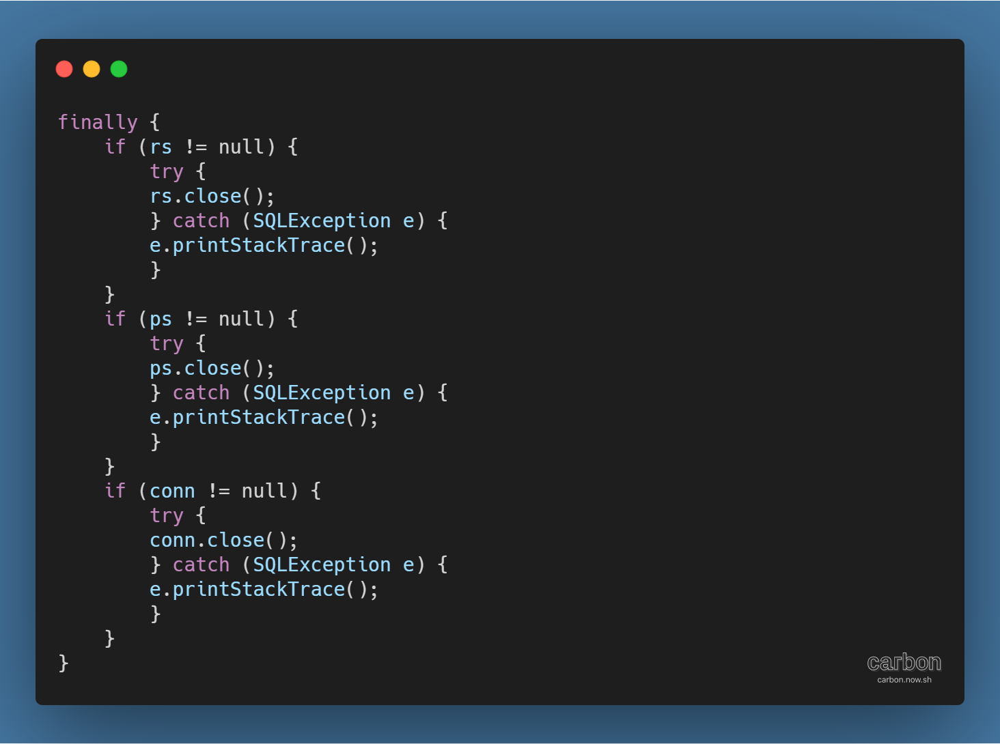
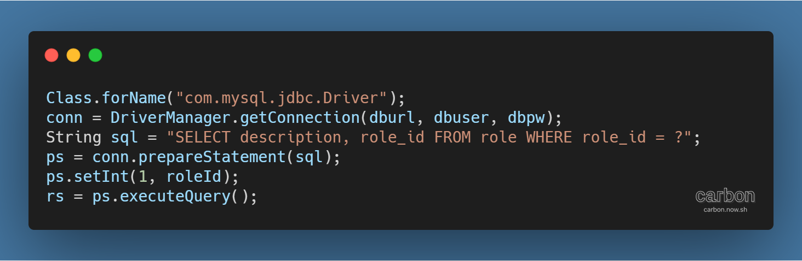
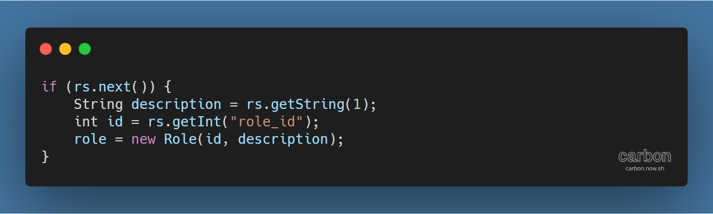
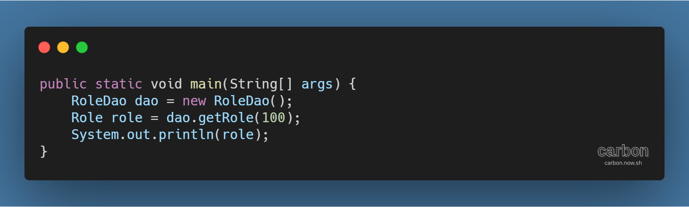

사이트: edwith

강의: [\[부스트코스\] 웹 프로그래밍](https://www.edwith.org/boostcourse-web/) 챕터 2, DB 연결 웹 앱

학습일: 2020년 4월 5일

---

## 10\. JDBC - BE

JDBC 실습하기 (1) - 데이터 반환

- Maven 프로젝트 생성: artifactId는 jdbcexam으로 입력
- Maven 프로젝트 환경설정
  - 1\. pom.xml 수정: JDK 1.8 사용을 위해 plugin 추가 (참고: [Maven (Back End)](https://til-devsong.tistory.com/17) 프로젝트 설정)  
    2\. JDBC 사용을 위한 벤더 드라이버 (mysql) dependency에 추가 (참고: [JDBC (Back End) ... Part 1](https://til-devsong.tistory.com/21) 환경설정)  
    3\. 프로젝트 우클릭 후 Maven > Update Project 실행
- Role 클래스 생성: 데이터베이스에서 정보를 넣거나 꺼내와 저장하는 기능
  - 데이터베이스에 데이터를 넣거나 꺼내올 때 정보를 저장할 객체 생성
    - 프로젝트 > src/main/java 우클릭 후 New > Class  
      → Name에는 Role 입력, Package는 kr.or.connect.jdbcexam.dto 입력
    - 생성된 Role 클래스에 테이블의 Column별 정보를 담을 객체 Role 생성
      - 각 객체의 타입은 Column 타입과 맞아야 함
      - **※ Java에서 필드명은 카멜표기법(camelCase)을 따름**
  - Column 별로 데이터를 넣고 꺼내는 메서드 Getter( ), Setter( )를 추가
    - Source > Generate Getters and Setters > Select All > OK
      - Getter, Setter 메서드가 다루는 객체가 제일 중요하므로 나중에 이 객체를 출력할 때 편하게 만듦
        - toString( ) 메서드를 Override
        - Source > Generate toString()... > OK
    - 나중에 객체 생성 시 편하게 하기 위해 인자를 받아 객체에 값을 저장하는 생성자 추가

- RoleDao 클래스 생성: 테이블의 정보를 입력, 수정, 삭제, 조회하는 기능
  - 프로젝트 > src/main/java 우클릭 후 New > Class  
    → Name에 RoleDao 입력, Package는 기본값.dao 입력
  - 데이터를 가져와 Role 객체에 담아 반환하는 메서드 getRole( ) 생성
    - 앞에서 만든 Role 클래스를 불러옴: 반환할 때 필요

        *   getRole() 메서드 정의

        *   데이터베이스와의 연결을 담당하는 객체, 쿼리문을 실행하는 객체, 결과값을 담을 객체를 각각 선언

        *   예외 처리: 중간에 접속이 끊기는 등의 예외 상황에 대처하기 위한 로직 작성
            *   try ... catch 구문으로 기본 구조를 작성해 객체 선언 뒤에 입력

            *   conn, ps, rs 객체는 자신의 역할을 수행한 뒤에 닫아줘야 함

                *   어떤 상황에서도 반드시 수행하는 finally 구문을 try ... catch 구문 뒤에 입력
                *   객체를 불러온 순서의 역순으로 닫아줌
                *   객체를 닫을 때 사용되는 close( ) 메서드에도 예외 처리
                    *   각 객체가 null이 아닌 경우에만 실행되도록 if 조건문 적용
                    *   이전 단계의 객체를 얻어내다가 예외가 발생 시, 이후 단계의 객체의 값은 null이므로
                        close ( ) 메서드를 실행하면 NullPointerException 등의 오류가 발생
            *   **※ 코드 작성 시 예외 처리를 통해 오류가 발생할 수 있는 여지를 최대한 줄여주는 것이 중요**
        *   데이터를 가져와 반환하는 코드 작성

            *   예외가 발생하지 않은 상황에서 동작해야 하므로 try 구문 안에 작성
            *   MySQL 드라이버 로드 (벤더에 따라 Class.forName( ) 메서드의 인자는 달라질 수 있음)
            *   DriverManager로 얻어온 접속 정보를 conn 객체에 저장
                *   DB 접속 정보는 계속 사용되므로 getRole 메서드 외부에 아예 변수로 저장해놓으면 편리
            *   ps 객체로 쿼리문 실행 준비 설정
                *   쿼리문 내 ?의 역할: 쿼리문이 저장된 변수 전체를 수정하지 않고 ? 부분만 수정할 수 있게 해줌
                *   ps.setInt(paramIndex, x)
                    *   메서드 이름인 set...는 대상 Column의 데이터 타입에 맞춰 변경
                    *   paramIndex: 쿼리문 내 ? 중 몇 번째 ?를 조작할 지 결정
                    *   x: paramIndex에 해당하는 ?에 어떤 값을 넣을지를 결정
            *   rs 객체에 ps 객체의 쿼리문을 실행한 결과를 저장
            *   rs 객체에서 결과 꺼내기

                *   결과값이 없을 때 실행하지 않도록 if 조건문 적용해 예외 처리
                *   getString( ), getInt( ) 등의 메서드로 값을 가져와 변수에 저장
                    *   메서드의 인자로 SELECT 구문을 입력했을 때 필드명의 인덱스, 또는 필드명을 입력
                *   값을 저장한 변수를 인자로 받는 Role 객체로 생성

- 예제 실행 확인
  - Java Class 생성 (Class명: JDBCExam1)

        *   getRole( ) 메서드 실행을 위해 RoleDao 객체 생성
        *   getRole( ) 메서드를 조회하고 싶은 role\_id를 인자로 실행
        *   getRole( ) 메서드의 반환된 결과값을 Role 타입의 변수에 저장한 뒤 출력

