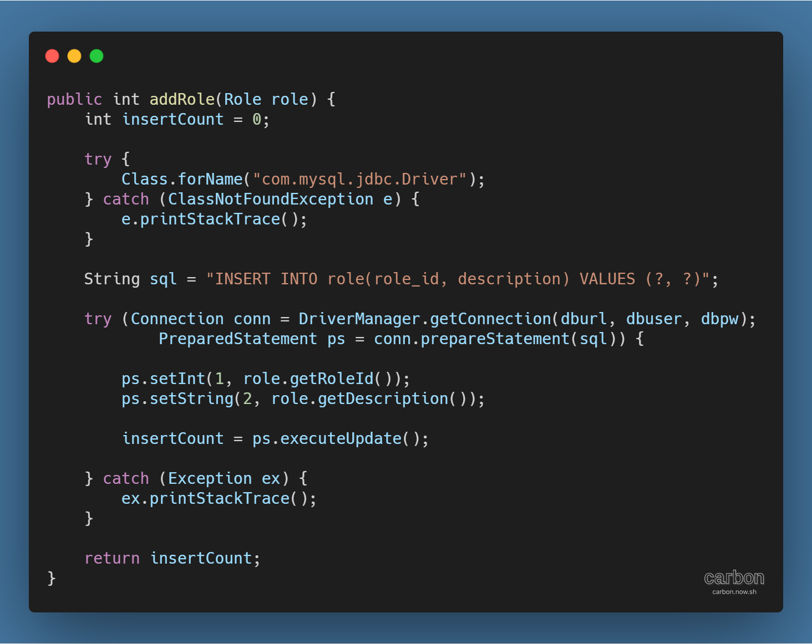
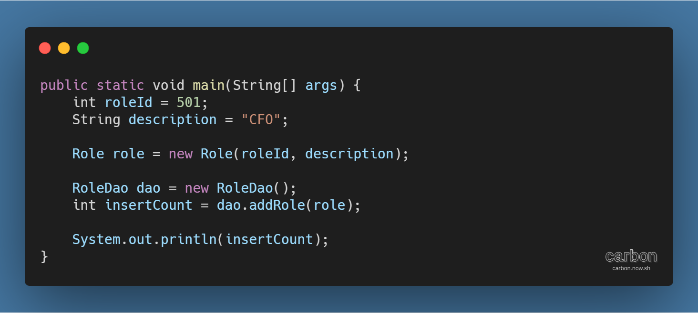
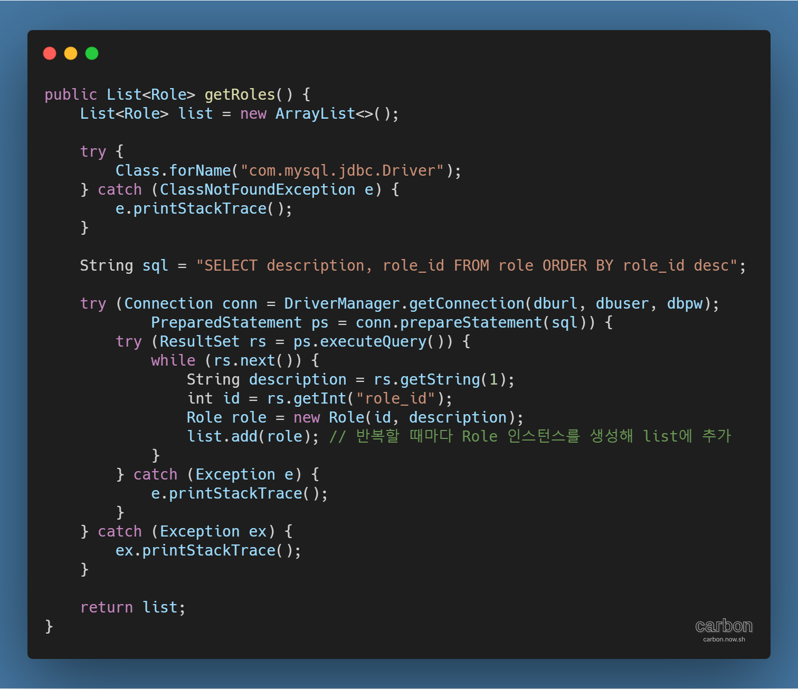
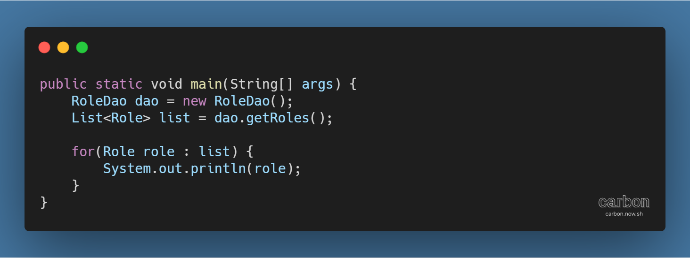
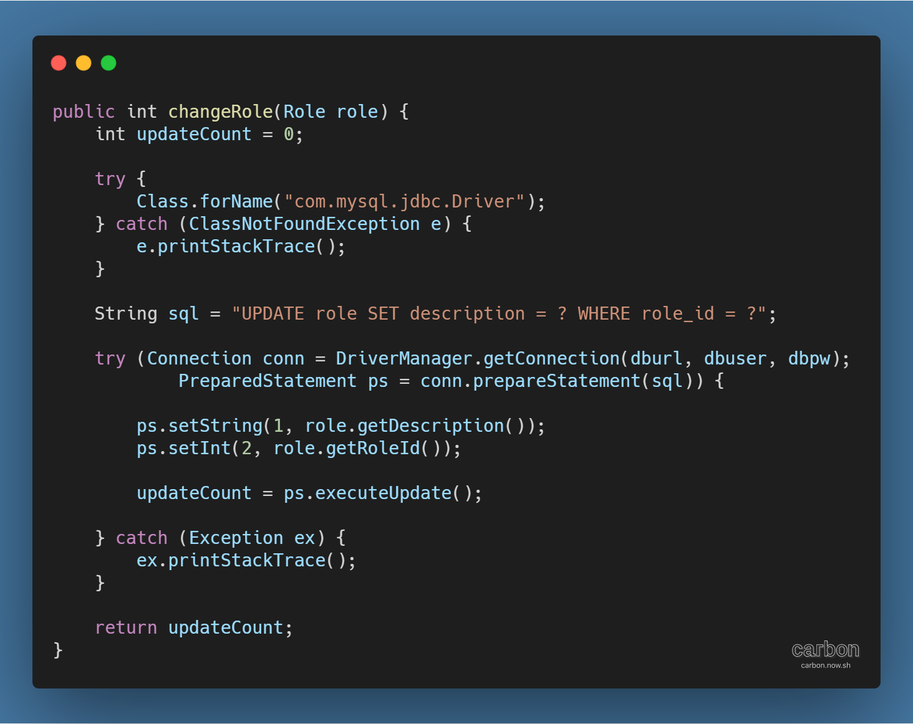
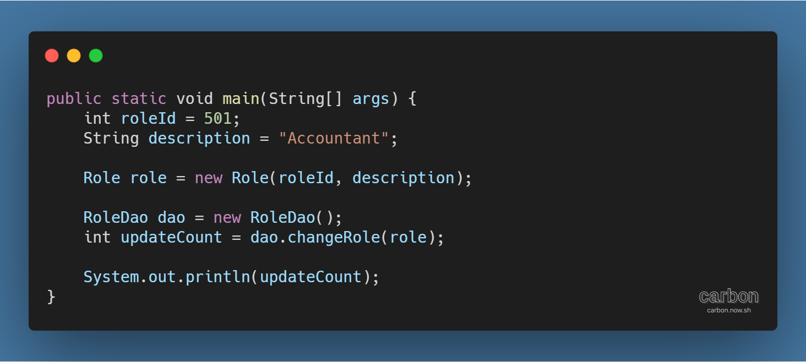
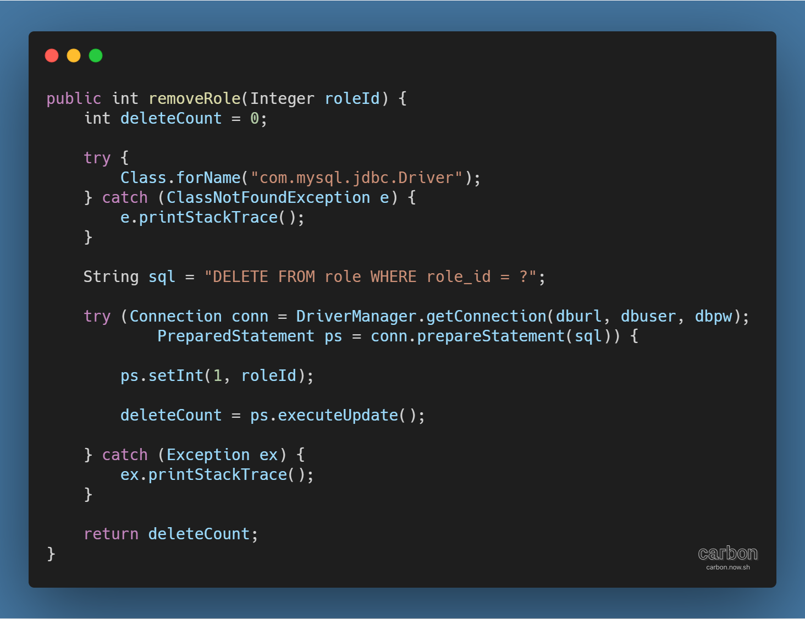
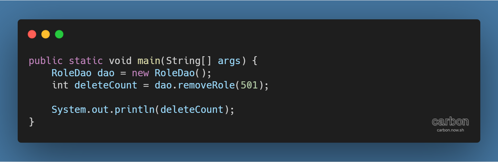

사이트: edwith

강의: [\[부스트코스\] 웹 프로그래밍](https://www.edwith.org/boostcourse-web/) 챕터 2, DB 연결 웹 앱

학습일: 2020년 4월 6일

---

## 10\. JDBC - BE

JDBC 실습하기 (2) - 데이터 추가, 데이터 조회

- JDBC 실습 (1)과의 차이점
  - try-catch-finally 구문 대신 try-with-resource 구문으로 예외 처리
    - try 뒤에 사용할 resource를 얻어오는 코드를 입력하면 해당하는 객체를 자동으로 close 처리해주는 구문
    - close( ) 메서드가 반복되는 finally 구문이 사라지므로, 코드의 가독성이 올라감
- addRole( ) 메서드 생성: 데이터를 추가하는 메서드
  - 
  - 드라이버 로드: 첫번째 try-catch 구문
  - 쿼리문 변수 설정
  - 실행 코드 작성: 두번째 try-catch 구문
    - try-with-resource 구문을 활용해 Connection 객체와 PreparedStatement 객체가 자동으로 닫히도록 처리
    - 쿼리문 내 ?가 입력값과 치환될 수 있도록 처리
  - 실행 확인
    - 
    - roleId, description 값을 설정한 뒤, 해당 값을 포함하는 Role 객체 생성
    - 생성된 Role 객체를 인자로 받는 RoleDao 객체의 addRole( ) 메서드 실행
    - 메서드의 실행 결과를 insertCount에 저장한 뒤 출력
- getRoles( ) 메서드 생성: 데이터 전체를 반환하는 메서드
  - 
  - getRole( ) 메서드와 동일한 실행 구조를 가지나, 최종적으로 반환되는 값이 list의 형태인 것이 차이점
  - 실행 확인
    - 
    - RoleDao 객체의 getRoles( ) 메서드 실행
    - 메서드의 실행 결과를 List<Role> 타입의 변수에 저장
    - 결과값은 List 형태이므로, List 내 모든 role에 대해 출력하는 반복문 실행
- changeRole( ) 메서드 생성: 조건에 맞는 필드의 값을 바꾸는 메서드
  - 
  - addRole( ) 메서드와 동일한 실행 구조를 가지며, 쿼리문만 UPDATE 구문으로 변경해주면 됨
  - 실행 확인
    - 
- removeRole( ) 메서드 생성: 조건에 맞는 필드를 삭제하는 메서드
  - 
  - addRole( ), changeRole( ) 메서드와 유사한 실행 구조를 가지나, 인자가 Role 타입이 아닌 것이 차이점
  - 실행 확인
    - 

**※ DAO와 DTO**

- 참고자료: [DAO vs DTO(=VO) 개념 알아보기](https://jungwoon.github.io/common%20sense/2017/11/16/DAO-VO-DTO/)

