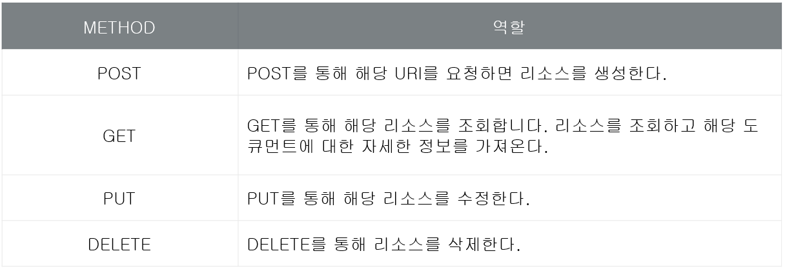
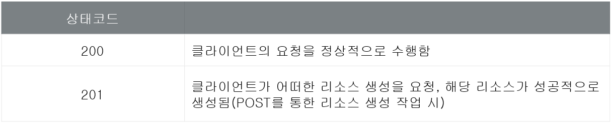
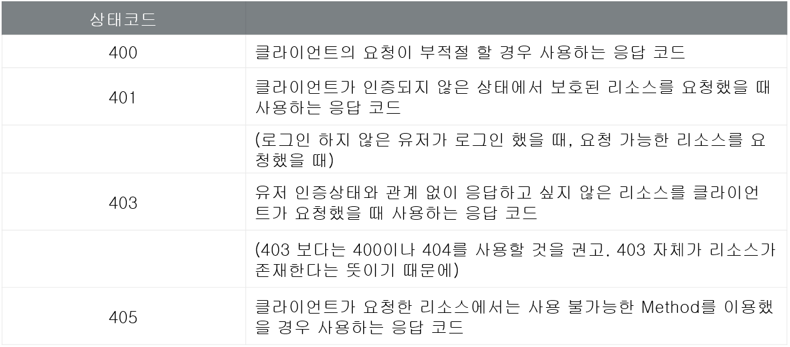
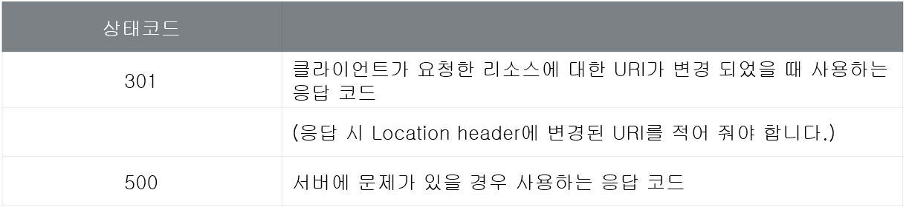

사이트: edwith

강의: [\[부스트코스\] 웹 프로그래밍](https://www.edwith.org/boostcourse-web/) 챕터 2, DB 연결 웹 앱

학습일: 2020년 4월 7일

---

## 11\. Web API - BE

REST API란?

- API (Application Programming Interface)
  - 운영체제나 프로그래밍 언어가 제공하는 기능을 응용 프로그램에서 사용, 제어할 수 있게 만든 인터페이스
  - 파일 제어, 창 제어, 화상 처리, 문자 제어 등을 위한 기능을 제공함
  - 기능을 제공하는 라이브러리의 내부 구현 코드를 모르더라도 인터페이스만 알면 사용할 수 있음
  - 예시) Java로 절대값을 구할 때 사용하는 Math 클래스의 abs( ) 메서드
- REST (REpresentational State Transfer) API
  - 핵심 컨텐츠 및 기능을 외부 사이트에서 활용할 수 있도록 제공하는 인터페이스
  - 웹 브라우저 뿐 아니라 앱 등 다양한 클라이언트가 등장하며 이에 대응하기 위해 널리 사용되고 있음
  - 서비스 업체들이 제공하는 REST API를 클라이언트가 조합해 어플리케이션을 만들 수 있음
  - 예시) [네이버 API](https://developers.naver.com/products/intro/plan/), Facebook의 [그래프 API](https://developers.facebook.com/docs/graph-api), 대한민국 정부의 [공공 데이터 포털](https://www.data.go.kr/) 등
- REST의 조건
  - 대부분의 REST API가 실제로는 REST API가 아닌데, 아래의 제약조건을 못 지키는 API가 대부분이기 때문
    - Client-Server, Stateless, Cache, Uniform Interface, Layered System, Code-on-Demand (선택적)
  - HTTP 프로토콜에서는 Client-Server, Stateless, Cache, Layered System, Code-on-Demand는 쉽게 구현되나,  
    Uniform Interface 구현은 쉽지 않음
    - Uniform Interface의 제약조건
      - 리소스가 URI로 식별되어야 함
      - 리소스를 생성, 수정, 추가할 때 HTTP 메시지에 표현해서 전송해야 함
      - Self-descriptive message: 메시지가 스스로를 설명할 수 있어야 함
      - HATEOAS: 어플리케이션의 상태가 하이퍼링크를 이용해 전이되어야 함
    - Self-descriptive message와 HATEOAS는 웹이 아닌 API로는 구현이 어려움
- Web API (또는 HTTP API)
  - REST의 Uniform Interface를 구현하는 것이 쉽지 않으므로, 많은 API 서비스가 REST를 완벽하게 지원하지 않음
  - REST를 완벽하게 지원하지 않는 API의 호명 방법
    - REST의 전체를 제공하지는 않지만 REST API라고 그대로 부름
    - REST의 전체를 제공하지 않으므로 Web API 또는 HTTP API라고 부름
- 참고자료
  - [REST API 튜토리얼](https://www.restapitutorial.com/)
  - [당신의 API가 Restful하지 않은 5가지 증거](https://beyondj2ee.wordpress.com/2013/03/21/%EB%8B%B9%EC%8B%A0%EC%9D%98-api%EA%B0%80-restful-%ED%95%98%EC%A7%80-%EC%95%8A%EC%9D%80-5%EA%B0%80%EC%A7%80-%EC%A6%9D%EA%B1%B0/)
  - \[YouTube\] [그런 REST API로 괜찮은가](https://www.youtube.com/watch?v=RP_f5dMoHFc)

Web API란?

- Web API 디자인 가이드: Web API를 만들 때의 규칙
  - URI는 대상이 되는 정보의 자원을 잘 표현해야 함
  - 자원에 대한 행위를 HTTP 메서드(GET, POST, PUT, DELETE)로 표현해야 함
  - HTTP 메서드에 따라 API에 요청하는 내용이 달라짐
    - 
- URI의 표현 방식
  - 대상 정보의 자원
    - GET /members: members의 모든 정보가 대상
    - DELETE /members/1: members 중 1이 대상
  - 자원에 대한 행위
    - 올바른 표현: GET /members/1, POST /members, PUT /members/1, DELETE /members/1
    - 틀린 표현: GET /members/get/1, GET /members/add, GET /members/update/1, GET /members/del/1
      - 조회, 입력, 수정, 삭제와 관련된 명령이 중간에 동사로 중첩되어 표현되면 안 됨
      - 어떤 행위를 해야 하는지가 HTTP 메서드로 명확히 전달되어야 함
- URI 경로 규칙
  - 형태
    - http://domain/houses/apartments
    - http://domain/departments/1/employees
  - 구분자의 종류
    - / (슬래시): 계층을 나타낼 때 사용하며, URI의 마지막 위치에는 오지 않음
    - \- (하이픈): URI 가독성을 높일 때 사용
    - \_ (언더바): 사용하지 않음
  - 특징
    - 소문자로 작성
      - URI 문법 형식인 RFC 3986은 URI 스키마와 호스트를 제외하면 대소문자를 구별함
    - 파일 확장자: URI에 포함시키지 않고 별도의 Accept Header를 사용함
- HTTP 상태 코드
  - 200번대: 성공
    - 
  - 400번대: 클라이언트의 요청이 잘못되었을 때
    - 
  - 500번대: 서버로 인한 오류
    - 

#웹 프로그래밍 #BACK END #인터넷 강의 #백엔드 #내용 정리 #web api #rest api #edwith #부스트코스
