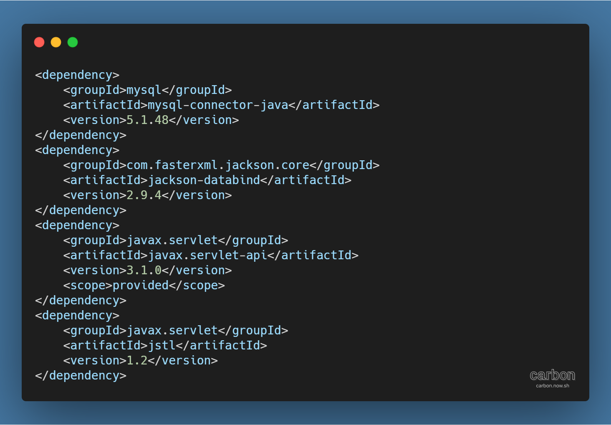
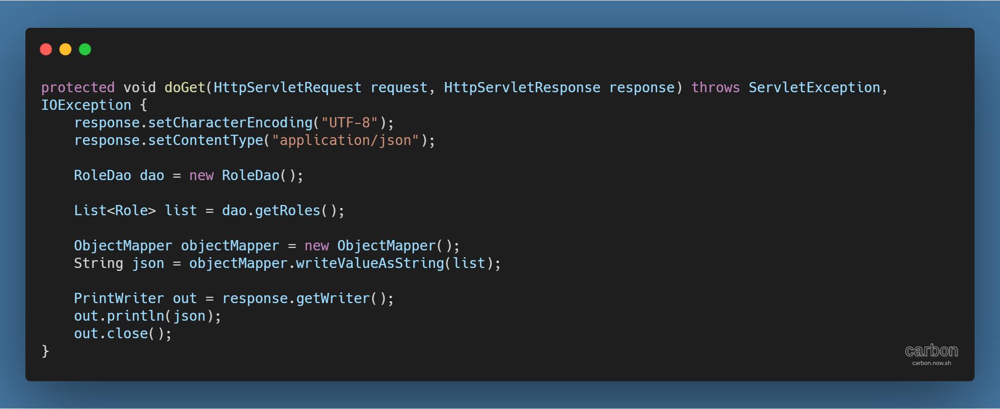

사이트: edwith

강의: [\[부스트코스\] 웹 프로그래밍](https://www.edwith.org/boostcourse-web/) 챕터 2, DB 연결 웹 앱

학습일: 2020년 4월 8일

---

## 11\. Web API - BE

Web API 실습

- Maven Project 생성
  - archetype 종류는 **webapp**, artifactId는 **webapiexam** 입력
- pom.xml 변경
  - plugin에 JDK 버전 1.8 추가 ([Maven (Back End)](https://til-devsong.tistory.com/17) 프로젝트 설정 참고)
  - dependencies에 라이브러리 추가
    - 
    - MySQL JDBC ([JDBC (Back End)](https://til-devsong.tistory.com/21) ... Part 1 환경설정 참고)
    - JSON 라이브러리
    - Java Servlet 라이브러리 ([Maven (Back End)](https://til-devsong.tistory.com/17) 프로젝트 설정 참고)
    - JSTL 라이브러리 ([Maven (Back End)](https://til-devsong.tistory.com/17) 프로젝트 설정 참고)
  - 변경사항 적용: 프로젝트 우클릭 > Maven > Update Project 실행
- Dynamic Web Module 버전 변경
  - 경로: Navigator 탭 > 프로젝트 > .settings > org.eclipse.wst.common.project.facet.core.xml
  - **facet="jst.web"**의 version을 "2.3"에서 **"3.1"**로 변경
  - 변경사항 적용: Eclipse 재시작
- web.xml 파일 삭제
  - 경로: Navigator 탭 > src > main > web-app > WEB-INF
  - Annotation을 사용해 Servlet을 설정하므로 web.xml 파일은 필요 없어 삭제
  - 오류 방지: pom.xml > properties > **<failOnMissingWebXml>false</failOnMissingWebXml>** 구문 추가
- Java 폴더 생성: Java 패키지와 클래스가 저장되는 디렉토리
  - 경로: Navigator 탭 > src > main
- Servlet이 들어갈 Java 패키지 생성
  - 경로: 프로젝트 > Java Resources > src/main/java 우클릭 > New > Package
  - Name에 **kr.or.connect.webapiexam.api** 입력
- 기존 패키지 불러오기
  - 기존 패키지: jdbcexam 프로젝트 > **kr.or.connect.jdbcexam.dao**, **kr.or.connect.jdbcexam.dto**
  - src/main/java에 복사 & 붙여넣기
- Servlet 생성
  - 생성한 kr.or.connect.webapiexam.api 패키지 우클릭 > New > Servlet
  - Class Name은 **RolesServlet**, URL Mappings는 **/roles** 입력
  - doGet 메서드 Override
- doGet 메서드 작성
  - 
  - 인코딩 방식 설정: "UTF-8" 입력
  - 컨텐츠 타입 설정: JSON 형식이므로 "application/json" 입력
  - getRoles( ) 메서드를 실행하기 위해 RoleDao 타입 객체 생성
  - getRoles( ) 메서드의 실행 결과값을 저장할 List<Role> 타입 객체 생성
  - JSON 라이브러리를 사용하기 위해 ObjectMapper 객체 생성
  - writeValueAsString( ) 메서드를 사용해 JSON 객체를 문자열로 바꿈
  - JSON 문자열을 출력하기 위해 PrintWriter 객체 생성
  - 출력 후 PrintWriter 객체를 닫음
- **※ Servlet 실행 시 다운로드 창이 뜨는 경우**
  - IE 9 이하에서는 "application/json"인 컨텐츠 타입을 정상적으로 인식하지 못해 파일 다운로드 진행
  - IE 10 이후 버전과 Google Chrome에서는 정상적으로 뜨므로, 브라우저를 변경하면 해결됨
    - Google Chrome에서 JSON 형식을 정돈된 모습으로 보고 싶으면 JSON Formatter 확장프로그램을 설치
- **※ 라이브러리를 import했음에도 계속 오류가 발생하는 경우**
  - Eclipse 종료 후 C:\\사용자\\.m2 디렉토리 삭제
    - .m2 폴더: 라이브러리 파일이 보관되는 곳
  - Eclipse 재시작 후 프로젝트 > Maven > Update Project

