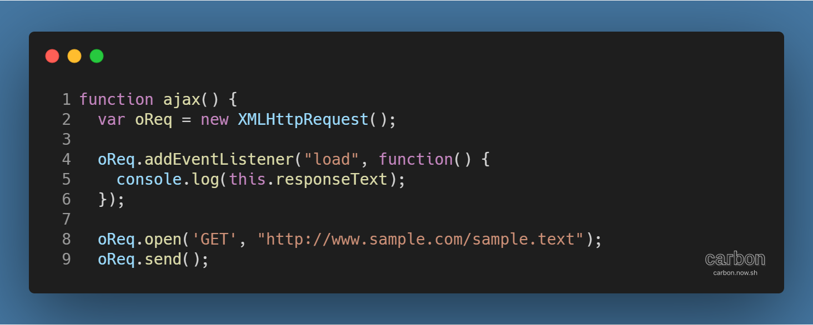
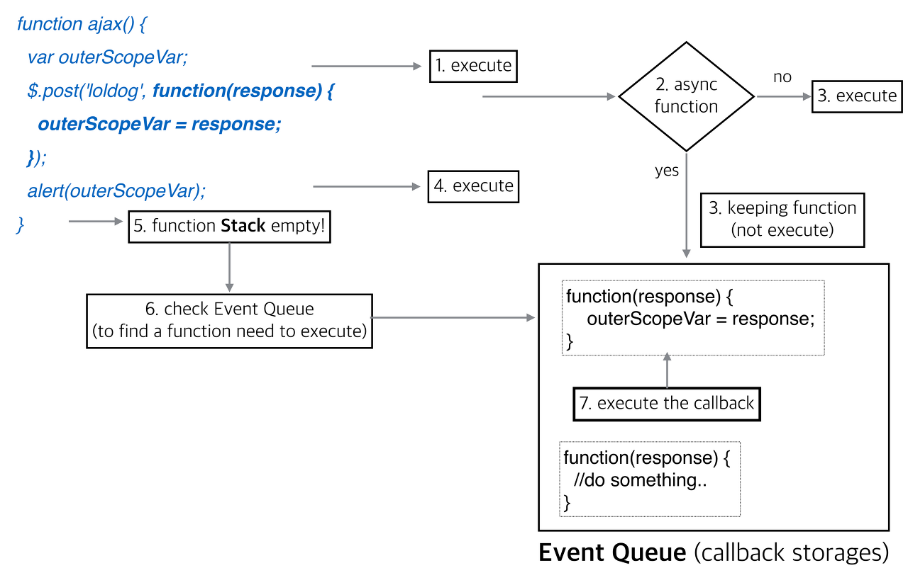

강의:[\[edwith 부스트코스\] 웹 프로그래밍](https://www.edwith.org/boostcourse-web/)챕터 3, 웹 앱 개발: 예약서비스 1/4

학습일: 2020년 4월 11일, 12일

---

## 3\. AJAX - FE

AJAX 응답 처리와 비동기

- AJAX와 비동기 실행
  - 
  - Line 4의 addEventListener가 순서대로 실행되는 것과 달리, 그 안의 익명함수는 비동기로 실행됨  
    → 비동기로 실행된 익명함수는 Event Queue에 보관되다가 "load" 이벤트가 발생 (서버로부터 데이터를 받음)  
    → Call Stack을 확인한 뒤, 비어있다면 Call Stack으로 올라와 실행됨
  - 비동기에 대한 참고자료
    - \[YouTube\] [Philip Roberts: What the heck is the event loop anyway? | JSConf EU 2014](https://www.youtube.com/watch?v=8aGhZQkoFbQ)
    - [Synchronous and Asynchronous](http://www.phpmind.com/blog/2017/05/synchronous-and-asynchronous/)
    - 
- AJAX 응답 처리
  - 서버로부터 받아온 JSON 데이터는 문자열 형태이므로 브라우저에서 바로 실행할 수 없음
  - 따라서 문자열을 파싱해 JavaScript 객체로 변환해야 데이터에 접근할 수 있음
    - 문자열을 일일이 손수 파싱하는 것은 불편하고 생산성이 떨어짐
    - 브라우저에서 제공하는 JSON 객체를 활용해 JSON 문자열을 JavaScript 객체로 변환해 접근할 수 있음
      - 형태: 변수 = JSON.parse(JSON 문자열);
- Cross Domain 문제
  - XHR 통신은 다른 도메인 사이에서는 보안을 이유로 요청이 되지 않음
    - A 도메인 → B 도메인으로 XHR, AJAX 통신을 할 수 없음
  - 이를 해결하기 위해 JSONP 방식이 널리 사용되었고, 최근에는 CORS라는 표준 방식이 제공되고 있음
    - CORS: HTTP 헤더를 사용해, 브라우저가 웹 어플리케이션에게 서로 다른 도메인에 대한 접근권한을 주는 방식
      - 사용하기 위해 프로그램 코드에서 처리할 것은 없지만, 백엔드 코드에서 헤더 설정을 해줘야 함
    - JSONP: HTML의 script 요소로부터 요청되는 호출에는 보안상 정책이 적용되지 않음을 이용한 우회법
      - 표준 방식은 아니지만, 아직도 많은 곳에서 쓰여 사실상의 비공식적인 표준으로 인식됨
    - 참고자료
      - [교차 출처 리소스 공유 (CORS) - HTTP | MDN](https://developer.mozilla.org/ko/docs/Web/HTTP/CORS)
      - [JSONP 알고 쓰자](https://kingbbode.tistory.com/26)
      - [JSONP - W3Schools](https://www.w3schools.com/js/js_json_jsonp.asp)
- **※ 다양한 웹사이트의 검색 자동완성 UI가 데이터를 JSONP 방식으로 통신해서 가져옴**
  - Google Chrome 개발자 도구의 Network 패널을 열고 확인할 수 있음
  - 예시) Naver 검색 자동완성, Daum 검색 자동완성

디버깅 - Google Chrome 개발자 도구

- 네트워크 통신: 소스 코드가 직접적으로 실행되지 않고, 브라우저가 소스 코드를 읽어 필요한 부분을 서버에 요청
  - 브라우저는 이를 위해 네트워크 모듈을 내장하고 있음
  - 예시) 브라우저 주소창에 URL을 입력할 경우, 해당 URL로 GET 방식의 HTTP 요청이 전송됨
- 통신 과정은 수많은 단계로 이루어지는데, 특정 단계에서 문제가 발생해 예상하지 못한 결과가 나올 수 있음
  - 문제의 원인을 찾기 위해선 소스 코드만으로는 문제를 찾기 어려움
  - 서버 쪽에 문제가 있는 것 같다고 추정하기에 앞서, 먼저 클라이언트 단에서 서버에게 요청은 잘 했는지, 서버의 응답은 잘 왔는지를 개발자 도구를 써서 확인할 수 있음
- Chrome 개발자 도구의 Network 패널
  - 녹화 기능: 서버로부터 파일을 내려받는 상황을 실시간으로 알 수 있음
    - Capture Screenshots를 활용하면 불러오는 화면을 ms 단위로 나눠서 볼 수 있음
  - 상태 코드: Error 404 등 응답에 오류가 있을 경우 직관적으로 확인할 수 있음
  - 서버로부터의 응답 시간: 성능 개선에 활용할 수 있음
  - 크기, 타입 등 기타 요청한 파일에 대한 다양한 정보를 확인할 수 있음
- 참고자료: [Chrome DevTools | Tools for Web Developers](https://developers.google.com/web/tools/chrome-devtools/?hl=ko#network)

