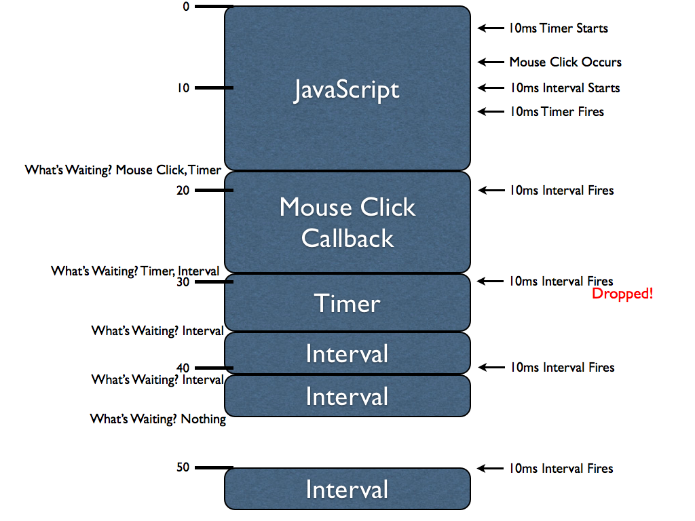
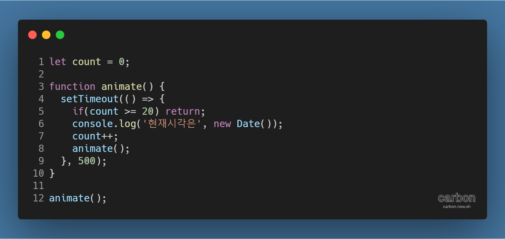
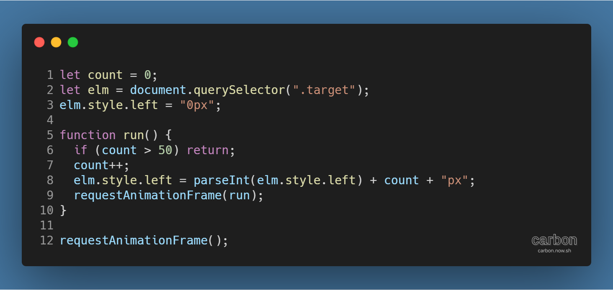

강의: [\[edwith 부스트코스\] 웹 프로그래밍](https://www.edwith.org/boostcourse-web/) 챕터 3, 웹 앱 개발: 예약서비스 1/4

학습일: 2020년 4월 12일

---

## 4\. Web Animation - FE

웹 애니메이션 이해와 setTimeout 활용

- 애니메이션: 반복적인 움직임을 나타내는 것
  - 웹 UI의 애니메이션은 JavaScript로 다양하게 제어할 수 있음
  - 단순하고 규칙적인 애니메이션은 CSS3의 transition과 transform 속성으로 대부분 구현할 수 있음
    - CSS 방식은 JavaScript보다 더 빠른 성능을 보장하며, 특히 모바일 웹에서 성능 차이가 두드러짐
  - 애니메이션이 단순하면 CSS로, 세밀한 조작이 필요하다면 JavaScript로 적절하게 나눠 구현해야 함
    - 성능 비교를 통해 가장 빠른 방법을 찾는 과정도 필요함
- FPS(Frame Per Second): 1초에 화면에 표현할 수 있는 정지화면(frame)의 수
  - 매끄러운 애니메이션은 보통 60fps로 이루어짐
    - 1 frame이 약 1000ms / 60 frames = 16.666ms 간격으로 생성되어야 함
- JavaScript 애니메이션
  - 규칙적인 처리를 하도록 JavaScript 코드를 구현
  - setInterval( ) 메서드
    - 형태: setInterval(callback, time);
    - 주어진 시간(단위: ms)을 간격으로 하여 callback 함수를 실행
    - 문제점
      - 
      - 정해진 시간에 함수가 실행된다고 보장할 수 없음
      - 비동기적으로 실행되기 때문에, 실행 중에 동기적으로 다른 동작이 수행되면 밀려서 나중에 실행됨
    - 애니메이션 구현에선 잘 사용되지 않음
  - setTimeout( ) 메서드
    - 형태: setTimeout(callback, time);
    - 주어진 시간(단위: ms) 이후에 callback 함수를 실행
    - 재귀적으로 호출하는 방식으로 애니메이션을 구현할 수 있음
    - 예시 코드
      - 
    - 장점
      - 코드를 실행하고 callback 함수를 호출한 뒤 Call Stack에서 사라지므로 stack overflow가 일어나지 않음
      - Callback 함수가 누적되지 않으므로, 재귀 호출이 지연될 수는 있어도 아예 실행되지 않는 상황은 일어나지 않음
    - 문제점
      - 애니메이션 주기를 16.6ms 미만으로 할 경우 불필요한 프레임이 생성되는 등의 문제가 생김
      - 애니메이션에 최적화된 방식은 아님
  - 위 문제점을 해결하기 위해 애니메이션 전용 메서드 requestAnimationFrame( )이 대안으로 도입됨
  - 참고자료: [Scheduling: setTimeout and setInterval](https://javascript.info/settimeout-setinterval)

requestAnimationFrame 활용

- requestAnimationFrame( ) 메서드
  - 애니메이션에 최적화되지 않은 setInterval( ), setTimeout( ) 메서드와 달리, 애니메이션에 최적화된 방식
  - setTimeout( ) 메서드의 재귀 호출을 좀 더 개선한 방법으로, 애니메이션을 적절한 시점에 렌더링해줌
- 예시 코드
  - 
- 복잡한 애니메이션을 제어할 때 필수적
  - 예시) canvas나 svg를 이용한 복잡한 도형 생성 및 이동
- 동시에 호출되는 애니메이션이 많아질수록 setTimeout( )에 비해 자연스럽게 표현됨
- 참고자료: [Window.requestAnimationFrame() - Web APIs | MDN](https://developer.mozilla.org/en-US/docs/Web/API/window/requestAnimationFrame)

CSS3 transition 활용

- 일반적으로 JavaScript로 애니메이션을 구현하는 것보다 빠름
  - 모바일 웹에서 element 조작은 CSS의 transform 속성을 사용하는 방법이 많이 쓰임
  - 참고자료: [CSS Transitions and Transforms for Beginners](https://thoughtbot.com/blog/transitions-and-transforms)
- transition: CSS 스타일의 변화를 일정 시간 동안 점진적으로 표현하는 속성
  - 점진적으로 표현할 시간, 속성의 종류, 표현방식 등을 브라우저에게 위임
  - transform 속성과 함께 사용하면 활용도를 극대화할 수 있음
  - 예시) 슬라이더 애니메이션
    - 특정 요소의 위치를 A에서 B로 옮길 때, transition 속성 없이는 순간이동하는 것처럼 보이나  
      transition 속성을 부여하면 특정 시간동안 A에서 B로 직선 경로를 따라 이동하는 것처럼 표현됨
- transform: HTML 요소를 변형시키는 속성
  - 상하좌우 이동, 확대/축소, 왜곡, 회전 등 다양하게 변형되도록 조작할 수 있음
  - 참고자료: [transform - CSS: Cascading Style Sheets | MDN](https://developer.mozilla.org/ko/docs/Web/CSS/transform)
- GPU 가속을 이용하는 속성을 사용하면 애니메이션 처리가 빠름
  - 예시) transform 속성의 translate(), scale(), rotate() 값, opacity 속성 등
  - 참고자료: [하드웨어 가속에 대한 이해와 적용](https://d2.naver.com/helloworld/2061385)
- 벤더 프리픽스 (Vendor Prefix, 공급자 접두사)
  - 웹 브라우저 공급자가 새로운 CSS 기능을 제공할 때, 이전 버전의 웹 브라우저에게 알려주는 접두사
  - transition, transform 등 신규 기능을 지원하지 않는 버전이더라도 해당 기능을 사용할 수 있게 됨
  - 참고자료: [벤더 프리픽스 - TCP School](http://tcpschool.com/css/css3_module_vendorPrefix)

