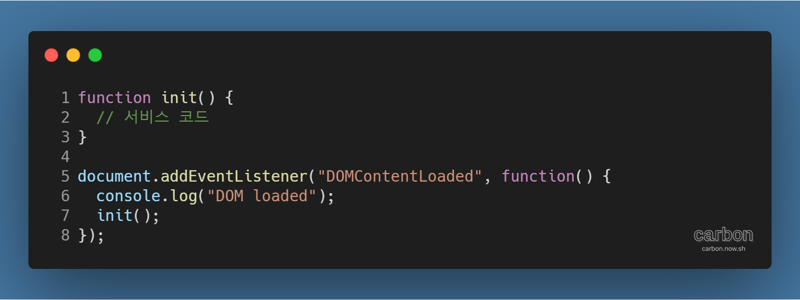
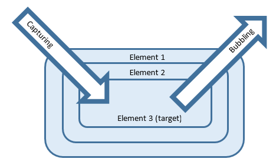
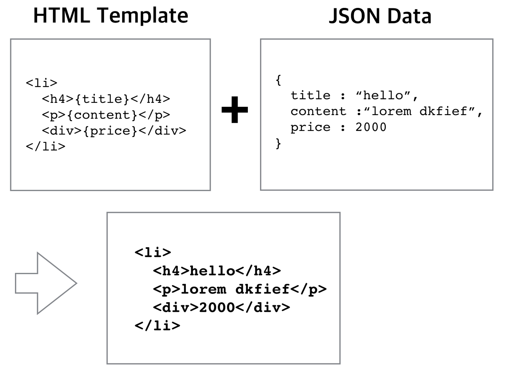
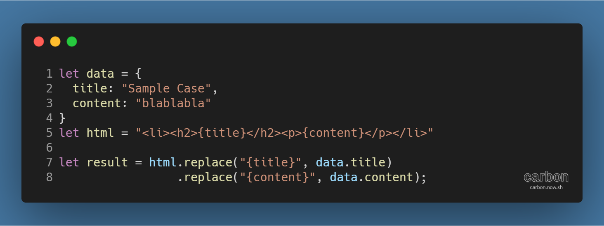
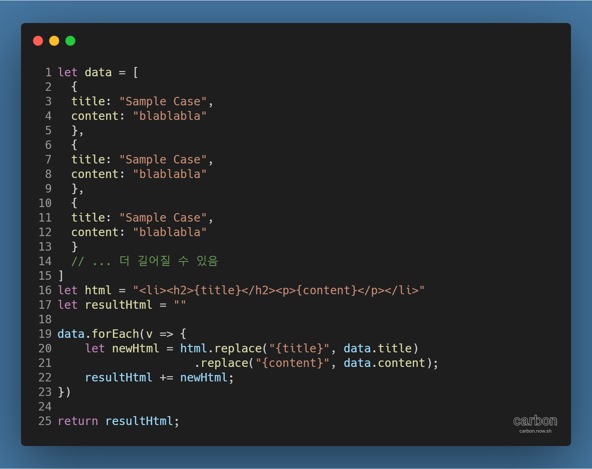
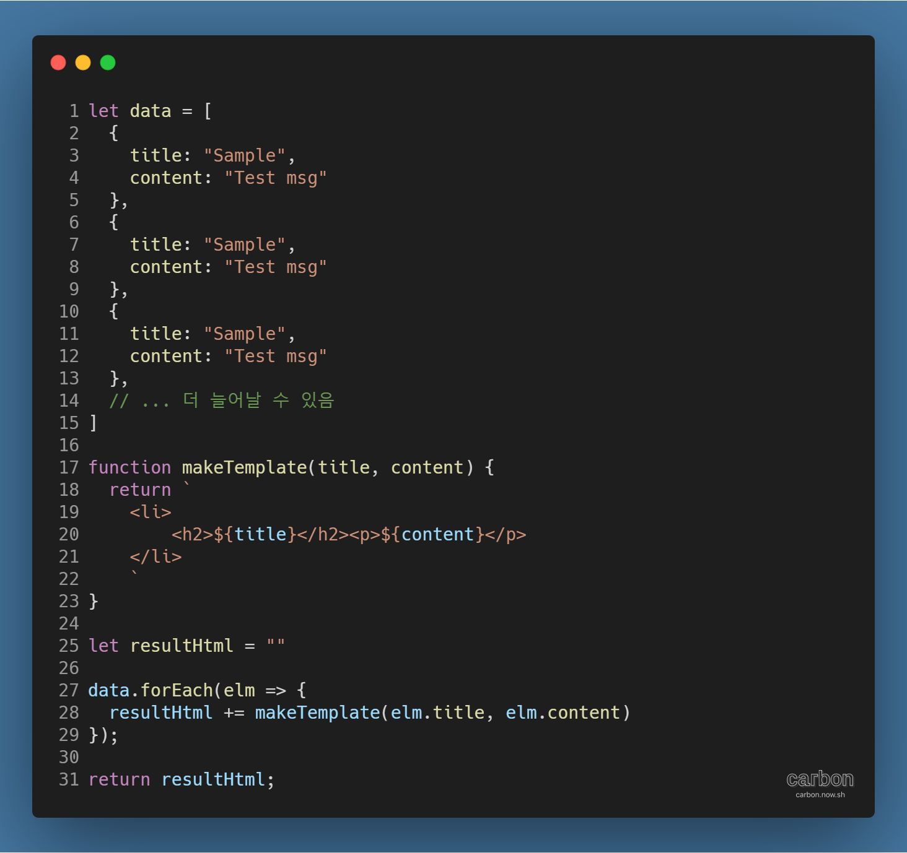

강의: [\[edwith 부스트코스\] 웹 프로그래밍](https://www.edwith.org/boostcourse-web/) 챕터 3, 웹 앱 개발: 예약서비스 1/4

학습일: 2020년 4월 13일

---

## 5\. WEB UI - FE

서비스 개발을 위한 디렉토리 구성

- JavaScript 파일 구성
  - JavaScript 코드의 내용이 간단하다면 파일 하나에 모두 표현하는 것도 괜찮으나,  
    그렇지 않다면 의미에 맞게 여러 파일로 구분하는 것이 좋음
    - 예시) 현업에서의 spec 폴더: 테스트 코드용 JavaScript 파일을 모아놓는 곳
  - 실제 서비스에서는 JavaScript 파일이 많아지면 HTTP 요청이 여러 차례 전송되므로 하나의 파일로 merge해서 배포함
    - Merge에 쓰이는 전용 도구가 있음
- HTML 안에 CSS, JavaScript 구성하기
  - CSS
    - 코드 내용이 간단하면 head > style 태그 안에 작성할 수도 있지만,  
      코드가 많아지면 별도의 .css 파일을 만들어 head > link 태그로 연결
  - JavaScript: 소스 파일 간 의존성을 고려해 body 태그 종료 전 배치
    - 코드 내용이 간단하면 script 태그 안에 작성할 수도 있지만,  
      코드가 많아지면 별도의 .js 파일을 만들어 script 태그로 연결
    - ! head 태그에 JavaScript 코드를 넣으면 의도대로 동작하지 않는 이유
      - 웹 브라우저는 코드를 한 줄씩 파싱하며 실행하는데, DOM을 찾지 못하므로 오류가 발생함
  - CSS, JavaScript의 내용이 짧다면 분리하는 것보다 HTML과 함께 작성하는 것이 성능을 개선시킬 수도 있음
    - 웹 브라우저가 별도의 파일을 받아오는 시간보다 HTML 내 라인을 해석하는 것이 더 빠를 수도 있기 때문

DOMContentLoaded 이벤트

- DOM tree가 그려지기 전 JavaScript로 조작하려고 하면 의도대로 작동하지 않음
  - DOM tree가 완성되는 시점 이후 JavaScript가 동작하도록 코드를 작성해 정확성을 높이는 방법을 많이 씀
- DOMContentLoaded 이벤트와 load 이벤트의 차이점
  - 개발자도구의 Network 탭 하단에서 두 이벤트의 소요시간을 확인할 수 있음
  - DOMContentLoaded: DOM tree 분석이 종료된 것을 알려주는 이벤트
    - DOM tree가 만들어진 이후에 DOM APIs를 활용할 수 있음
    - DOMContentLoaded 이벤트 이후 JavaScript 코드가 동작하도록 하는 것이 빠르면서도 정확도가 높음
  - load: 웹페이지의 모든 자원을 받은 뒤 브라우저의 렌더링까지 완료되었음을 알려주는 이벤트
    - 이미지 등 로드되는 자원의 속성이 사용되는 경우,  
      load 이벤트 이후 JavaScript 코드가 동작하도록 하는 것이 안정적
- 예시 코드
  - 
- 참고자료: [Difference between DOMContentLoaded and load events - Stack Overflow](https://stackoverflow.com/questions/2414750/difference-between-domcontentloaded-and-load-events)

Event Delegation

- 웹페이지 내 이벤트에 연동되어야 하는 요소가 여럿일 때, 이벤트 리스너를 등록하는 방법
  - 요소 각각에 addEventListener 반복문 실행
    - 요소가 많아질수록 브라우저가 기억해야 하는 이벤트 리스너의 갯수가 많아져 비효율적  
      (= 기억하는 데 필요한 메모리를 많이 요구함)
    - 요소가 동적으로 추가될 경우 해당 요소에도 별도로 이벤트 리스너를 등록해줘야 함
  - Event Delegation 활용: 이벤트가 발생한 요소 외, 상/하위요소에도 이벤트를 위임하는 방식
    - Event Bubbling
      - 이벤트가 발생한 지점이 하위 요소이더라도, 상위 요소의 이벤트 리스너까지 실행
      - 예시)  
        HTML 구조가 main > section > div 이고 각각에 이벤트 리스너를 등록한 경우,  
        div에서 이벤트가 발생하면 하위 요소 → 상위 요소 순으로 이루어져, 3개의 이벤트 리스너가 실행됨
      - 요소의 target과 currentTarget으로 확인
    - Event Capturing
      - Event Bubbling과 유사하나, 이벤트 리스너의 실행 순서가 Event Bubbling의 역순
      - 실행 방법: addEventListener( ) 메서드의 3번째 인자에 true 입력
    - Event Bubbling과 Event Capturing의 실행 순서
      - 
    - 이벤트의 target 속성과 currentTarget 속성 활용
      - target: 이벤트가 직접적으로 발생한 요소를 나타냄
      - currentTarget: 이벤트 리스너가 실행된 요소를 나타냄
- 참고자료
  - [HTML and Wijmo Events: Capturing, Bubbling, and Listeners](https://www.grapecity.com/blogs/html-and-wijmo-events/)
  - [버블링과 캡처링](https://ko.javascript.info/bubbling-and-capturing)

HTML Templating

- HTML의 구조를 템플릿(Template)으로 만들어놓고, 서버에서 받은 데이터를 결합해 화면에 추가하는 작업
  - 서버에서 받는 데이터가 비슷한 형태의 반복적인 구조를 갖는 경우
    - 데이터는 주로 JSON 형식을 가짐
  - 클라이언트와, 백엔드에서 모두 사용 가능
    - 클라이언트는 받은 데이터를 직접 HTML에 결합해 렌더링함
    - 백엔드에서는 데이터를 조회한 다음 동적으로 데이터를 만들어 클라이언트에 보냄
- HTML Templating 예시 코드
  - 
  - 템플릿은 일종의 양식이므로, JSON 데이터의 값이 템플릿의 양식과 결합되어 HTML 문자열이 반환됨
  - HTML 템플릿의 JSON 데이터로 조작하는 방식이라고 볼 수 있음
- 실행 방법
  - 문자열 치환
    - .replace( ) 메서드: 템플릿의 해당 문자열을 받은 데이터의 해당 값으로 변환
    - 예시 코드
      - 
  - 문자열 치환 반복문 실행 및 결합
    - 배열 형태의 데이터에 활용 가능
    - .replace( ) 메서드를 반복문으로 사용한 뒤, 하나의 HTML 문자열로 결합
    - 예시 코드
      - 
- 참고자료: [JavaScript Templating Without a Library](https://jonsuh.com/blog/javascript-templating-without-a-library/)

HTML Templating 실습

- HTML 템플릿을 JavaScript 코드 안에 보관하는 것은 권장되지 않음
  - JavaScript 코드는 데이터 로직을 처리하는데, HTML 템플릿이 중간에 들어 있으면 가독성을 해치기 때문
- HTML 템플릿을 보관하는 다른 방법들
  1.  서버에서 별도의 파일에 보관하다가 AJAX로 요청해서 받아오는 방법
  2.  HTML의 script 태그 안에 숨겨놓는 방법
      - HTML의 script 태그는 type 값이 javascript가 아니라면 렌더링하지 않고 무시하는 성질을 이용
      - 해당 script 태그에 id 속성을 설정한 뒤 DOM API로 innerHTML을 가져오는 방식
  3.  기타 Template 라이브러리
      - 예시) [pug](https://pugjs.org/api/getting-started.html)
- **※ ES6의 기능인 Template Literal을 활용하면 .replace( ) 메서드를 이용하지 않고도 템플릿의 내용을 바꿀 수 있음**
  - 예시 코드
    - 

