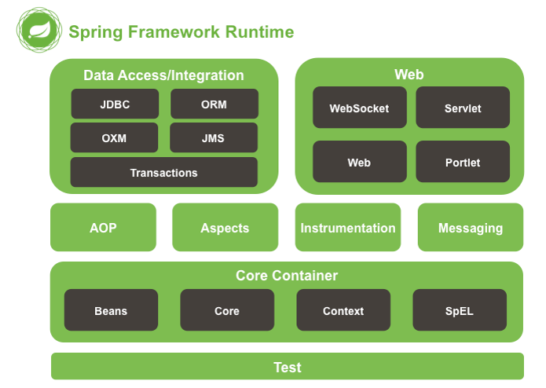
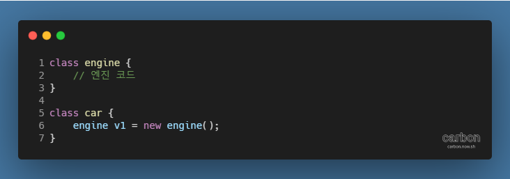
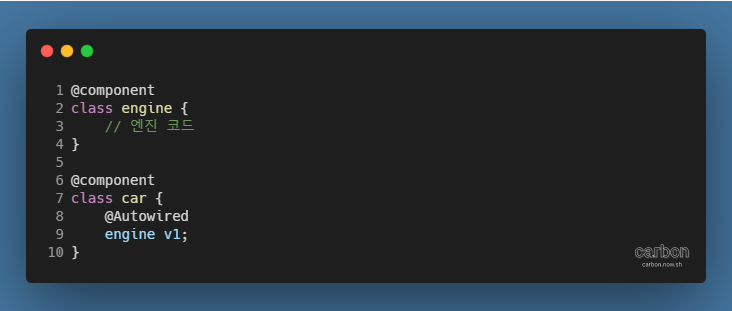

강의: [\[edwith 부스트코스\] 웹 프로그래밍](https://www.edwith.org/boostcourse-web/) 챕터 3, 웹 앱 개발: 예약서비스 1/4

학습일: 2020년 4월 14일

---

## 7\. Spring Core - BE

Spring이란?

- Framework란?
  - 일종의 반(半)제품
  - 이미 어느 정도의 기본 뼈대가 구성되어 있는 제품에, 사용자가 추가적으로 살을 덧붙여 제품을 완성할 수 있음
    - 사용자가 뼈대까지 모두 만들려면 시간과 능력이 필요하므로, 프레임워크를 써서 보다 쉽게 만들 수 있음
- Spring Framework의 특징
  - 엔터프라이즈급의 대규모 어플리케이션을 구축할 수 있는 가벼운 솔루션
  - One-Stop-Shop: 모든 과정을 한꺼번에 해결할 수 있는 서비스
  - 원하는 부분만 가져다 사용할 수 있도록 모듈화가 잘 되어 있음
    - 예시) LEGO 블록
  - IoC 컨테이너
  - 선언적으로 transaction을 관리할 수 있음
  - 완전한 기능의 MVC Framework를 제공
  - AOP 지원
  - 도메인 논리 코드와 쉽게 분리될 수 있는 구조
- Spring Framework 모듈
  - 
  - 약 20개의 모듈로 구성되어 있으며, 필요한 모듈만 가져와 사용할 수 있음
- AOP와 Instrumentation
  - spring-AOP: AOP Alliance와 호환되는 방법으로 AOP를 지원
  - spring-aspects: AspectJ와의 통합을 지원
  - spring-instrument: instrumentation을 지원하는 클래스와 특정 WAS에서 사용하는 클래스로더 구현체를 제공
    - **※ BCI (Byte Code Instrumentations): 런타임이나 로드 때 클래스의 바이트 코드를 변경하는 방법**
  - **! 부스트코스에선 다루지 않으나, Spring 개발에서 유용한 기능이므로 추후 개인적으로 공부하는 것을 권장**
- 메시징 (Messaging)
  - spring-messaging
    - 메시지 기반 어플리케이션을 작성할 수 있는 Message, MessageChannel, MessageHandler 등을 제공
    - 메서드에 메시지를 mapping하기 위한 annotation이 포함되어 있음
      - Spring MVC annotation과 유사
  - **! 부스트코스에선 다루지 않음**
- 데이터 액세스 (Data Access) / 통합 (Integration)
  - JDBC, ORM, OXM, JMS 및 Transaction 모듈로 구성됨
    - spring-jdbc: JDBC 프로그래밍을 쉽게 할 수 있는 기능 제공
      - 데이터베이스에 데이터를 추가, 수정, 삭제
    - spring-tx: 선언적으로 transaction을 관리할 수 있는 기능 제공
    - spring-orm: JPA, JDO 및 Hibernate를 포함한 ORM API 통합 레이어를 제공
    - spring-oxm: JAXB, Castor, XMLBeans, JiBX 및 XStream 등의 Object/XML mapping을 지원
    - spring-jms: 메시지를 생성(producing)하고 사용(consuming)하는 기능을 제공
      - Spring Framework 4.1부터 spring-messaging 모듈과의 통합을 제공함
- 웹 (Web)
  - Web, WebMVC, WebSocket, webMVC Portlet 모듈로 구성됨
    - spring-web
      - Multi-part 파일 업로드, Servlet 리스너 등 웹 지향 통합 기능을 제공
      - Http 클라이언트와 Spring의 원격 지원을 위한 웹 관련 부분 제공
    - spring-webmvc: Spring MVC 및 REST 웹 서비스 구현을 포함하며, web-servlet 모듈로도 불림
    - spring-websocket: 웹 소켓을 지원
    - spring-webmvc-portlet: Portlet 환경에서 사용할 MVC 구현을 제공
- **※ Framework와 Library의 차이**
  - Framework: 완제품의 뼈대가 되는 반제품
  - Library: 완제품을 만들기 위한 작업 도구

Spring IoC/DI 컨테이너

- 컨테이너(Container)란?
  - 인스턴스의 life cycle을 관리하고 생성된 인스턴스에 추가적인 기능을 제공하는 프로그램
  - 예시) Servlet을 실행할 때 쓰이는 WAS의 Servlet 컨테이너
    - Servlet 클래스는 개발자가 만들지만, 실제 메모리에 올리고 실행하는 것은 WAS의 Servlet 컨테이너
- IoC (Inversion of Control, 제어의 역전)
  - 어플리케이션 코드를 작성하는 경우, 일반적으로 개발자가 작성한 코드가 프로그램의 흐름을 제어하게 되나,  
    프레임워크 기반 개발에서는 프레임워크가 흐름을 제어하며, 필요할 때만 어플리케이션 코드를 호출하여 사용
  - 프레임워크의 '컨테이너'가 흐름에 대한 제어권을 가지게 됨
    - 컨테이너가 넘어감에 따라 객체 생성부터 life cycle 관리까지 담당
    - 객체에 대한 제어권이 개발자로부터 컨테이너에게 넘어가면서, 일반적인 흐름이 바뀌었다고 IoC라고 함
  - 참고자료: [Spring - IoC & DI - 92Hz](https://jongmin92.github.io/2018/02/11/Spring/spring-ioc-di/)
- DI (Dependency Injection, 의존성 주입)
  - 클래스 사이의 의존 관계를 Bean 설정 정보를 바탕으로 컨테이너가 자동으로 연결해주는 것
    - 공장이 만든 인스턴스 객체를 어플리케이션에서 사용하기 위해 가져오는 방법 중 하나
  - 예시 코드)
    - DI가 적용되지 않은 경우
      - 
      - 자동차 인스턴스에서 엔진 인스턴스를 생성 후 사용
        - 개발자가 인스턴스를 직접 생성
    - DI가 적용된 경우
      - 
      - 자동차 인스턴스가 엔진 인스턴스를 사용하고, 이에 기반해 IoC 컨테이너가 엔진 인스턴스를 주입
        - engine 타입의 변수 v1에 인스턴스가 할당되지 않았으므로, 컨테이너가 v1에 인스턴스를 할당
- Spring에서 제공하는 IoC/DI 컨테이너
  - BeanFactory
    - 기본적인 IoC/DI 기능만을 제공
  - ApplicationContext
    - BeanFactory의 모든 기능을 포함하므로, 일반적으로 BeanFactory보다 많이 쓰임
    - Transaction, AOP 등을 처리할 수 있음
    - BeanPostProcessor , BeanFactoryPostProcessor 등을 자동으로 등록할 수 있음
      - BeanPostProcessor:  
        개발자의 의도대로 인스턴스화와 의존성 처리 로직을 구현하도록 컨테이너 기본 로직을 Override함
      - BeanFactoryPostProcessor: 설정, metadata 등을 커스터마이징할 수 있게 해줌
    - 국제화 처리, 어플리케이션 이벤트 등을 처리할 수 있음

#Java #Spring #IOC #di #Framework #웹 프로그래밍 #내용 정리 #edwith #부스트코스
