강의: [\[edwith 부스트코스\] 웹 프로그래밍](https://www.edwith.org/boostcourse-web/) 챕터 3, 웹 앱 개발: 예약서비스 1/4

학습일: 2020년 4월 14일

---

## 7\. Spring Core - BE

XML 파일을 이용한 설정

- Maven Project 생성
  - File > New > Maven Project
  - Maven Project 설정
    - Archetype: maven-archetype-quickstart 선택
    - Group Id (회사명): kr.or.connet 입력
      - 일반적으로 소속된 회사 도메인을 역순으로 작성함
    - Artifact Id (프로젝트명): diexam01 입력
      - Group Id.Artifact Id 형태인 패키지 이름의 일부로 사용됨
- pom.xml 수정
  1.  JDK 1.8 사용을 위해 plugin 추가 (참고: [Maven (Back End)](https://til-devsong.tistory.com/17?category=772389) 프로젝트 설정)
  2.  프로젝트 우클릭 > Maven > Update Project 로 수정사항 반영
  3.  프로젝트 우클릭 > Properties > Java Compiler 에서 변경되었는지 확인
- DI 테스트
  - DI: 원하는 객체를 내가 아닌 Spring이 만들어 내 어플리케이션에 주입하는 과정
    - 자동으로 만들어질 객체인 bean이 필요함
      - bean은 시각적인 Component를 지칭하는 말이었으나, 현재는 일반적인 Java Class를 지칭하게 됨
      - bean의 특징
        - 기본 생성자를 가짐
        - 필드 선언 방식은 private
        - getter, setter 메서드를 가짐
          - get...(), set...() 메서드를 ... property(프로퍼티)라고 함
          - **! 용어 중요함**
    - bean을 만들 때 위의 특징에 맞춰야 하는 이유
      - bean의 생성을 사용자가 아닌 프레임워크가 하기 때문
      - 사용자가 직접 하는 것이 아니라 누군가가 대신 할 때는 그 규칙에 맞춰야 함
    - **! 사용자가 직접 new 연산자로 생성하는 객체는 bean이라고 부르지 않음**
  - Bean Class 생성
    - 공장에서 생산할 제품의 규격이라고 볼 수 있음 
    - 프로젝트 > src/main/java > 패키지 우클릭 > New > Class
    - Class Name에 UserBean 입력
    - 코드
      - 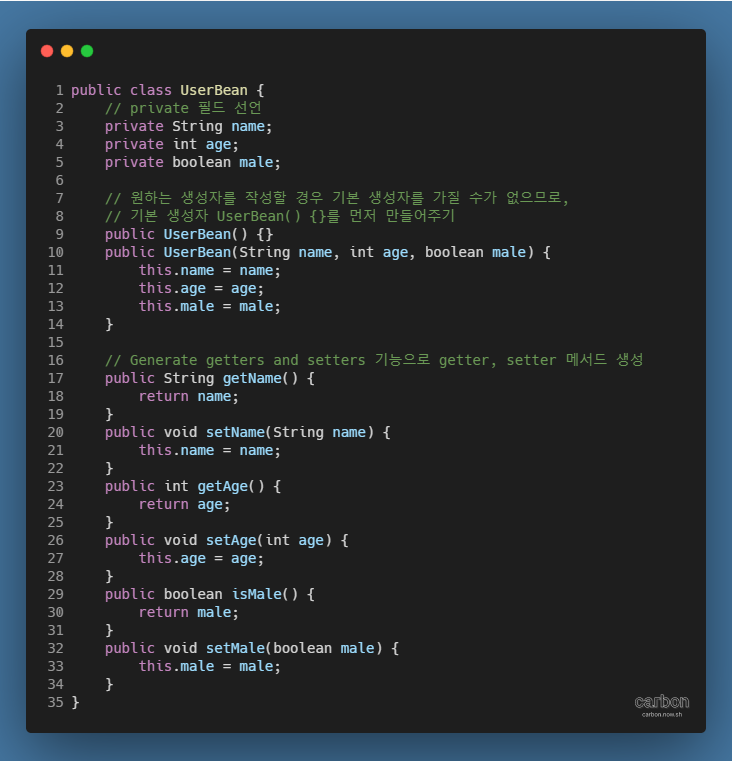
  - Spring 라이브러리 불러오기
    - 일종의 공장 역할을 하게 됨
    - pom.xml 수정
      1.  properties에 변수로 쓰일 Spring 버전 추가
          - 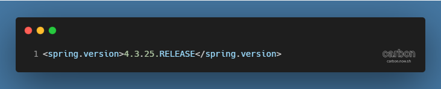
          - 버전 업데이트는 [Maven Repository](https://mvnrepository.com/artifact/org.springframework/spring-context)에서 확인
      2.  dependency에 Spring 라이브러리 추가
          - 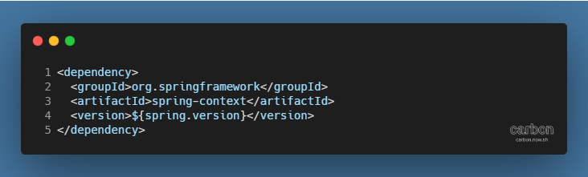
          - ${ }를 사용해 Spring 버전을 상수화시키는 이유
            - Spring 라이브러리들이 여럿일 때, 한 번에 모든 라이브러리의 버전을 바꿀 수 있음
          - spring-context를 추가하면 spring-aop, spring-beans, spring-core 등 연관 라이브러리도 추가됨
            - spring-context가 정상 작동하기 위한 관련 라이브러리도 자동으로 불러오기 때문
  - Spring에 전달할 정보를 보관할 폴더 resources 생성
    - 프로젝트 > src > main 우클릭 > New > Folder  
      → Folder name에 resources 입력
  - Spring에 전달할 정보를 담은 파일 applicationContext.xml 생성
    - Spring 설정 파일의 역할을 함
    - 프로젝트 > src > main > resources 우클릭 > New > File  
      → File name에 applicationContext.xml 입력
  - applicationContext.xml 수정
    - 초기 코드 입력
      - 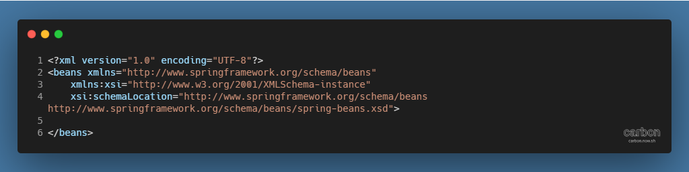
      - XML 파일은 반드시 XML 버전과 인코딩 방식에 대한 정보를 포함해야 함
      - XML 파일로 Spring 설정 파일을 만들 경우, Root (가장 바깥쪽) 요소는 반드시 beans여야 함
      - XML Schema에 대한 설정이 되어 있어야 함
    - Spring 컨테이너에 정보 전달
      - 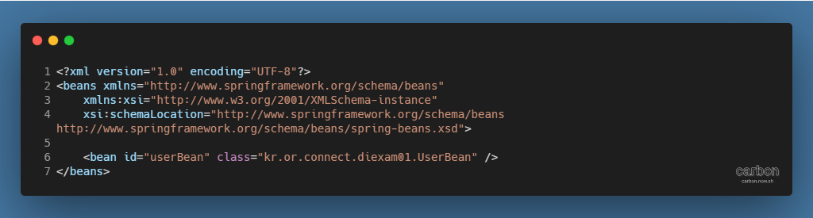
      - bean 요소(Java의 일반적 Class)에 속성값을 부여해서 만들고 싶은 클래스에 대한 정보를 명시
      - bean 요소에서 명시된 class 속성은 Spring에서 일반적인 인스턴스 생성으로 바뀌어 동작함
        - kr.or.connect.diexam01.UserBean userBean = new kr.or.connect.diexam01.UserBean();
      - **※ Spring 컨테이너는 이렇게 생성된 객체를 단 하나만 갖고 있는데, 이를 싱글턴 패턴이라고 함**
  - applicationContext.xml을 읽어들이는 객체 생성
    - 프로그램을 시작시키는 시작점의 역할 
    - 프로젝트 > src/main/java > kr.or.connect.diexam01 우클릭 > New > Class  
      → Class Name에 ApplicationContextExam01 입력
    - 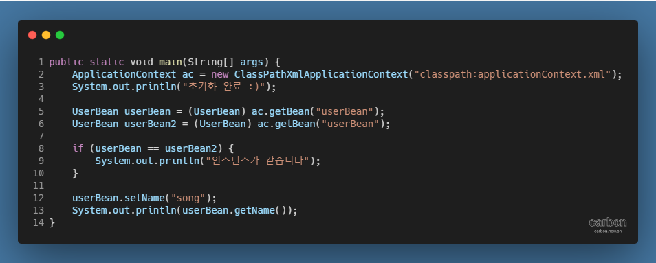
    - ApplicationContext(공장)를 불러와 만들 객체에 대한 정보를 담은 applicationContext.xml의 경로 입력
    - UserBean은 생성할 필요 없이 바로 선언한 뒤 getBean( ) 메서드로 데이터를 요청
    - ApplicationContext는 입력받은 경로에서 id가 getBean( ) 메서드의 인자로 받은 값과 같은 bean을 탐색
      - 해당되는 bean이 있다면 class를 확인하고 생성해서 반환
    - getter 메서드는 항상 객체 타입으로 반환하므로, 필요 시 UserBean으로 타입 변환해줘야 함
  - 전달받은 UserBean 데이터 활용
    - setter, getter 메서드를 사용할 수 있음
    - getBean( ) 메서드를 여러 번 요청하더라도 서로 다른 bean이 아닌, 하나의 bean을 계속 반환함
      - **※ 싱글턴 패턴 (Singleton Pattern)**
  - **※ src > main > resources는 소스 폴더로, 그 안에서 생성된 XML 파일은 자동으로 classpath로 지정됨**
    - java 디렉토리에서 만들어진 class와 같이, bean 디렉토리에 생성되므로,  
      ClassPathXmlApplicationContext( ) 메서드로 읽어들여 사용할 수 있음
      - 인스턴스가 생성될 때 설정 파일 내 선언된 bean의 정보를 다 읽어들인 뒤,  
        bean에 명시된 객체들을 전부 생성해 메모리에 올림
      - 이 때 문제가 발생하면 어플리케이션이 종료됨
  - **※ 싱글턴 패턴의 특징**
    - Spring에서 bean을 생성할 때 메모리에 하나만 생성함
    - 싱글턴 객체를 여럿이 동시에 사용할 경우, 데이터가 원치 않은 방향으로 변조될 수 있음
      - XML 파일의 bean 태그에 scope 속성을 줘서 데이터의 변조를 예방할 수 있음
      - scope 속성을 명시하지 않으면 싱글턴 타입으로 지정되고,  
        prototype으로 지정하면 해당 객체를 요청할 때마다 새로운 객체를 생성해 반환함
      - 참고자료: [\[Spring\] Spring Bean의 개념과 Bean Scope 종류](https://gmlwjd9405.github.io/2018/11/10/spring-beans.html)
- DI 확인하기
  - 테스트 클래스 생성
    - Engine 클래스 생성
      - 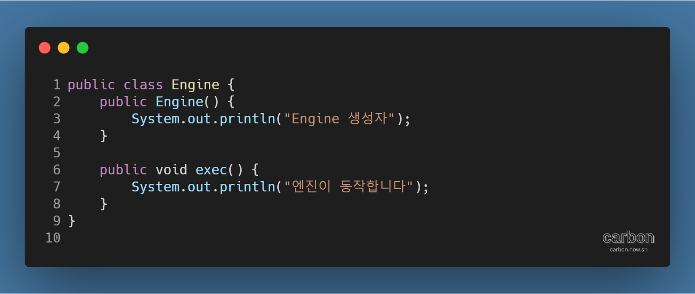
    - Car 클래스 생성
      - 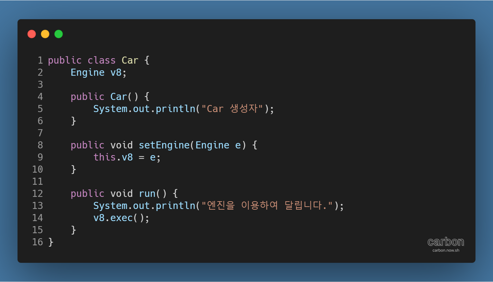
  - XML 설정 파일 수정
    - Spring 컨테이너에 생성할 객체 정보를 bean에 담아 전달
    - 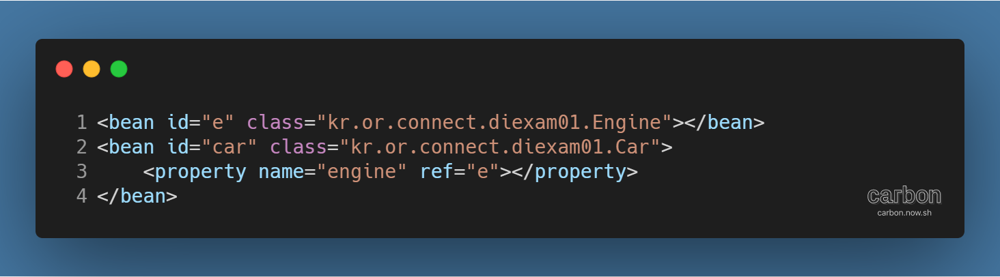
      - bean의 id는 객체의 값으로, class는 패키지 이름으로 입력
      - 다른 클래스에서 상속된 객체를 사용할 경우,  
        property 태그를 사용해 name 속성에 객체의 타입을, ref 속성에 객체의 id를 입력
    - **※ 개발자가 직접 객체를 생성할 경우, 다음의 코드를 main 함수에 입력해줘야 함**
      - 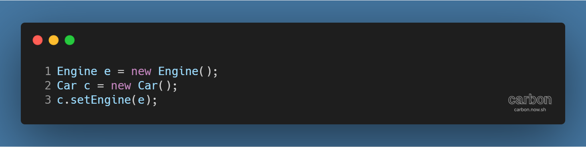
  - 수정된 XML 파일 내용에 따라 실행될 클래스 생성
    - 클래스명: ApplicationContextExam02
    - 코드 예시
      - 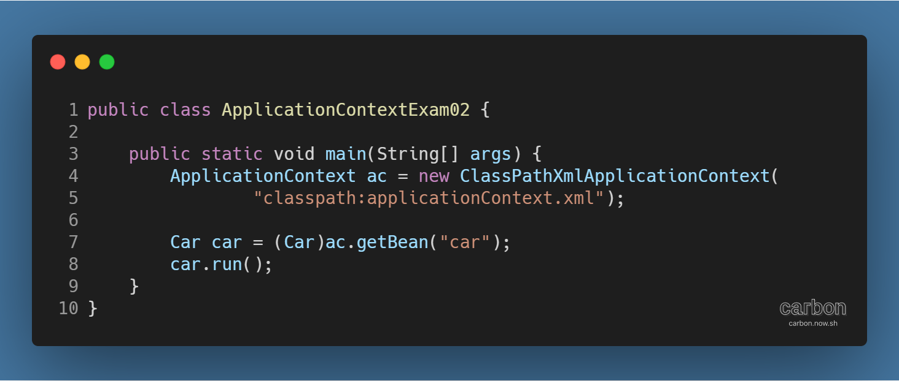
      - ApplicationContext 객체로 지정된 경로에 있는 XML 파일의 설정을 불러옴
      - id가 car인 Bean에서 반환된 객체를 실행
        - engine 클래스를 별도로 호출할 필요가 없음

