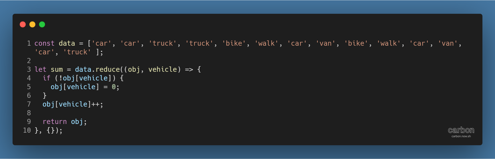
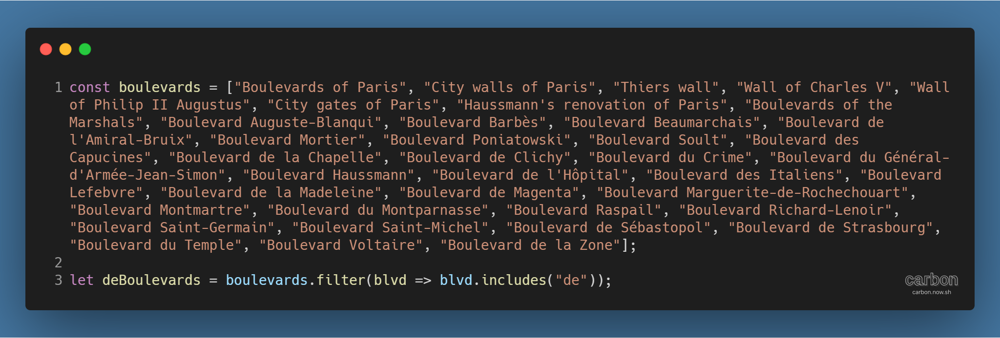

튜토리얼 출처: [JavaScript30](https://javascript30.com/)

튜토리얼 이름: Day 04 - Array Cardio 1

튜토리얼 분류: JavaScript

튜토리얼 설명: JavaScript 배열 조작 메서드 연습하기

진행기간: 2020년 4월 15일

---

배열 내 원소가 중복해서 등장하는 횟수 구하기

- reduce( ) 메서드의 초기값으로 객체 입력
  - 2번째 인자로 초기값을 입력
  - 형태: 배열.reduce( callback, 초기값 ); 
- 반복마다 객체\[key\] 조작 후 반환
- 예시 코드
  - 

배열에서 특정 문자열을 포함하는 원소만 추출하기

- filter( ) 메서드의 조건식으로 includes( ) 메서드를 입력
- 예시 코드
  - 

---

[GitHub 저장소 링크](https://github.com/dev-song/_home/tree/master/projects/JavaScript30/Day%2004/tutorial-Array-Cardio-1)

