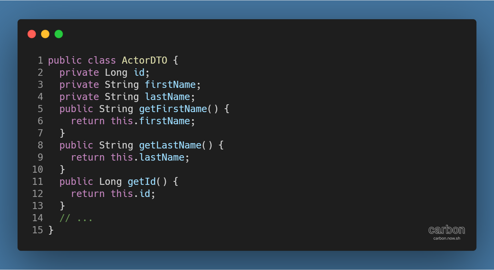
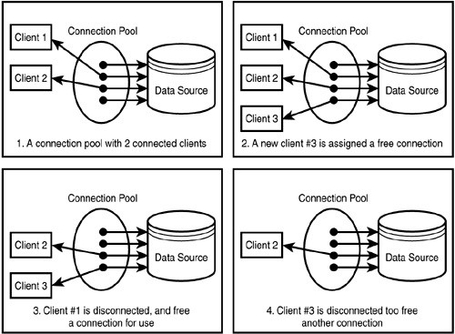
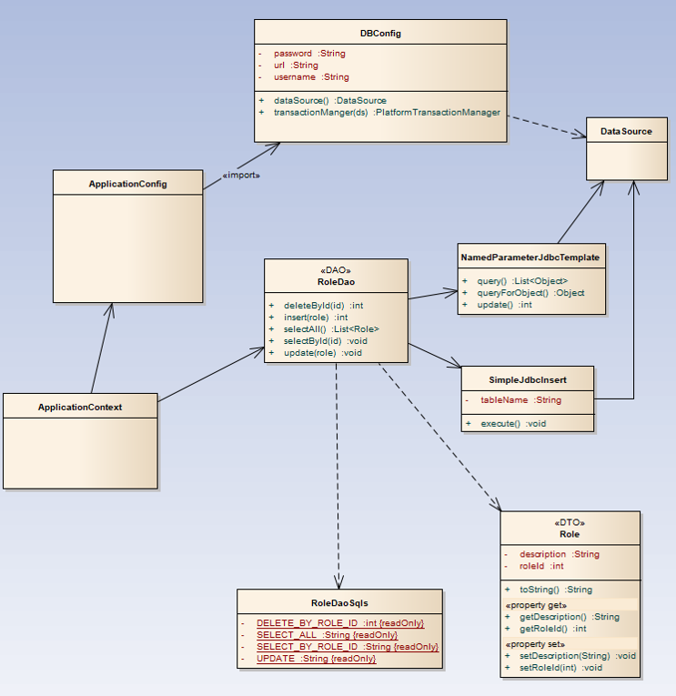
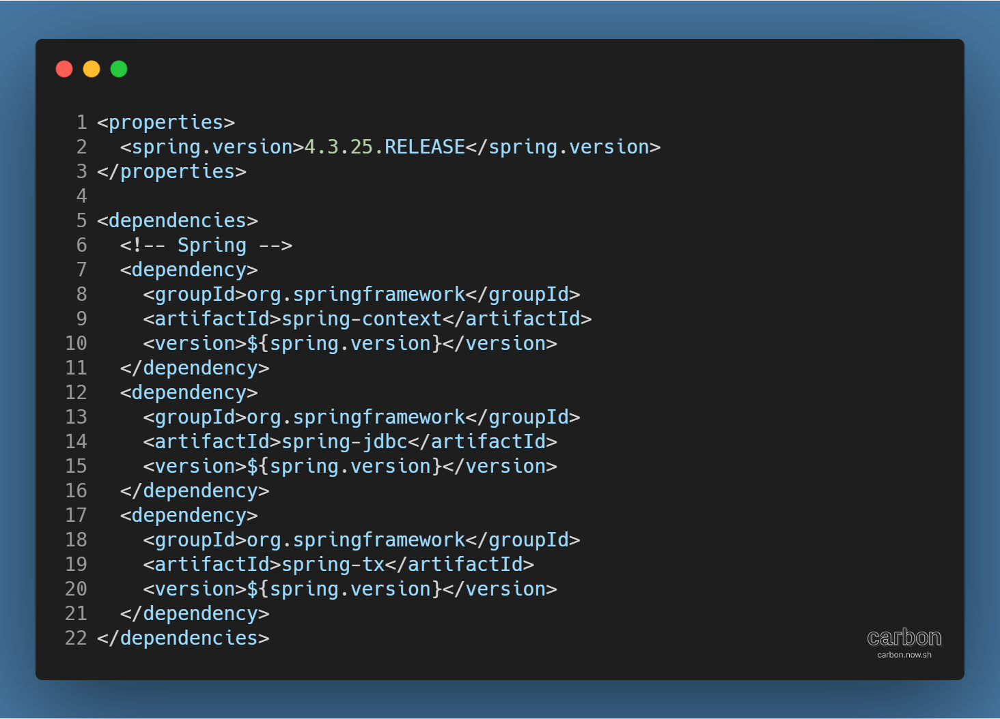
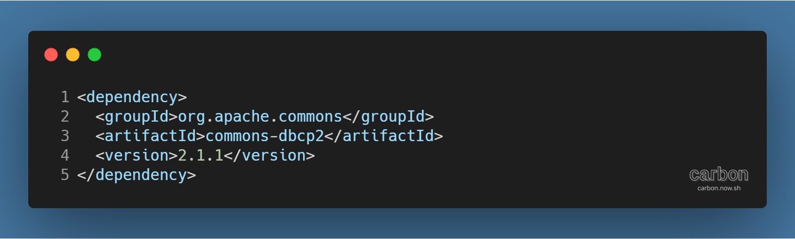
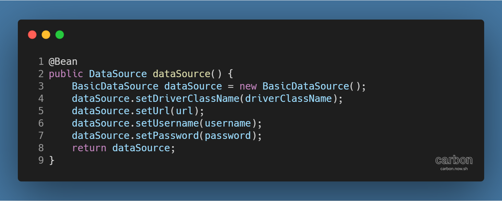
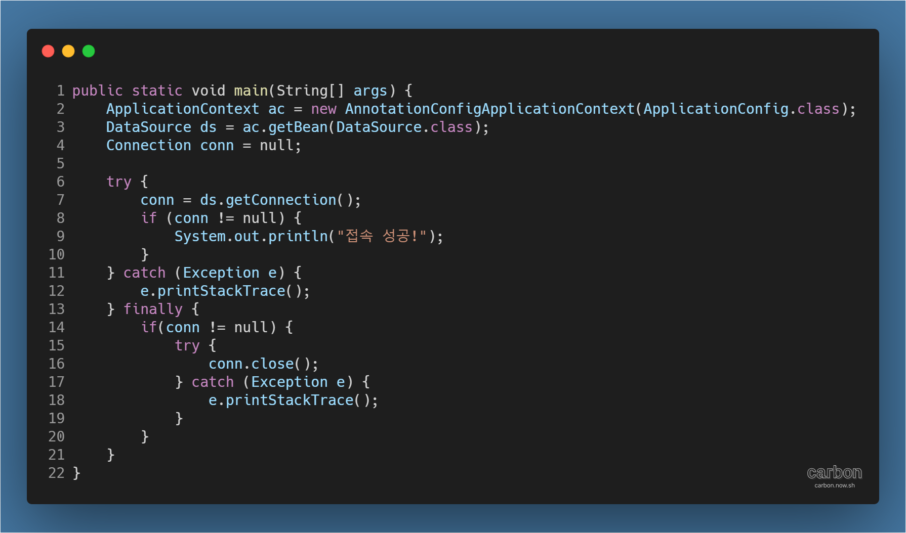

강의: [\[edwith 부스트코스\] 웹 프로그래밍](https://www.edwith.org/boostcourse-web/) 챕터 3, 웹 앱 개발: 예약서비스 1/4

학습일: 2020년 4월 17일

---

## 8\. Spring JDBC - BE

Spring JDBC 실습에 필요한 기본 개념

- DTO (Data Transfer Object)
  - 계층간 데이터 교환을 위한 Java Bean
    - 계층: Controller View, Business 계층, Persistence 계층
    - 데이터를 개별적으로 움직이려면 번거롭기 때문에 하나로 묶어 한꺼번에 움직이는 개념
  - 특징
    - 일반적인 DTO는 순수한 데이터 객체로, 별도의 로직을 갖지 않음
    - 필드와 getter, setter 메서드를 가짐
    - toString( ), equals( ), hashCode( ) 등의 Object 메서드를 추가적으로 Override할 수 있음
  - 예시 코드
    - 
- DAO (Data Access Object)
  - 데이터를 조회하거나 조작하는 기능을 전담하도록 만든 객체
  - 일반적으로 데이터베이스 조작을 전담하는 것이 목적임
  - **※ 객체 지향 프로그래밍: 어떤 객체가 한 가지 작업을 제대로 하게 하는 것을 목적으로 함**
- ConnectionPool
  - DB 연결은 시간이 많이 걸리거나 자원을 많이 소모함 (비용이 많이 발생함)
  - ConnectionPool의 작동 방식
    - 
    - DBMS와 여러 Connection을 미리 맺어 놓음
    - Connection이 필요한 경우 ConnectionPool에게 빌려서 사용하고 반납
      - **! 반납하지 않으면 ConnectionPool의 여분 Connection이 없어져서 프로그램이 느려지거나,**  
        **장애를 발생시킬 수 있음**
- DataSource
  - ConnectionPool을 관리하기 위해 사용되는 객체
  - Connection을 얻어오고 반납하는 등의 작업을 수행
    - close( ) 메서드가 반납을 위한 메서드

Spring JDBC 구조

- 
  - ApplicationContext: Spring 컨테이너
  - ApplicationConfig: ApplicationContext가 읽어들이는 Spring 설정 클래스
    - @ComponentScan이 DAO 클래스를 찾도록 설정
    - @ComponentScan이 찾은 모든 DAO 클래스는 Spring 컨테이너가 관리
  - DBConfig: ApplicationContext가 import하는 DB 설정 클래스
    - DataSource와 transactionManager 객체를 생성
  - RoleDao
    - 필드로 NamedParameterJdbcTemplate과 SimpleJdbcInsert의 두 객체를 가짐
    - 두 객체는 Spring JDBC가 제공하는 SQL 실행을 쉽게 하도록 도와주는 객체로,  
      DB 연결을 위해 내부적으로 DataSource를 필요로 함
    - RoleDao 생성자로 초기화된 두 객체를 이용해 RoleDao의 메서드를 구현함
  - RoleDaoSql: SQL을 따로 상수로 정의해놓는클래스
    - SQL을 변경할 경우 편하게 접근할 수 있음
  - RoleDto: 한 건의 Role 정보를 저장하고 전달하기 위한 클래스

Spring JDBC를 이용한 접속 구현

- Maven Project 생성
  - File > New > Maven Project
  - Maven Project 설정
    - Archetype: maven-archetype-quickstart 선택
    - Group Id (회사명): kr.or.connect 입력
    - Artifact Id (프로젝트명): daoexam 입력
- pom.xml 수정
  - JDK 1.8 사용을 위해 plugin 추가 (참고: [Maven (Back End)](https://til-devsong.tistory.com/48?category=772389) 프로젝트 설정)
  - Spring Context 라이브러리 추가 (참고: [Spring Core (Back End) ... Part 2](https://til-devsong.tistory.com/48) Spring 라이브러리 불러오기)
    - 
    - Spring JDBC, Spring Tx 라이브러리도 추가
  - MySQL 드라이버 라이브러리 추가 (참고: [JDBC (Back End) ... Part 1](https://til-devsong.tistory.com/21?category=772389) 환경설정)
  - DataSource 라이브러리 추가
    - 
  - 프로젝트 우클릭 \> Maven > Update Project 로 수정사항 반영
  - 프로젝트 우클릭 > Properties > Java Compiler 에서 변경되었는지 확인
- Spring JDBC를 구성하는 클래스 파일 생성
  - ApplicationConfig 클래스 생성
    1.  Spring 설정 클래스 파일만 모아놓을 패키지 생성
        - 패키지명: kr.or.connect.daoexam.config
    2.  ApplicationConfig 클래스 생성
    3.  클래스 위 @Configuration 입력 (참고: [Spring Core (Back End) ... Part 3](https://til-devsong.tistory.com/50?category=772389) Java Config 클래스 수정)
    4.  클래스 위 @Import({DBConfig.class}) 입력
        - 여러 개의 설정 파일을 종류별로 만들어 불러올 수 있음
  - DBConfig 클래스 생성
    1.  클래스 위 @EnableTransactionManagement 입력
        - Transaction 때문에 필요한 annotation
    2.  DB와 관련된 정보(드라이버, URL, 계정, 비밀번호)를 변수에 저장
    3.  @Bean으로 DataSource 객체 등록
        - 
        - DB 접속 정보를 얻어낼 때 필요한 DataSource 라이브러리를 불러오는 클래스
        - DataSource 객체는 Connection을 관리하므로 접속 정보를 setter 메서드로 입력
- DB 접속 테스트하기
  1.  본 프로그램 역할을 할 패키지 생성
      - 패키지명: kr.or.connect.daoexam.main
  2.  DataSourceTest 클래스 생성
  3.  main 메서드 생성
      - 
        - ApplicationContext(공장)에 만들 객체에 대한 정보를 담은 클래스의 경로를 입력
          - 실제 정보는 applicationConfig에서 import한 DBConfig에서 읽어들이게 됨
        - getBean( ) 메서드로 ApplicationContext에서 DataSource 객체를 얻어냄
        - Connection 객체를 선언한 뒤, DataSource를 통해 접속 시도
          - 정상적으로 작동할 경우
            - Connection 객체 반환
            - "접촉 성공!" 메시지 출력
            - close( ) 메서드로 Connection 객체 종료
              - 종료에 문제가 발생할 경우 예외 처리
          - 정상적으로 작동하지 않을 경우 예외 처리

#Java #Spring #Dao #DataSource #웹 프로그래밍 #dto #ConnectionPool #내용 정리 #edwith #부스트코스
