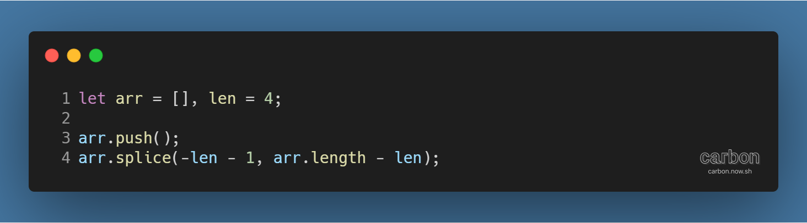

튜토리얼 출처: [JavaScript30](https://javascript30.com/)

튜토리얼 이름: Day 12 - Key Sequence Detection

튜토리얼 분류: JavaScript

튜토리얼 설명: 특정 키 조합에 반응하여 JavaScript 코드 동작시키기

진행기간: 2020년 4월 23일

* * *

배열에 원소를 추가하면서 전체 길이를 일정 길이 이하로 유지하기

*   예시 코드
    *   
    *   배열의 길이가 주어진 길이 len보다 작거나 같을 때
        *   배열의 길이 - len <= 0 이므로 배열의 원소는 사라지지 않음
    *   배열의 길이가 주어진 길이 len보다 클 때
        *   배열의 길이 - len >= 1이므로, -len - 1 index의 원소를 삭제
        *   음수 index는 끝으로부터의 순서이므로, -len - 1 은 항상 배열의 첫번째 원소를 가리키게 됨
        *   배열의 길이는 len으로 유지되면서, 가장 오래된 원소는 자동으로 제외됨

* * *

[Github 저장소 링크](https://github.com/dev-song/_home/tree/master/projects/JavaScript30/Day%2012/tutorial-Key-Sequence-Detection)

