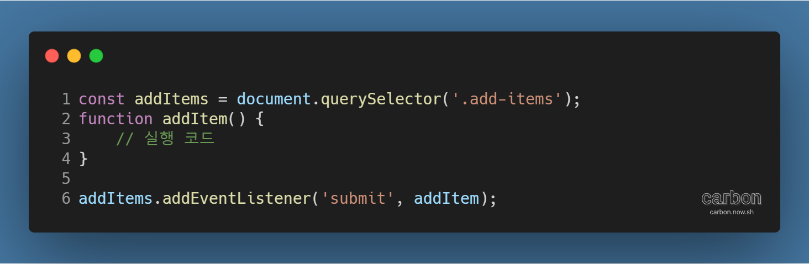
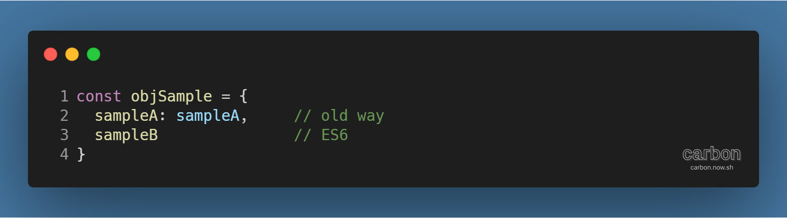
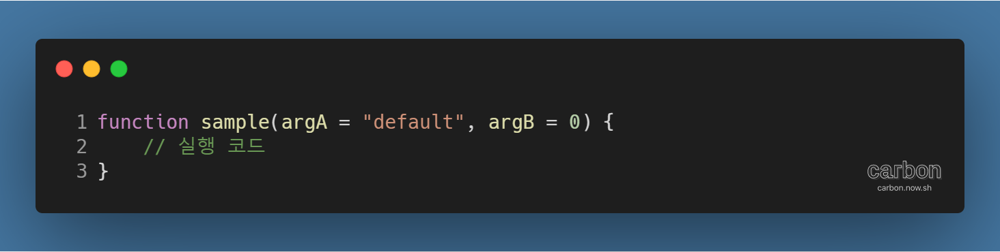
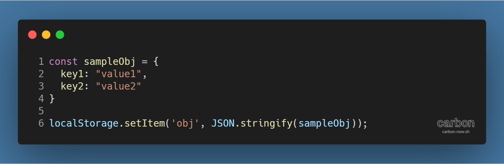
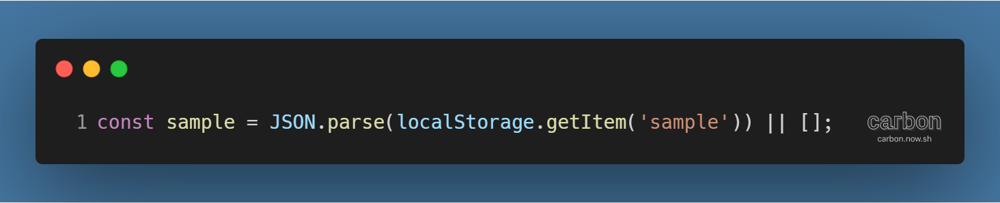

튜토리얼 출처: [JavaScript30](https://javascript30.com/)

튜토리얼 이름: Day 15 - LocalStorage and Event Delegation

튜토리얼 분류: JavaScript

튜토리얼 설명: localStorage로 값을 저장하고, 이벤트 위임을 활용해 동적으로 추가된 요소에 이벤트 연동시키기

진행기간: 2020년 4월 27일

---

HTML submit 타입 태그에 이벤트 설정하기

- 해당 태그에 click 이벤트를 연동하는 방식과, submit 이벤트를 연동하는 방식으로 나뉨
  - click 이벤트는 키보드 입력으로 발생하는 submit 이벤트에 반응하지 않는다는 한계가 있음
  - submit 이벤트를 통해 연결하는 것이 확실함
- 예시 코드
  - 
- 참고자료: [SubmitEvent - Web APIs | MDN](https://developer.mozilla.org/en-US/docs/Web/API/SubmitEvent)

특정 HTML 태그로 인한 웹페이지 새로고침 막기

- a 태그, 또는 submit 타입의 태그는 동작 시 페이지를 이동시키거나 데이터를 전송하고 페이지를 새로고침
- event.preventDefault( ) 메서드를 사용해 해당 페이지 동작을 취소할 수 있음
- 참고자료: [event.preventDefault() - Web API | MDN](https://developer.mozilla.org/ko/docs/Web/API/Event/preventDefault)

객체 내 데이터의 속성과 값이 같을 때의 간편 표기법

- 객체 내 데이터는 속성(key)과 값(value)의 쌍으로 구성됨
- 속성과 값이 같은 값을 가질 경우, 다음과 같이 간편하게 표기할 수 있음
- 예시 코드
  - 
    - sampleB의 값은 sampleB라는 변수에 저장된 값을 가짐
- **! ES6부터 지원되므로 호환성 이슈 확인 필요**

함수의 인자에 기본값 설정하기

- 함수 정의 시 '매개변수 = 값'의 형태로 인자의 기본값을 설정할 수 있음
- 예시 코드
  - 

Storage 객체를 활용해 페이지 새로고침과 상관없이 값 저장하기

- Web Storage API를 활용해 속성-값 데이터 쌍을 페이지 로딩에 영향받지 않도록 저장할 수 있음
- 속성과 값은 반드시 문자열 타입이므로, 객체를 저장하고 싶을 경우 먼저 문자열로 변환해줘야 함
  - JSON.stringify( ) 메서드 등
  - 저장된 객체를 나중에 꺼내서 쓸 경우 JSON.parse( ) 등으로 다시 객체로 변환해줘야 정상적으로 사용 가능
- 예시 코드
  - 
- 참고자료
  - [Web Storage API 사용하기 - Web API | MDN](https://developer.mozilla.org/ko/docs/Web/API/Web_Storage_API/Using_the_Web_Storage_API)
  - [JavaScript LocalStorage 사용 방법과 쿠키와의 차이점](https://ponyozzang.tistory.com/341)

변수의 기본값 설정하기

- 비교 연산자 || (or) 을 활용해 변수의 기본값을 설정할 수 있음
  - || 좌측의 연산을 먼저 수행하고, false인 경우 오른쪽의 연산을 수행하는 메커니즘이 활용됨
- 예시 코드
  - 
    - localStorage 객체에 sample이란 속성이 없을 경우, 변수 sample에 빈 배열을 지정

이벤트 위임 (Event Delegation)

- 참고자료: [이벤트 위임](https://ko.javascript.info/event-delegation)

---

[GitHub 저장소 링크](https://github.com/dev-song/_home/tree/master/projects/JavaScript30/Day%2015/tutorial-LocalStorage)

