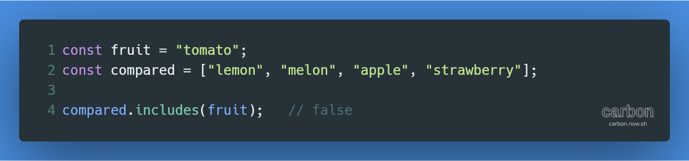

튜토리얼 출처: [JavaScript30](https://javascript30.com/)

튜토리얼 이름: Day 17 - Sort Without Articles

튜토리얼 분류: JavaScript

튜토리얼 설명: 문자열로 이루어진 배열에서 정관사 The, A, An을 제외한 기준으로 정렬하기

진행기간: 2020년 4월 29일

* * *

Array.prototype.sort( ) 메서드의 특징

*   sort( ) 메서드의 인자로 들어가는 함수의 반환값에 따라 동작이 달라짐
    *   함수의 반환값 < 0인 경우: 비교되는 두 값 중 전자가 앞의 순서로 옴
    *   함수의 반환값 > 0인 경우: 비교되는 두 값 중 후자가 앞의 순서로 옴
    *   함수의 반환값 = 0인 경우: 두 값에 대해 별도의 변경을 적용하지 않음
*   참고자료: [Array.prototype.sort() - JavaScript | MDN](https://developer.mozilla.org/ko/docs/Web/JavaScript/Reference/Global_Objects/Array/sort)

문자열을 여러 값과 비교하기

*   가장 기본적 방식인 '문자열 == 값 1 || 문자열 == 값 2 || ...'는 비교대상이 많아질수록 가독성이 떨어짐
*   비교대상인 값을 배열로 만들어 비교함으로써 간편하게 여러 값과 비교할 수 있음
*   예시 코드
    *   
*   참고자료: [Better Ways of Comparing a JavaScript String to Multiple Values](https://www.tjvantoll.com/2013/03/14/better-ways-of-comparing-a-javascript-string-to-multiple-values/)

* * *

[GitHub 저장소 링크](https://github.com/dev-song/_home/tree/master/projects/JavaScript30/Day%2017/tutorial-Sort-Without-Articles)

  

#자바스크립트 #javascript #튜토리얼 #string #sort #문자열 비교 #javascript30 #includes