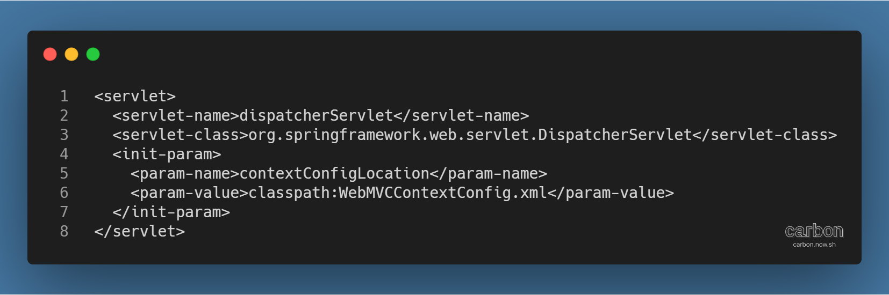
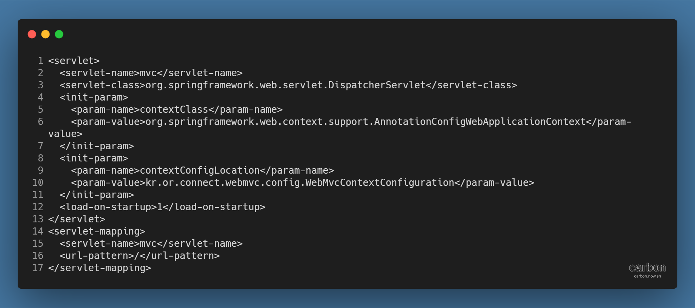
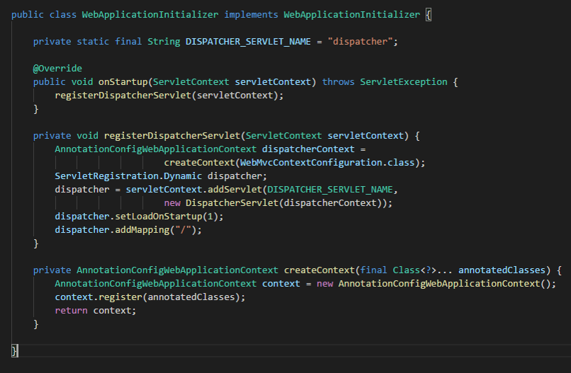
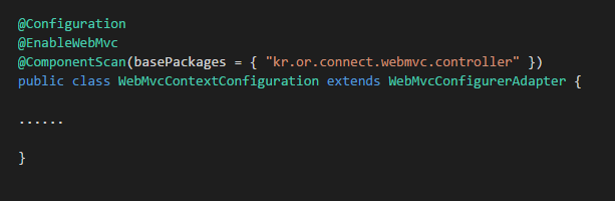
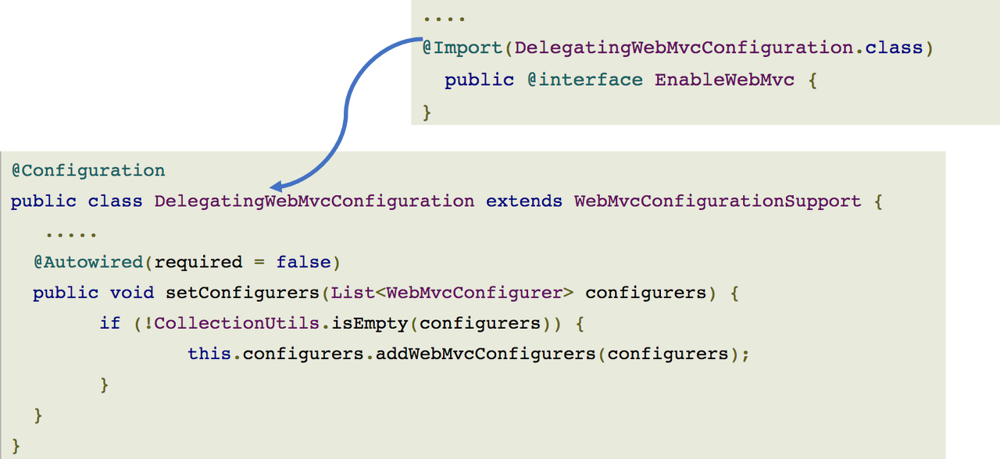
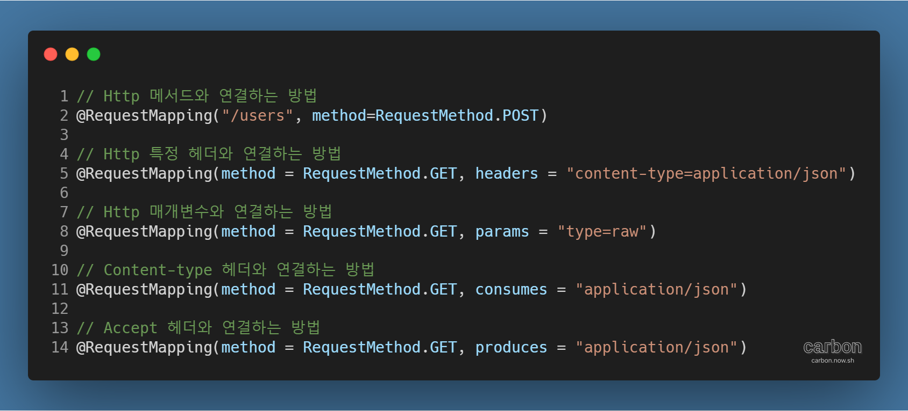

강의: [\[edwith 부스트코스\] 웹 프로그래밍](https://www.edwith.org/boostcourse-web/) 챕터 3, 웹 앱 개발: 예약서비스 1/4

학습일: 2020년 4월 30일

---

## 9\. Spring MVC - BE

Spring MVC 실습 - 프로젝트 기본 설정

- Maven Project 생성
  - File > New > Maven Project
  - Maven Project 설정
    - Archetype: maven-archetype-webapp 선택
    - Group Id (회사명): kr.or.connect 입력
    - Artifact Id (프로젝트명): mvcexam 입력
- java 폴더 생성
  - Navigator 탭 > mvcexam > src > main 디렉토리에 java 폴더 생성
- pom.xml 수정
  - JDK 1.8 사용을 위해 plugin 추가 (참고: [Maven (Back End)](https://til-devsong.tistory.com/48?category=772389) 프로젝트 설정)
  - JSTL, JSP, Servlet 라이브러리 추가
  - Spring Context 라이브러리 추가 (참고: [Spring Core (Back End) ... Part 2](https://til-devsong.tistory.com/48) Spring 라이브러리 불러오기)
  - 프로젝트 우클릭 \> Maven > Update Project 로 수정사항 반영
  - 프로젝트 우클릭 > Properties > Java Compiler 에서 변경되었는지 확인
- Servlet 버전 수정
  - Navigator 탭 > mvcexam > .settings > org.eclipse.wst.common.project.facet.core.xml 수정
  - jst.web facet의 버전을 3.1로 수정
  - Eclipse 재시작으로 수정사항 반영
  - 프로젝트 우클릭 > Properties > Project Facets 에서 변경되었는지 확인

Spring MVC 웹페이지 작성 실습 - Spring MVC 설정 개요

- DispatcherServlet을 FrontController로 설정
  - 설정 방법 (3가지 중 하나) 
    - web.xml > web-app 부분 수정
      - 기본적 방식 
      - 
        - servlet-name은 servlet mapping과 일치해야 함
        - servlet-class는 Spring이 제공하는 클래스명을 패키지를 포함해 입력
          - 실제로 동작되는 클래스를 의미
        - init-param은 개발자가 실제로 하고 싶은 작업에 대한 내용을 입력
      - XML 파일이 아닌 Java Config를 대신 사용하는 방법
      - 
        - init-param에 XML 파일이 아닌 Java Class 이름을 입력
      - **※ Servlet 작동 방식**
        - url-pattern에 입력된 url로 요청이 들어왔을 때, servlet-mapping의 servlet-name을 확인
        - 확인한 servlet-name과 같은 servlet-name을 가진 servlet-class를 실행
        - 위처럼 '/'로 설정한 경우 모든 요청을 받아들임
    - javasx.servlet.ServletContainerInitializer 사용 (Servlet Spec 3.0 이상)
      - 거의 사용되지 않음
    - org.springframework.web.WebApplicationInitializer 인터페이스 사용
      - 
      - 작동 방식
        - ServletContainerInitializer를 구현하는 SpringServletContainerInitializer를 활용 (Spring MVC가 제공)
        - SpringServletContainerInitializer는 WebApplicationInitializer 구현체를 찾아  
          인스턴스를 만들고 해당 인스턴스의 onStartup 메서드를 호출하여 초기화
      - 단점
        - 처음 웹 어플리케이션이 구동되는 시간이 오래 걸릴 수 있음
      - 부스트코스에서는 사용하지 않음
- DispatcherServlet이 읽어들일 설정 파일의 Annotation 수정
  - DispatcherServlet의 설정은 web.xml로, DispatcherServlet이 읽어들일 설정은 Java Config로 함
  - DispatcherServlet은 해당 설정 파일을 읽어들여 내부적으로 Spring 컨테이너인 ApplicationContext를 생성
  - 
  - Annotation의 종류별 역할
    - @Configuration
      - Java Config 파일임을 알려줌
    - @EnableWebMvc
      - 웹에 필요한 대부분의 Java Bean을 자동으로 설정
        - DispatcherServlet의 RequestMappingHandlerMapping, RequestMappingHandlerAdapter 등
      - 기본 설정 외의 설정이 필요하면 WebMvcConfigurerAdapter를 상속받는 Java Config class를 작성하고, 필요한 메서드를 Override
        - Spring 클래스: org.springframework.web.servlet.config.annotation.WebMvcConfigurerAdapter
      - **※ XML 파일로 설정할 경우, <mvc:annotaion-driven/> 태그가 동일한 역할을 함**
      - 소스 코드
        - 
        - 상속받는 WebMvcConfigurationSupport를 확인하면 기본 설정 객체를 확인할 수 있음
          - 참고자료: [WebMvcConfigurationSupport.java - GitHub](https://github.com/spring-projects/spring-framework/blob/master/spring-webmvc/src/main/java/org/springframework/web/servlet/config/annotation/WebMvcConfigurationSupport.java)
    - @ComponentScan
      - @Controller, @Service, @Repository, @Component가 붙은 클래스를 찾아 Spring 컨테이너가 관리
      - 컨트롤러에는 URL Mappings 정보가 Annotation으로 설정되어 있음
        - DispatcherServlet이 관리하는 RequestMapping 객체가 URL Mappings 정보를 설정함
        - Spring 컨테이너인 ApplicationContext의 요청 처리 Bean에서  
          @RequestMapping을 클래스, 메서드에서 찾아 HandlerMapping 객체를 생성
          - HandlerMapping 객체는 서버로 들어온 요청을 어느 Handler로 전달할 지 결정
          - DefaultAnnotationHandlerMapping과 RequestMappingHandlerMapping 구현체가 사용됨
            - Annotation을 사용해 Mapping 관계를 찾음
            - 다른 HandlerMapping보다 더 정교하고 강력함
      - **※ DefaultAnnotationHandlerMapping과 RequestMappingHandlerMapping의 특징**
        - DefaultAnnotationHandlerMapping: DispatcherServlet의 기본 HandlerMapping 객체
        - RequestMappingHandlerMapping: 강력하고 유연하지만 별도로 설정해줘야 사용 가능
- Controller (Handler) 클래스 작성
  - 클래스 위에 @Controller를 붙임
  - 클래스나 메서드에 @RequestMapping 입력
    - 요청이 왔을 때 요청의 URL을 확인해 실제로 처리해야 하는 컨트롤러, 그리고 클래스, 메서드를 지정
    - Servlet의 URL 패턴 지정과 같은 역할
    - **※ @RequestMapping**
      - Http 요청과 이를 다루는 Controller의 메서드를 연결하는 Annotation
      - 사용 방법
        - 
        - Http 메서드와 연결하는 경우, Spring 버전 4.3부터  
          GetMapping, PostMapping, PutMapping, DeleteMapping, PatchMapping도 사용할 수 있음

#Java #Spring #MVC #웹 프로그래밍 #backend #백엔드 #내용 정리 #edwith #부스트코스
