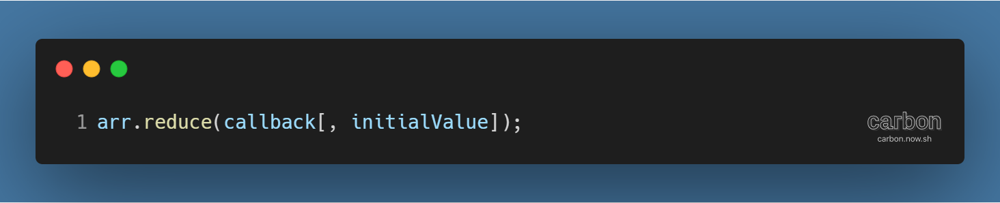
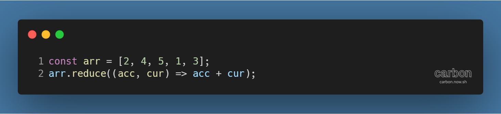
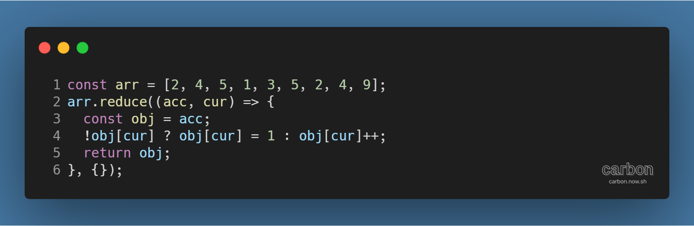
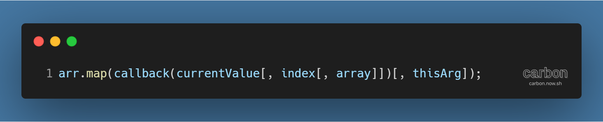
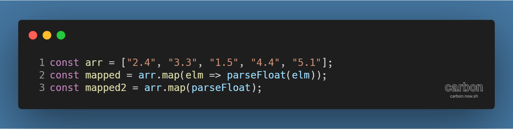

튜토리얼 출처: [JavaScript30](https://javascript30.com/)

튜토리얼 이름: Day 18 - Adding Up Times with Reduce

튜토리얼 분류: JavaScript

튜토리얼 설명: 여러 동영상의 길이가 표시되어 있을 때, 전체 재생 시간을 합산하기

진행기간: 2020년 4월 30일

---

## Array.prototype.reduce( ) 메서드로 배열 원소 합치기

JavaScript 배열의 reduce( ) 메서드는 다양한 곳에 활용될 수 있다.

#### 형태

우선 reduce( ) 메서드의 형태를 살펴보자.

callback 함수와, initialValue(초기값) (각주: 초기값은 생략할 수 있으며, 생략할 경우 배열의 첫 번째 요소가 초기값이 된다. 비어 있는 배열일 경우 오류가 발생한다.) 을 인자로 실행된다는 것을 알 수 있다.

callback 함수는 다음 4개의 매개변수를 받아 실행된다.

1.  accumulator(누산기): 계속 누적되는 callback 함수의 반환값. callback의 첫 번째 호출일 경우 initialValue가 지정된다.
2.  currentValue(현재값): callback 함수가 처리할 현재 요소
3.  currentIndex (각주: 생략 가능): 처리할 현재 요소의 인덱스. initialValue가 지정된 경우 0, 아니면 1부터 시작한다.
4.  array (각주: 생략 가능): reduce( ) 메서드를 호출한 배열

#### 활용방법

1\. 단순 합산

배열 안의 모든 요소를 합산하는 방법이다.

callback 함수는 매 호출마다 누산기와 현재값을 더한 값을 반환하고, 그 값이 다음 호출 때 누산기로 사용된다.

2\. 객체 활용

메서드의 최종 반환값이 정수가 아닌 객체가 되도록 할 수 있다.

초기값을 빈 배열로 지정하고, callback 함수 호출마다 객체의 정보를 현재값을 사용해 갱신한 뒤 반환한다.

예시 코드처럼 배열 내 중복 원소의 갯수를 세는 상황 등에 활용할 수 있다.

#### 참고자료

[Array.prototype.reduce() - JavaScript | MDN](https://developer.mozilla.org/ko/docs/Web/JavaScript/Reference/Global_Objects/Array/Reduce)

## Array.prototype.map( ) 메서드 간편 작성 방법

map( ) 메서드의 기본 형태는 다음과 같다.

currentValue, currentIndex (각주: 생략 가능), array (각주: 생략 가능)를 인자로 받는 callback 함수와 callback 함수의 this (각주: 생략 가능)를 인자로 실행된다.

callback 함수의 형태는 다양하나, 다음과 같은 형태라면 좀 더 간단하게 표시할 수 있다.

반환값이 현재값을 특정 함수의 인자로 넣어 실행한 함수의 결과값이라면, 간단하게 함수명만 메서드의 인자로 입력해주어도 동일한 결과값을 얻을 수 있다.

#### 참고자료

[Array.prototype.map() - JavaScript | MDN](https://developer.mozilla.org/ko/docs/Web/JavaScript/Reference/Global_Objects/Array/map)

---

[GitHub 저장소 링크](https://github.com/dev-song/_home/tree/master/projects/JavaScript30/Day%2018/tutorial-Adding-Up-Times-with-Reduce)

---

#자바스크립트 #javascript #튜토리얼 #map #Reduce #javascript30
