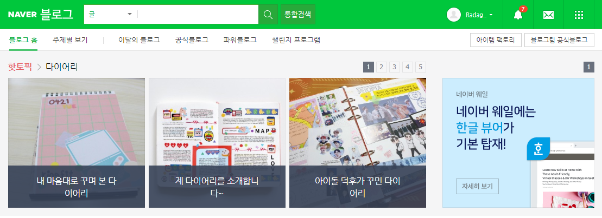
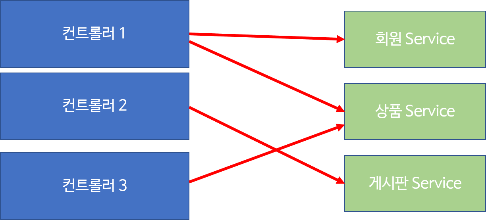
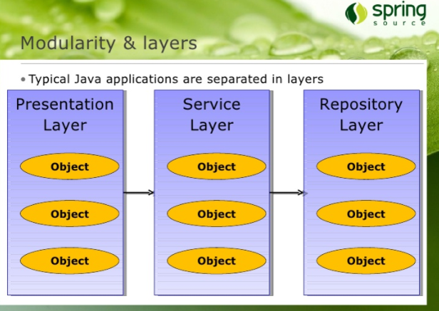

강의: [\[edwith 부스트코스\] 웹 프로그래밍](https://www.edwith.org/boostcourse-web/) 챕터 3, 웹 앱 개발: 예약서비스 1/4

학습일: 2020년 4월 30일

---

## 10\. 레이어드 아키텍쳐 (Layered Architecture) - BE

#### 레이어드 아키텍처(Layered Architectrue)

웹페이지에는 중복되어 나타나는 요소들이 있다. 아래의 Naver 블로그를 보면, 상단의 초록색 바는 하위 페이지인 '블로그 홈'에서든, '이달의 블로그'에서든 동일하게 나타난다. 이런 요소가 중복되는 것은 개발에서도 마찬가지이다.

#### 컨트롤러가 중복 요소를 처리하는 방법

당신이 쇼핑몰 웹사이트 개발자라고 생각해보자. 회원 정보를 게시판 페이지와 상품 목록 페이지 두 곳 모두에서 보여주고 싶다면, 회원 정보를 읽어들이는 코드는 어디에 넣어야 할까? 게시판 컨트롤러? 상품 목록 컨트롤러? 아니면 둘 다?

간단하다. 공통으로 사용하는 코드를 별도의 객체나 메서드로 만들어 두 컨트롤러가 이를 사용하면 된다.

이처럼, 컨트롤러가 중복적으로 호출하는 부분만 따로 구현한 것이 서비스(Service) 객체이다. 이런 서비스 객체는 비즈니스 로직을 수행하는 메서드 (각주: 서비스 객체는 보통 업무와 관련된 메서드를 가지기 때문에 비즈니스 메서드라고도 불린다.)를 가진다. 비즈니스 로직은 하나의 트랜잭션으로 동작한다.

#### 트랜잭션

트랜잭션(Transaction)은 하나의 논리적인 작업을 의미한다. 다음과 같은 4가지의 특성을 지녀야 트랜잭션이라고 할 수 있다.

> 원자성 (Atomicity)
>
> 트랜잭션은 전체가 성공하거나, 전체가 실패한다.  
> 예를 들어, 은행 앱에서 '출금'이라는 기능이 있고 그 기능의 흐름이 다음과 같은 경우를 상상해보자.  
>   1. 잔액이 얼마인지 조회  
>   2. 출금하려는 금액이 잔액보다 작은지 검사  
>   3. 출금하려는 금액이 잔액보다 작다면 (잔액 - 출금액)으로 수정  
>   4. 언제, 어디서 출금했는지 정보를 기록  
>   5. 사용자에게 출금
>
> 만약 4번째에서 오류가 발생한 경우 앞의 작업도 모두 원래대로 복원을 시켜야 한다. 이를 rollback한다고 한다.  
> 5번까지 전체가 성공한 경우에만 정보를 반영해야 하며, 이를 commit한다고 한다.  
> 트랜잭션은 이처럼 rollback 또는 commit이 되어야만 처리된다.

> 일관성 (Consistency)
>
> 트랜잭션의 처리 결과는 항상 일관성이 있어야 한다.  
> 만약 트랜잭션 진행 중에 데이터가 변경되어도, 변경된 데이터가 아닌 진행 전 참조한 데이터로 진행되어야 한다.

> 독립성 (Isolation)
>
> 트랜잭션이 동시에 둘 이상 실행되고 있는 경우, 어느 한 트랜잭션이 다른 트랜잭션의 연산에 끼어들 수 없다. 또한, 하나의 트랜잭션이 완료되기 전에는 다른 트랜잭션이 그 트랜잭션의 결과를 참조할 수 없다.  
> 여러 사용자가 동시에 데이터를 입력하고 수정할 경우 특히 필요성이 부각되는 특성이다.

> 지속성 (Durability)
>
> 트랜잭션이 성공적으로 완료되었을 경우, 그 결과는 영구적으로 반영되어야 한다.

#### JDBC 프로그래밍에서 트랜잭션을 처리하는 방법

데이터베이스에 연결해 Connection 객체를 얻어낼 때, setAutoCommit( ) 메서드를 호출할 수가 있다.

이 메서드의 기본값은 true이므로 입력, 수정, 삭제할 때 별도로 commit을 명령하지 않아도 바로 데이터베이스에 반영되기 때문에, false로 지정한 뒤 모든 작업이 성공해야만 commit( ) 메서드를 호출하면 트랜잭션을 처리할 수 있다.

#### Spring에서의 트랜잭션을 처리하는 방법

Java Config 파일에서 @EnableTransactionManagement를 사용해 트랜잭션을 활성화시킬 수 있다. 이 때 Java Config는 PlatformTransactionManager 구현체를 모두 찾아 그 중 하나를 매핑해 사용하게 된다.

특정 TransactionManager를 사용할 때는, Java Config에서 TransactionManagementConfigurer를 구현한 뒤 원하는 TransactionManager를 반환하거나, 특정 TransactionManager 객체를 생성한 뒤 @Primary를 붙여주면 된다.

#### 서비스 객체에서 중복으로 호출되는 코드를 처리하는 방법

데이터에 접근하는 메서드는 별도의 Repository (DAO) 객체에서 구현하고, 서비스 객체는 구현된 Repository 객체를 사용한다. 컨트롤러가 서비스 객체를 별도로 구현해 사용하는 것과 동일한 방식으로 처리하는 것이다.

#### 레이어드 아키텍쳐의 구조

Repository 객체까지 추가로 구현을 했다면, 레이어드 아키텍쳐는 최종적으로 3개의 레이어로 이루어지게 된다.

> Presentation Layer
>
> 컨트롤러 객체로 이루어진 레이어

> Service Layer
>
> 비즈니스 메서드를 실행하는 서비스 객체로 이루어진 레이어

> Repository Layer
>
> 실제 데이터베이스에 접근해 데이터를 조작하는 repository (DAO) 객체로 이루어진 레이어

#### 레이어드 아키텍쳐로 프로그램 재활용하기

레이어드 아키텍쳐로 설계한 프로그램이 웹 어플리케이션이라고 할 때, 웹에 프로그램을 표시하는 부분은 Presentation Layer로 한정된다. 그러므로 Presentation Layer만 바꾼다면 얼마든지 Windows 앱으로도, Mac 앱으로도 전환할 수 있다.

이처럼 언제든지 분리해 작업할 수 있도록, Presentation Layer와 다른 두 레이어의 설정 파일을 아예 분리하는 것이 좋다.

#### 레이어드 아키텍쳐 설정 분리하기

Spring을 사용해 Presentation Layer와 다른 레이어의 설정 파일을 분리할 수 있다.

우선, web.xml에서 Presentation Layer에 대한 설정은 DispatcherServlet이, 다른 레이어 설정은 ContextLoaderLister가 읽도록 한다.

경우에 따라 2개 이상의 DispatcherServlet을 설정할 경우, 각각의 ApplicationContext는 독립적이므로 한 설정 파일에서 생성한 Bean을 다른 설정 파일에서 사용할 수 없다. 이 경우 공통으로 필요한 Bean은 ContextLoaderListener로 함께 사용할 수 있다.

ContextLoaderListener와 DispatcherServlet은 각각 ApplicationContext를 생성한다. ContextLoaderListener가 생성하는 것이 root Context가 되고, DispatcherServlet이 생성한 것은 root Context를 부모로 하는 자식 Context가 된다. 자식 Context는 root Context의 설정 Bean을 사용할 수 있다.

---

#Java #웹 프로그래밍 #backend #백엔드 #내용 정리 #edwith #부스트코스 #레이어드 아키텍쳐 #Layered Architecture
