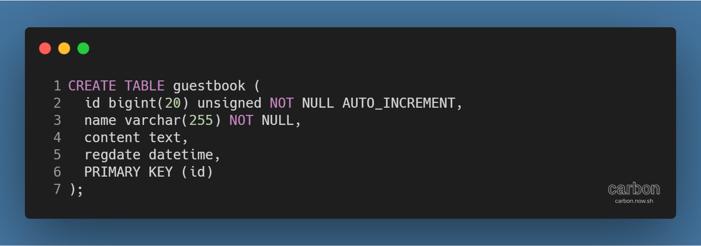
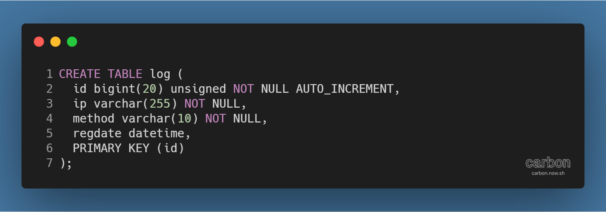
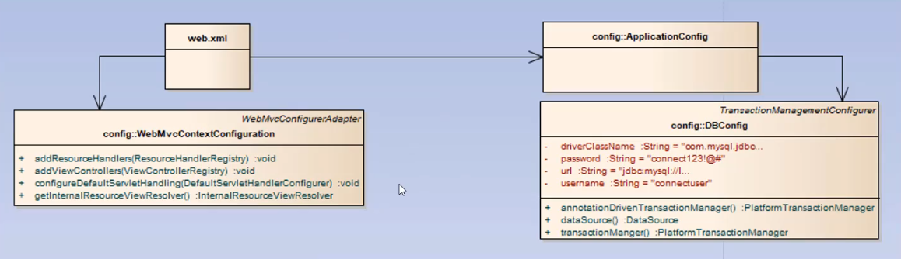
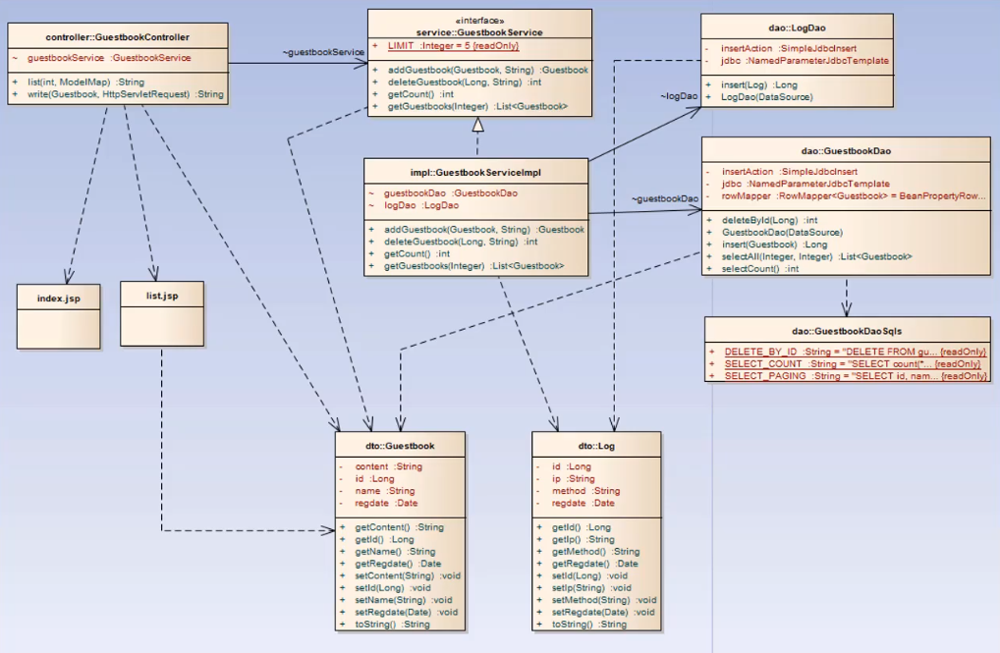

강의: [\[edwith 부스트코스\] 웹 프로그래밍](https://www.edwith.org/boostcourse-web/) 챕터 3, 웹 앱 개발: 예약서비스 1/4

학습일: 2020년 5월 1일

---

## 10\. 레이어드 아키텍쳐 (Layered Architecture) - BE

#### 방명록 만들기 실습 - 기본 구조

레이어드 아키텍쳐를 활용한 간단한 방명록 페이지를 만들어보자.

기본적인 구조는 다음과 같다.

- Spring JDBC를 이용해 DAO 객체 작성
- Controller, Service, DAO 객체로 레이어드 아키텍쳐 구성
- 트랜잭션을 처리
- Spring MVC에서 form 값을 입력받아 redirect
- Controller가 JSP 파일에 값을 전달
- JSP는 전달받은 값을 JSTL과 EL을 이용해 출력

#### 방명록 만들기 실습 - 구현할 기능

구현하려는 기능은 다음과 같다.

- 방명록 정보(id, 이름, 내용, 등록일)를 guestbook 테이블에 저장
  - 정보 중 id는 자동으로 입력

- http://localhost:80880/guestbook/ 요청 시 /guestbook/list로 리다이렉트
  - 기존 방명록이 없다면 방명록의 갯수가 0으로 표시됨
  - 이름과 방명록을 입력하는 form, 그리고 등록 버튼이 표시됨
- 이름과 방명록을 입력한 뒤 등록 버튼을 누르면 /guestbook/write로 입력한 값을 전달
- 전달받은 값을 저장한 후 다시 /guestbook/list로 리다이렉트
  - 방명록이 있으므로 방명록의 갯수가 1 이상의 정수로 표시됨
  - 기존에 입력했던 방명록 정보(id, 이름, 내용, 등록일)가 표시됨
  - 방명록 페이지 링크가 표시됨
  - 이름과 방명록을 입력하는 form, 그리고 등록 버튼이 표시됨
- 방명록 페이지는 1페이지당 5건의 방명록을 표시
  - 방명록이 5n + 1건 될 때마다 페이지 링크가 늘어남
  - 1페이지를 누르면 /guestbook/list?start=0을 요청
  - 2페이지를 누르면 /guestbook/list?start=5를 요청
  - /guestbook/list는 /guestbook/list?start=0과 결과가 같음
- 방명록에 글을 쓰거나 삭제할 때 정보(클라이언트 IP주소, 등록/삭제 시간, 등록/삭제 메서드)를 log 테이블에 저장
  - 정보 중 id는 자동으로 입력

#### 방명록 만들기 실습 - 클래스 다이어그램

우선, 설정 파일은 아래의 다이어그램처럼 4개의 파일로 구성된다.

이 중 web.xml, WebMvcContextConfiguration.java은 웹 레이어의 설정을, ApplicationConfig.java, DbConfig.java는 비즈니스, Repository 레이어의 설정을 담당한다.

전체 클래스의 다이어그램은 아래와 같다.

이 중 GuestbookHandler는 URL 요청을 처리하는 핸들러로, 비즈니스 로직을 가진 서비스 객체를 사용한다.

GuestbookService 인터페이스, 그리고 실제로 구현되는 GuestbookServiceImpl 클래스가 서비스 객체를 구성한다.

여기서 GuestbookServiceImpl 클래스는 logDao와 GuestbookDao를 사용해 비즈니스 로직을 수행하게 된다.

저장 외의 다른 작업을 하지 않으므로 SQL 구문이 필요 없는 logDao와 달리, GuestbookDao는 여러 작업을 수행하므로 SQL 구문을 필요로 하고, 이 때의 SQL 구문은 GuestbookDaoSqls에서 모아 관리한다.

logDao와 GuestbookDao의 작업을 수행하는 데 필요한 데이터 타입은 DTO 클래스 Guestbook과 Log에서 제공한다.

최종적인 결과를 화면에 표시할 View 역할을 하는 것은 list.jsp이다. index.jsp는 리다이렉트하는 코드만을 담고 있다.

---

#Java #웹 프로그래밍 #backend #백엔드 #내용 정리 #edwith #부스트코스 #레이어드 아키텍쳐 #Layered Architecture
