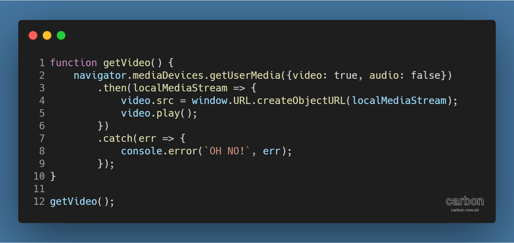
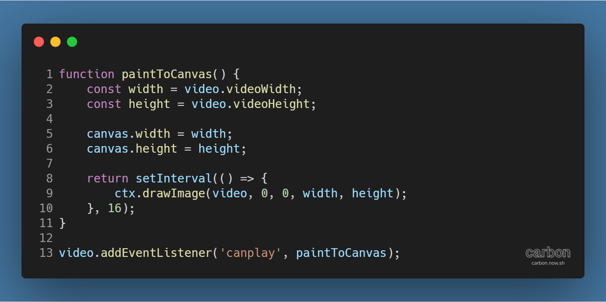
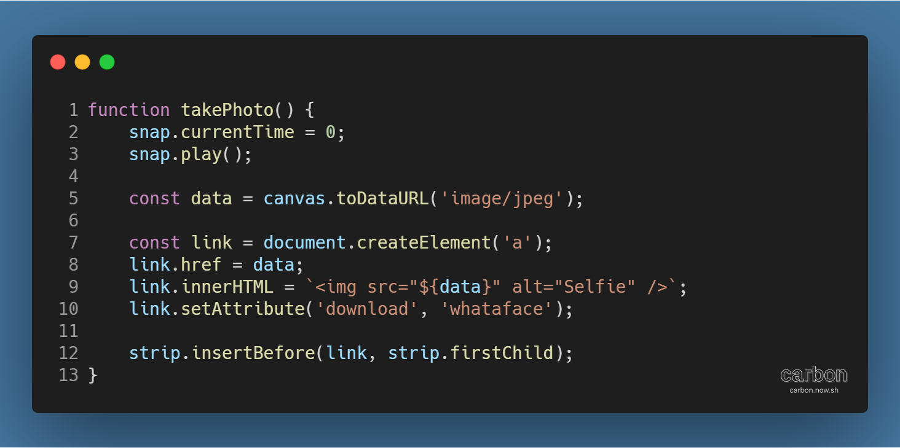
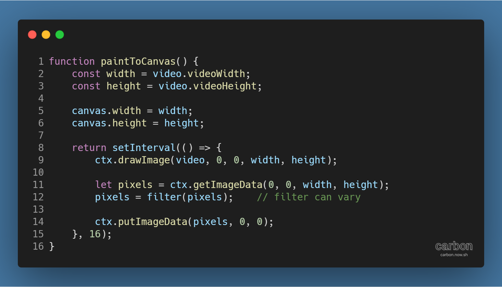
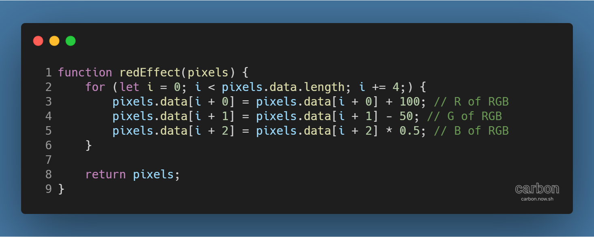
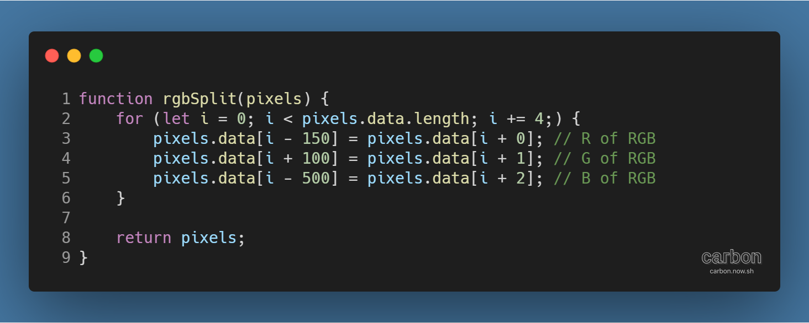
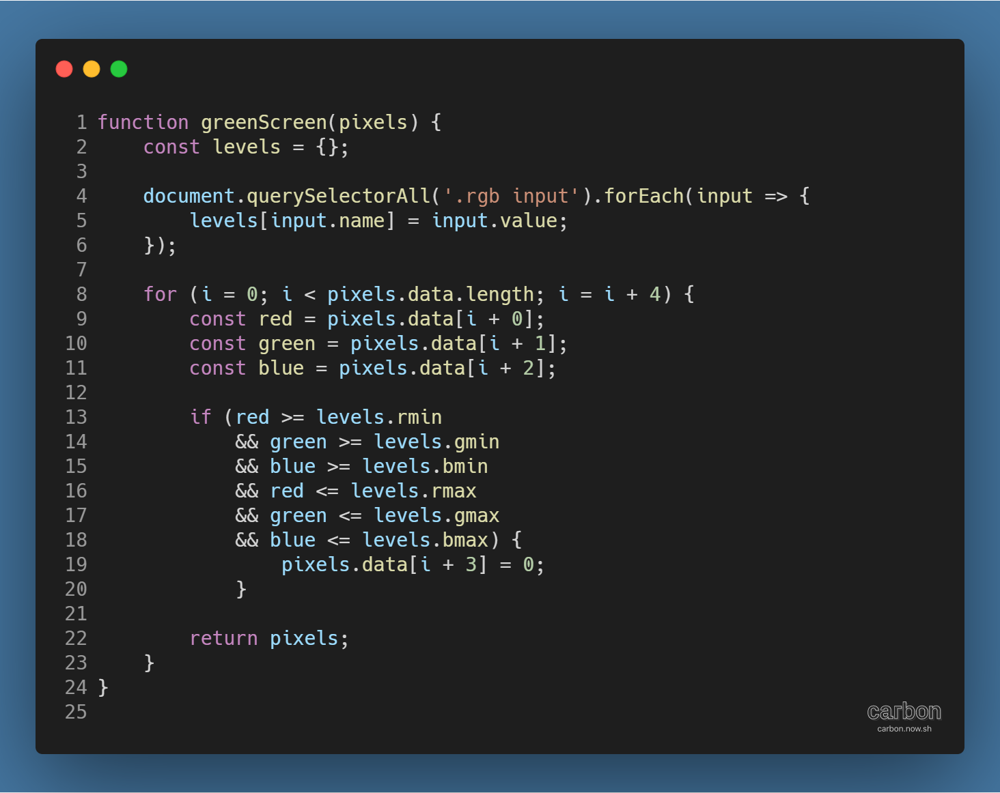

튜토리얼 출처: [JavaScript30](https://javascript30.com/)

튜토리얼 이름: Day 19 - Webcam Fun

튜토리얼 분류: JavaScript

튜토리얼 설명: 웹캠 화면을 브라우저에 표시하고 캡처 및 다운로드, 필터 효과 기능 추가하기

진행기간: 2020년 5월 2일, 3일

---

## 브라우저에 웹캠 화면 표시하기

당신의 컴퓨터에 웹캠이 달려있다면, 웹캠의 화면이 브라우저에 나오도록 할 수 있다. 다음 getVideo( ) 함수를 보자.

사용자의 브라우저 정보와 상태를 알려주는 Navigator 인터페이스 (각주: 참고자료: [Navigator - Web APIs | MDN](https://developer.mozilla.org/en-US/docs/Web/API/Navigator))를 사용하고 있다. Navigator 인터페이스의 mediaDevices 속성 (각주: 표준이 아니므로 오페라, 사파리에서 호환성 이슈가 있음)은 MediaDevices 싱글턴 객체를 반환하므로, 이에 getUserMedia( ) 메서드 (각주: 참고자료: [MediaDevices.getUserMedia() - Web APIs | MDN](https://developer.mozilla.org/en-US/docs/Web/API/MediaDevices/getUserMedia))를 사용해 카메라, 마이크 등의 미디어 장치에 접근한다.

getUserMedia( ) 메서드의 사용 방법은 다음과 같다.

> 1\. 웹캠 화면만 필요하므로 미디어 장치 중 영상만 true로, 음성은 false로 지정한다.  
> 2\. 메서드가 반환하는 Promise 객체에서 localMediaStream 객체를 브라우저가 인식할 수 있는 URL로 변환한다.  
> 3\. 웹페이지 내 영상 요소의 src 속성을 변환된 URL로 지정한다.  
> 4\. 영상 요소를 재생한다.  
> 5\. 에러가 발생할 경우, 콘솔에 출력한다.

! 주의

getUserMedia( ) 메서드는 보안 및 프라이버시 이슈가 있으므로 보안 컨텍스트 (각주: 참고자료: [Secure contexts - Web security | MDN](https://developer.mozilla.org/en-US/docs/Web/Security/Secure_Contexts))인 HTTPS, file:///, localhost를 사용한 연결에서만 작동하며, 영상 및 음성 입력에 대한 접근 권한을 사용자가 설정해야 활성화된다.

## 대형 캔버스로 웹캠 화면 표시하기

캔버스 위에 직접 영상을 재생하는 것은 힘들지만, 우회법을 사용하면 가능하다. 다음의 paintToCanvas( ) 함수를 보자.

캔버스와 길이와 높이를 영상과 같게 한 뒤, drawImage( ) 메서드를 사용해 영상의 이미지 데이터를 캔버스 컨텍스트에 16ms 간격으로 입력한다.

canplay 이벤트 (각주: 참고자료: [HTMLMediaElement: canplay - Web API | MDN](https://developer.mozilla.org/ko/docs/Web/API/HTMLMediaElement/canplay_event))를 통해 함수를 영상과 연동하면, 영상이 재생될 수 있는 상태가 되었을 때 (각주: 튜토리얼에선 웹캠이 동작하는 순간) 함수가 동작한다.

## 웹캠 화면 캡쳐하기

이처럼 재생되는 영상을 캡처해서 다운로드 하는 것도 가능하다. 아래 takePhoto( ) 함수를 보자.

맨 위의 snap은 함수가 실행될 때마다 재생되는 음성 요소이다. '찰칵' 등의 소리를 생각하면 된다.

우선, 캔버스의 이미지에 접근할 수 있도록 URL 형태로 만든다.

그 다음, 다운로드할 수 있도록 a 태그 요소를 생성한다. href 속성은 캔버스 이미지 URL로, HTML은 이미지 URL을 src 속성으로 갖는 img 태그로 작성해주면 썸네일 모양의 링크가 생성 (각주: textContent 속성을 이용하면 문자열로 된 링크를 만들 수 있다.)된다. 여기에 download 속성에 지정한 값으로 다운로드 시의 파일명이 달라진다.

마지막으로 링크 썸네일을 영상 하단의 블록 요소의 자식 요소로 넣어주면 완료된다.

## 필터 효과 만들기

캔버스에 투영된 이미지의 픽셀 데이터를 조작해서 필터 효과를 구현할 수 있다. 먼저 paintToCanvas( ) 함수를 다음과 같이 변경해야 한다.

기존과 다르게 캔버스 컨텍스트에 넣은 영상의 이미지 데이터를 getImageData( ) 메서드로 추출해 필터 함수 (각주: 필터 함수명으로 filter 부분을 바꿔줘야 한다.)를 적용한 뒤 putImageData( ) 메서드로 다시 집어넣게 된다.

아래 세 가지의 필터 함수를 살펴보면서 어떤 효과를 구현할 수 있는지 살펴보자.

#### redEffect( )

붉은색 톤의 영상을 만드는 함수이다.

getImageData( ) 메서드로 추출된 이미지 데이터는 data 속성에 R, G, B, A, R, G, B, A, ... 순서로 이루어진 배열을 담고 있다.

Red, Green, Blue, Alpha 4개의 원소가 하나의 픽셀을 구성하므로, R 픽셀의 값을 높이고 G, B 픽셀의 값을 낮춰 영상의 전체적인 색상을 붉은 톤으로 보이게 하는 방식이다.

#### rgbSplit( )

영상의 붉은색, 녹색, 청색 레이어를 분리하는 함수이다.

좌측의 인덱스에서 + - 값을 통해 분리된 색상 레이어의 거리를 조절할 수 있다.

#### greenScreen( )

특정 범위 안의 색상을 투명하게 만드는 함수이다.

웹페이지의 슬라이더에서 R, G, B의 최소값과 최대값을 불러온 뒤, 각 픽셀의 R, G, B 값이 그 사이에 있을 경우 A 값을 0으로 만드는 방식이다.

---

[GitHub 저장소 링크](https://github.com/dev-song/_home/tree/master/projects/JavaScript30/Day%2019/tutorial-Webcam-Fun)

---

#웹캠 #자바스크립트 #javascript #캡쳐 #Webcam #튜토리얼 #web api #javascript30
