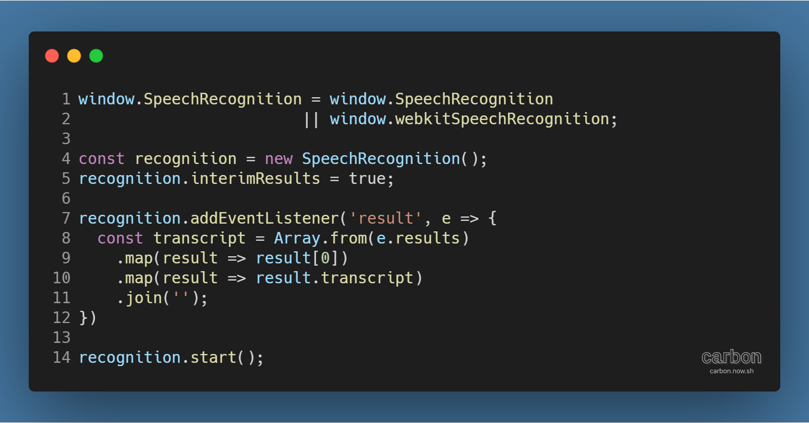
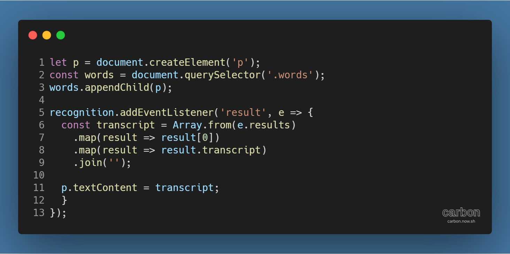
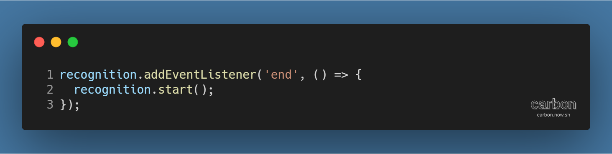
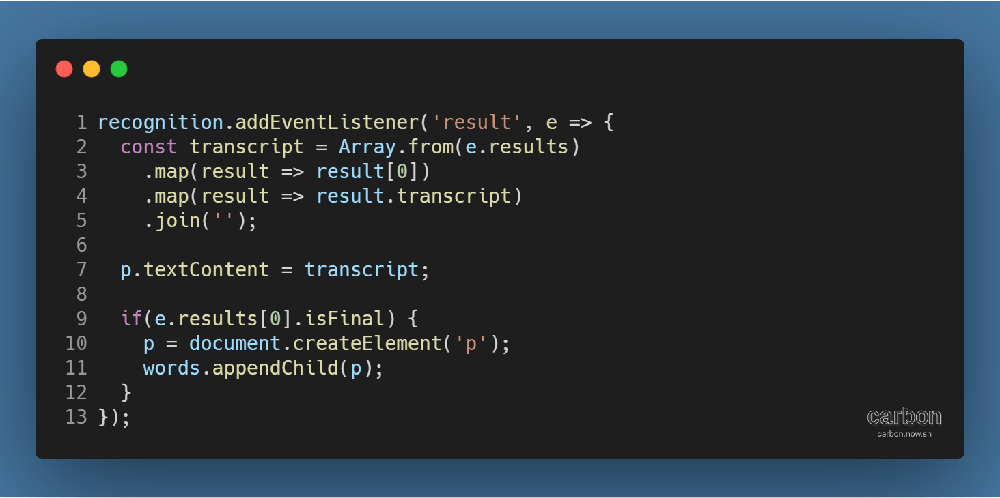
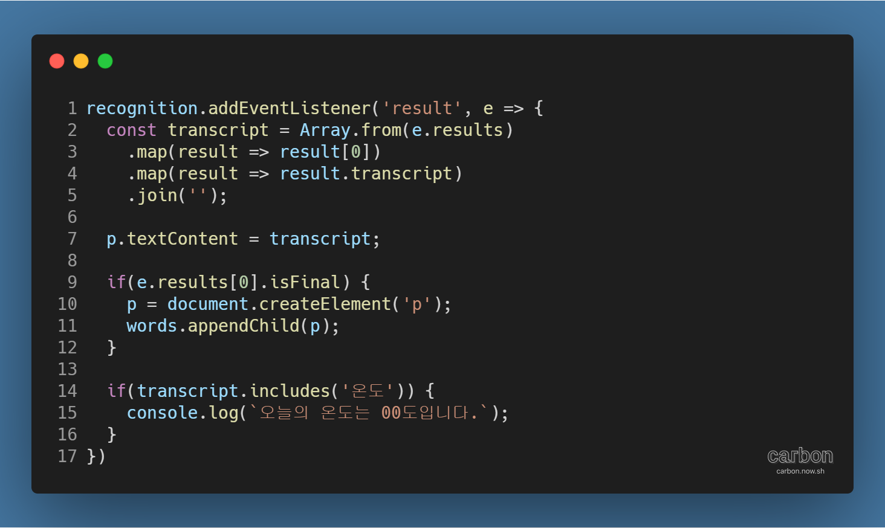

튜토리얼 출처: [JavaScript30](https://javascript30.com/)

튜토리얼 이름: Day 20 - Speech Detection

튜토리얼 분류: JavaScript

튜토리얼 설명: 사용자의 음성 입력을 인식해 웹페이지에 표시하기

진행기간: 2020년 5월 4일

---

## 브라우저로 음성 입력 받아들이기

당신의 컴퓨터에 마이크가 연결되어 있다면, 브라우저가 음성을 인식하게 할 수 있다. 다음의 코드를 보자.

음성을 인식하게 해주는 SpeechRecognition 인터페이스 (각주: 참고자료: SpeechRecognition - Web APIs | MDN)를 사용하고 있다. Google Chrome에서는 Vendor Prefix인 webkit을 붙여야 인터페이스를 인식하므로 || (or)을 사용해 설정해준다. SpeechRecognition 인터페이스의 사용 방법은 다음과 같다.

> 1\. 생성자로 SpeechRecognition 객체를 생성한다.  
> 2\. interimResult 속성을 true로 설정해, 음성 인식 도중의 결과를 반환 (각주: 기본값인 false로 설정해도 음성 인식에는 이상이 없으나, 화면에 표시될 때 실시간으로 인식되는 시각적인 효과를 줄 수 있다.)하도록 한다.  
> 3\. result 이벤트 (각주: 음성이 끝날 때 발생하는 이벤트이다.)에 SpeechRecognition 객체를 연동해, 이벤트가 발생하면 음성 인식 결과인 event.results에서 음성을 인식한 문자열을 추출해 합친다.  
> 4\. start( ) 메서드로 음성 인식 기능을 실행시킨다.

! 주의

몇몇 브라우저 (각주: Google Chrome도 해당된다.)에서 SpeechRecognition 인터페이스는 서버 기반의 음성 인식 엔진을 바탕으로 동작하므로, 오프라인에서는 동작하지 않는다.

## 음성 인식 결과를 HTML에 삽입하기

음성을 인식한 결과를 브라우저에 표시하는 것은 간단하다. 다음의 코드를 보자.

> 1\. HTML p 요소를 만든다.  
> 2\. 브라우저에 표시할 요소를 지정한다.  
> 3\. 만들어진 p 요소를 표시할 요소의 자식 요소로 삽입한다.  
> 4\. result 이벤트가 발생할 때, p의 내용을 음성 인식 결과인 transcript로 바꾼다.

## 잠시 멈췄다 말하더라도 계속 인식하게 하기

음성 인식은 말이 끝나는 순간 작동을 멈춘다. 그렇기 때문에 말하던 중 잠시 멈췄다가 말하면 뒷부분을 인식하지 못하는 경우가 생긴다. 다음의 간단한 코드를 사용해 문제를 해결할 수 있다.

음성 인식이 끝나면 end 이벤트가 발생하는데, 이 때 start( ) 메서드로 음성 인식 기능을 다시 실행시키는 방법이다.

## 잠시 멈췄다 말할 때마다 새로운 문단 만들기

말하다가 잠시 멈추면 음성 인식이 끊기는 문제는 해결했으나, 이제는 멈췄다 말하면 새로 말한 내용이 이전 내용 위에 덮어씌워지는 문제가 발생한다. 멈출 때마다 새로운 내용을 집어넣을 새 문단 요소를 만드는 방법으로 해결할 수 있다.

음성 인식 정보를 모아놓은 event.results에는 다양한 정보가 들어있는데, 그 중 isFinal 속성을 활용하면 된다.

> 1\. isFinal (각주: 말하다가 멈추면 최종 음성 정보가 반환될 때 true로 바뀌는 속성이다.)이 true인지 확인한다.  
> 2\. HTML p 요소를 새로 만든다.  
> 3\. 만들어진 p 요소를 표시할 요소의 자식 요소로 삽입한다.

## 특정 단어 인식하기

음성 인식 결과에서 특정 단어를 인식하면 동작을 수행하도록 설정할 수 있다. 다음의 코드를 보자.

음성 인식 결과인 transcript가 특정 단어를 포함할 경우, 함수를 수행하는 방식이다. 외부 API와 연동해 다양한 기능을 만들 수 있다.

예시 코드는 '온도'를 포함할 경우 '오늘의 온도는 00도입니다.'라는 메시지를 출력한다.

---

[GitHub 저장소 링크](https://github.com/dev-song/_home/tree/master/projects/JavaScript30/Day%2020/tutorial-Speech-Detection)

---

