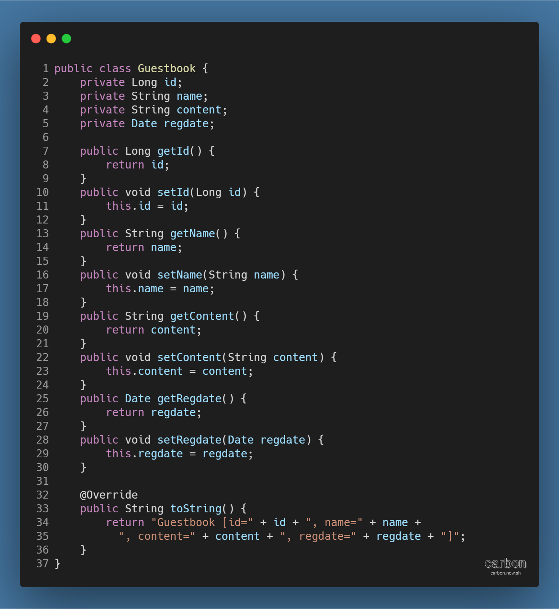
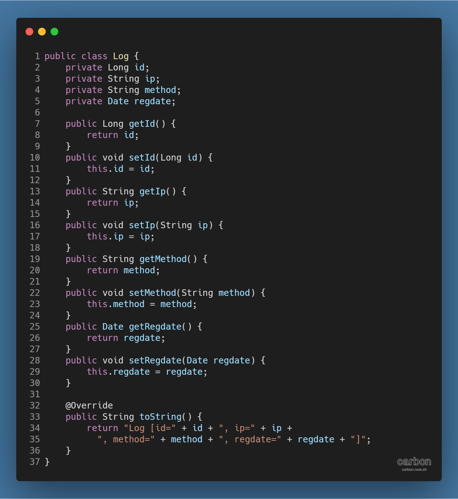
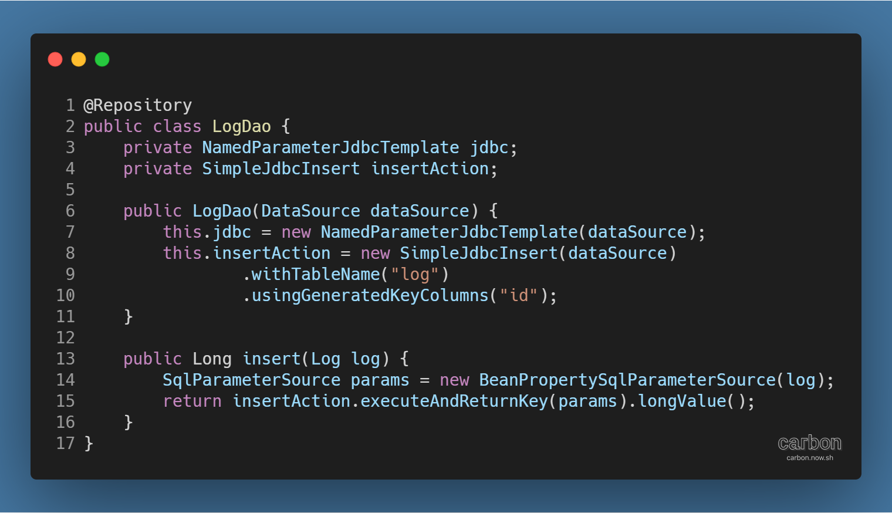
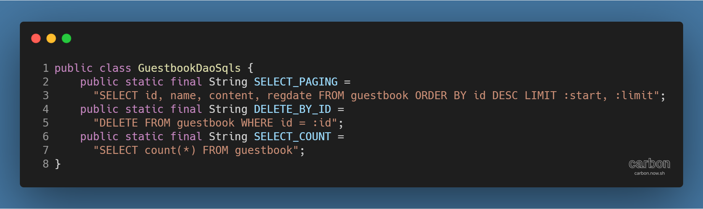
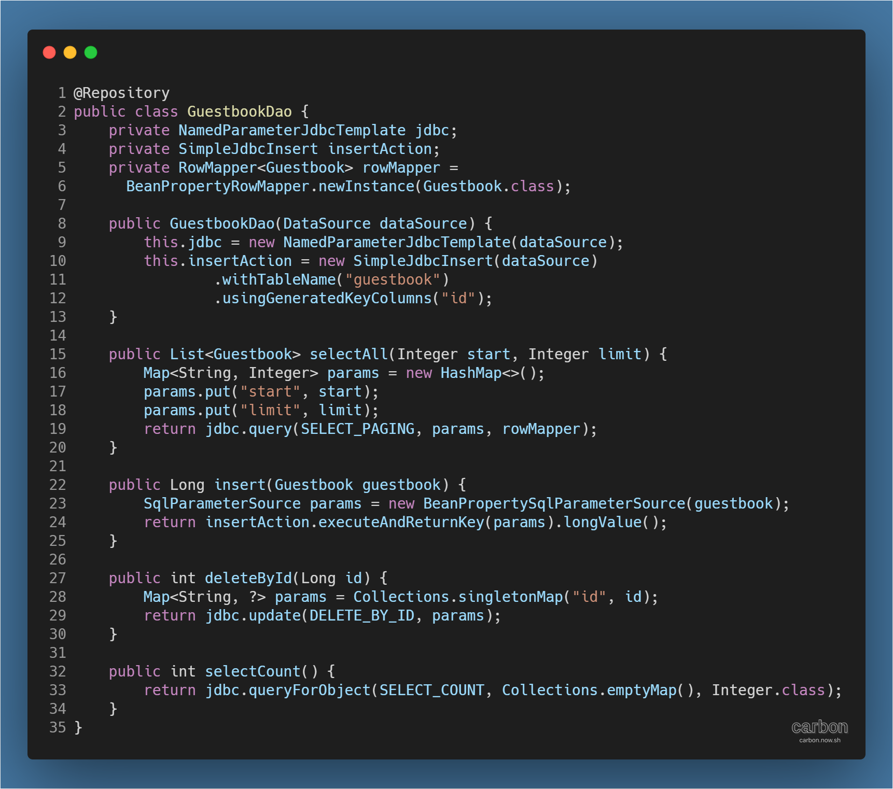
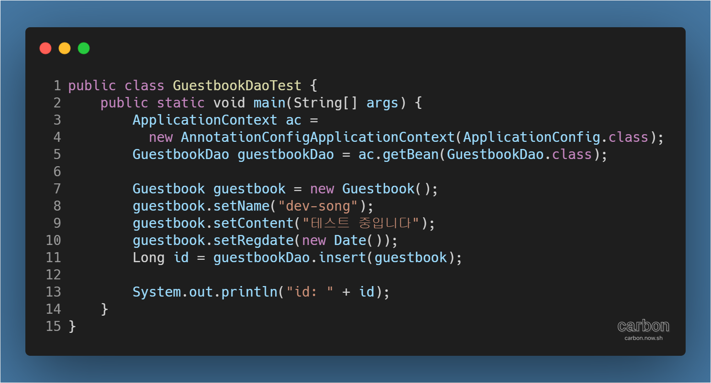
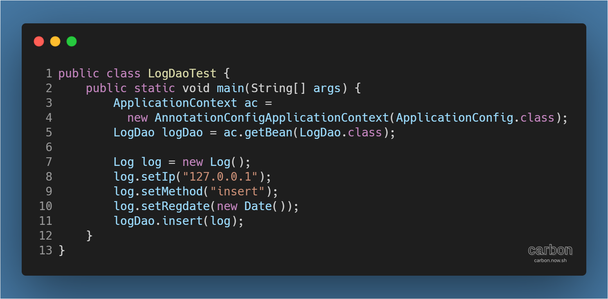

강의: [\[edwith 부스트코스\] 웹 프로그래밍](https://www.edwith.org/boostcourse-web/) 챕터 3, 웹 앱 개발: 예약서비스 1/4

학습일: 2020년 5월 4일

---

## 10\. 레이어드 아키텍쳐 (Layered Architecture) - BE

#### 방명록 만들기 실습 - 데이터베이스 테이블 생성

프로젝트의 기본 설정을 마쳤다면, 어플리케이션의 데이터를 관리할 데이터베이스 테이블을 생성할 차례이다. ([Layered Architecture (Back End) ... 실습 전 준비](https://til-devsong.tistory.com/73?category=772389) 구현할 기능 참조)

> MySQL  
> → guestbook 테이블을 생성하는 SQL 실행  
> → log 테이블을 생성하는 SQL 실행

#### 방명록 만들기 실습 - DTO 클래스 생성

데이터베이스가 준비되었으니, 레이어드 아키텍쳐 중 Repository Layer를 만들 차례이다. 우선, DTO 클래스를 먼저 생성한다. 이를 위해 DTO 클래스를 모아놓을 패키지를 생성한다.

> 프로젝트 > Java Resources > src/main/java 우클릭  
> → kr.or.connect.guestbook.dto 패키지 생성

그 다음, Guestbook 클래스를 생성한다. 이 DTO 클래스는 데이터베이스의 guestbook 테이블에 대응된다.

> 프로젝트 > Java Resources > src/main/java > kr.or.connect.guestbook.dto 우클릭  
> → Guestbook 클래스 생성 (각주 (각주:
>
> > 
> > )의 코드 참고)  
> > → guestbook 테이블의 필드를 타입에 맞게 변수로 선언  
> > → 각 변수에 대한 getters, setters 메서드 추가  
> > → 필요 시 변수를 일괄적으로 간편하게 확인하기 위해 toString() 메서드 Override

데이터베이스의 log 테이블에 대응되는 DTO 클래스인 Log 테이블도 만든다.

> 프로젝트 > Java Resources > src/main/java > kr.or.connect.guestbook.dto 우클릭  
> → Log 클래스 생성 (각주 (각주:
>
> > 
> > )의 코드 참고)  
> > → log 테이블의 필드를 타입에 맞게 변수로 선언  
> > → 각 변수에 대한 getters, setters 메서드 추가  
> > → 필요 시 변수를 일괄적으로 간편하게 확인하기 위해 toString() 메서드 Override

#### 방명록 만들기 실습 - DAO 클래스 생성

DTO 클래스가 준비되었으니 DAO 클래스도 만들어야 한다. 먼저 DAO 클래스를 모아놓을 패키지를 생성한다.

> 프로젝트 > Java Resources > src/main/java 우클릭  
> → kr.or.connect.guestbook.dao 패키지 생성

log 테이블에 데이터를 입력하는 LogDao 클래스를 만든다. 데이터를 입력하기만 하므로, 상대적으로 코드가 간단하다.

> 프로젝트 > Java Resources > src/main/java > kr.or.connect.guestbook.dao 우클릭  
> → LogDao 클래스 생성 (각주 (각주:
>
> > 
> > )의 코드 및 [Spring JDBC (Back End) ... Part 4](https://til-devsong.tistory.com/58) RoleDao 클래스 수정 참고)  
> > → @Repository 입력  
> > → SQL 구문을 실행하는 데 필요한 정보를 담은 LogDao 객체 (각주: Spring JDBC가 제공하는 usingGeneratedKeyColumns("id") 메서드를 사용해 id 칼럼의 값을 자동으로 생성한다.)를 생성  
> > → 데이터베이스에 데이터를 입력하고 Key 값을 돌려주는 insert( ) 메서드를 생성

다음은 guestbook 테이블의 데이터를 조작하는 GuestbookDao 클래스를 만들 차례이다.

그런데 GuestbookDao 클래스는 데이터 조회, 삭제 등 다양한 작업을 하므로 SQL 구문이 여럿 필요하다. 이를 관리할 GuestbookDaoSqls 클래스를 먼저 만들도록 한다.

> 프로젝트 > Java Resources > src/main/java > kr.or.connect.guestbook.dao 우클릭  
> → GuestbookDaoSqls 클래스 생성 (각주 (각주:
>
> > 
> > )의 코드 및 [Spring JDBC (Back End) ... Part 3](https://til-devsong.tistory.com/55?category=772389) RoleDaoSqls 클래스 생성 참고)  
> > → SQL 구문을 상수 (각주: public static final을 사용해 변수를 정의하면 상수가 된다.)로 입력
>
> **※ SELECT_PAGING 구문의 LIMIT은 특정 범위를 조회하는 키워드로, 조회할 범위를 start와 limit 사이로 설정할 수 있음**

SQL 구문이 준비되었으니 GuestbookDao 클래스를 만든다.

> 프로젝트 > Java Resources > src/main/java > kr.or.connect.guestbook.dao 우클릭  
> → GuestbookDao 클래스 생성 (각주 (각주:
>
> > 
> > )의 코드 참고)  
> > → @Repository 입력  
> > → SQL 구문을 실행하는 데 필요한 정보를 담은 GuestbookDao 객체 (각주: LogDao 객체와 동일하게 usingGeneratedKeyColumns("id") 메서드를 사용해 id 칼럼의 값을 자동으로 생성한다.)를 생성  
> > → LIMIT을 사용해 데이터베이스에서 특정 범위의 데이터를 조회하는 selectAll( ) 메서드를 생성  
> > → 데이터베이스에 데이터를 입력하고 Key 값을 돌려주는 insert( ) 메서드를 생성  
> > → 데이터베이스에서 특정 id를 가진 데이터를 삭제하는 deleteById( ) 메서드를 생성  
> > → 데이터베이스의 데이터의 갯수를 반환하는 selectCount( ) 메서드를 생성

#### 방명록 만들기 실습 - 중간 테스트

메서드를 구현한 뒤에는 정상적으로 동작하는지 테스트해주는 것이 매우 중요하다. GuestbookDao 클래스를 테스트하기 위해 GuestbookDaoTest 클래스를 생성한다.

> 프로젝트 > Java Resources > src/main/java > kr.or.connect.guestbook.dao 우클릭  
> → GuestbookDaoTest 클래스 생성 (각주 (각주:
>
> > 
> > )의 코드 및 [Spring JDBC (Back End) ... Part 3](https://til-devsong.tistory.com/55?category=772389) SELECT 쿼리문 실행 테스트하기 참고)   
> > → main( ) 메서드 (각주: 원칙적으로 테스트를 할 때에는 다른 개발 요소들과 테스트 클래스를 함께 보관하는 것은 적절하지 않으므로, JUnit 등 단위 테스트를 할 수 있는 도구를 활용하는 것이 권장된다. 그러나 불가피하게 함께 보관하더라도 테스트를 실시하는 것이 실시하지 않는 것보다는 낫다.) 생성  
> > → ApplicationContext에 만들 객체에 대한 정보를 입력  
> > → getBean( ) 메서드를 통해 ApplicationContext에서 GuestbookDao 객체를 얻어냄  
> > → Guestbook 객체를 생성한 뒤 이름, 내용, 등록일 등 방명록 정보를 입력  
> > → GuestbookDao 객체를 통해 insert( ) 메서드를 실행한 뒤 반환된 id를 저장  
> > → 콘솔에 id를 출력

GuestbookDaoTest 클래스를 Run As > Java Application (각주: main( ) 메서드에서 실행하는 것이므로 Run on Server는 해당되지 않는다.)으로 실행했을 때 콘솔에 id 값이 출력되고 guestbook 테이블에 내용이 입력되면 정상적으로 실행된 것이다.

유사한 방법으로 LogDao 클래스를 테스트하기 위해 LogDaoTest 클래스를 생성한다.

> 프로젝트 > Java Resources > src/main/java > kr.or.connect.guestbook.dao 우클릭  
> → LogDao 클래스 생성 (각주 (각주:
>
> > 
> > )의 코드 참고)   
> > → main( ) 메서드 생성  
> > → ApplicationContext에 만들 객체에 대한 정보를 입력  
> > → getBean( ) 메서드를 통해 ApplicationContext에서 LogDao 객체를 얻어냄  
> > → Log 객체를 생성한 뒤 IP, 메서드, 등록일 등 로그 정보를 입력  
> > → LogDao 객체를 통해 insert( ) 메서드를 실행

LogDaoTest 클래스를 Run As > Java Application으로 실행했을 때 log 테이블에 내용이 입력되면 정상적으로 실행된 것이다.

---

