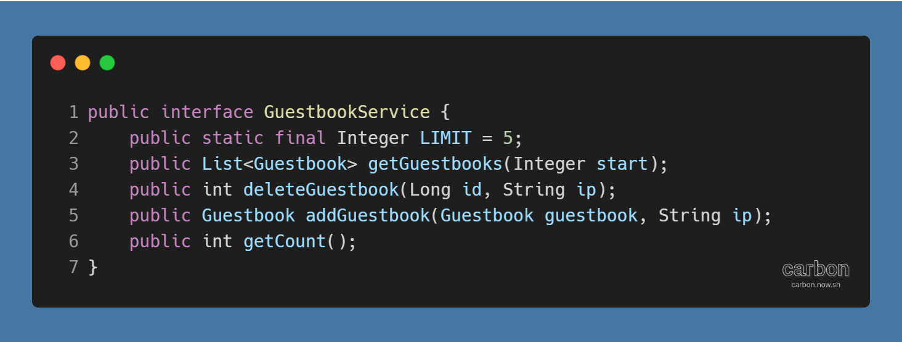
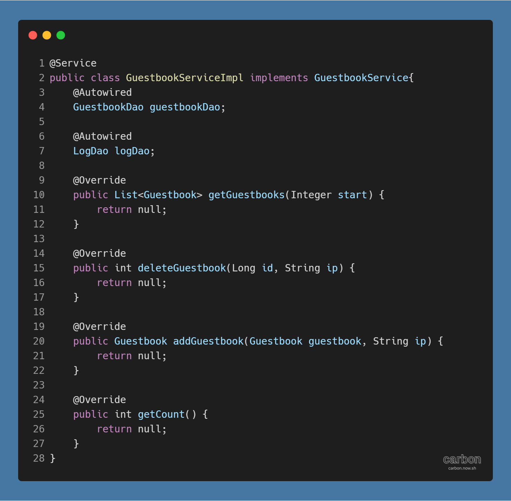
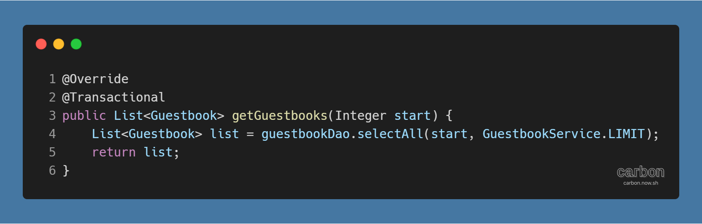
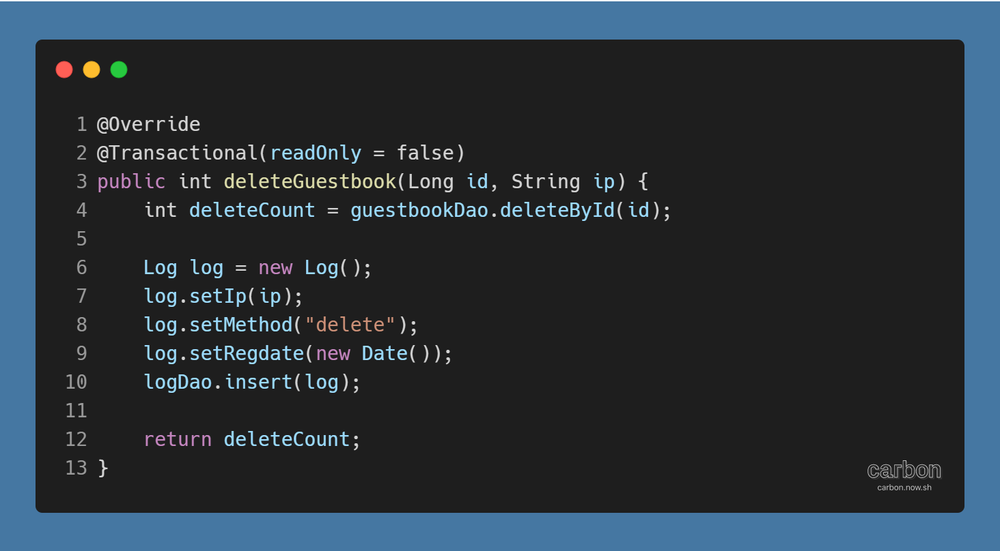
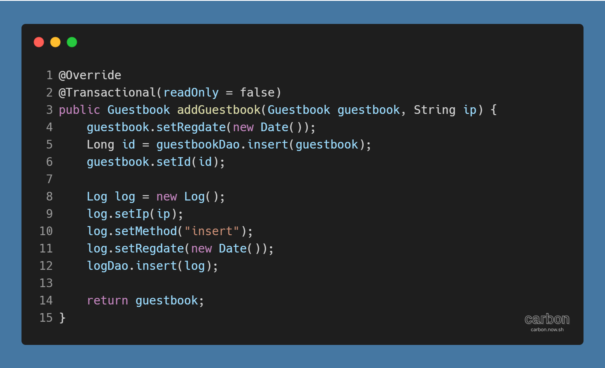
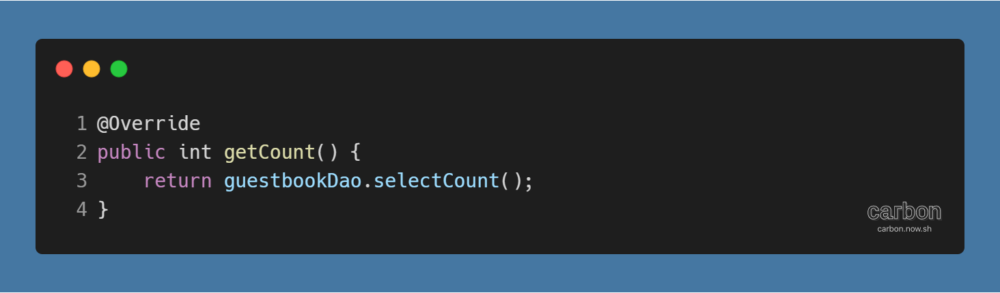
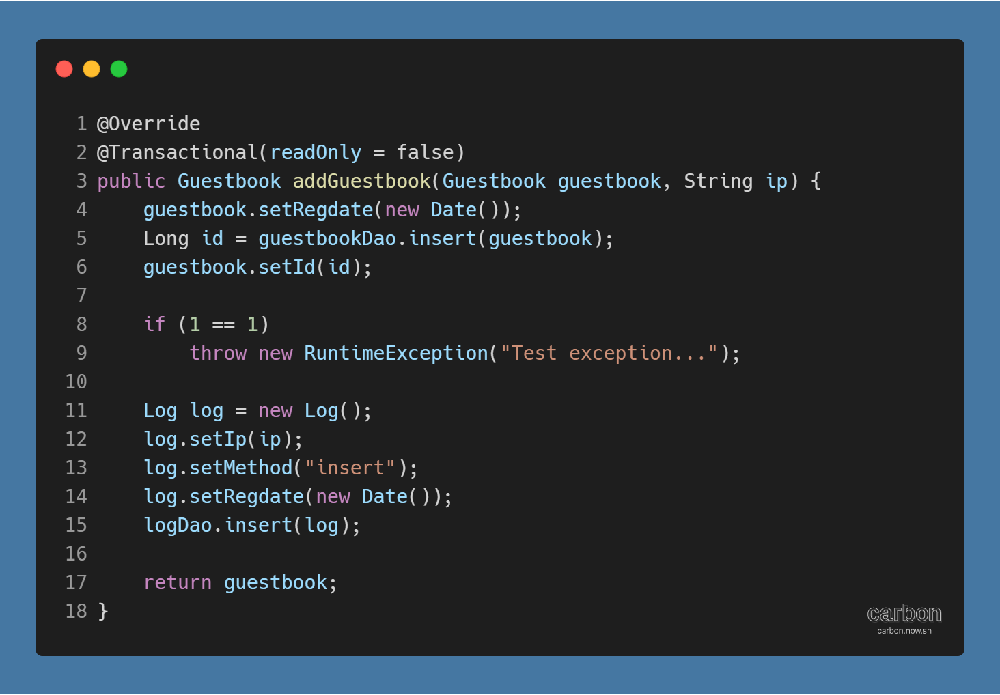

강의: [\[edwith 부스트코스\] 웹 프로그래밍](https://www.edwith.org/boostcourse-web/) 챕터 3, 웹 앱 개발: 예약서비스 1/4

학습일: 2020년 5월 5일

---

## 10\. 레이어드 아키텍쳐 (Layered Architecture) - BE

#### 방명록 만들기 실습 - Service 클래스 생성

이번에는 레이어드 아키텍쳐 중 Service Layer를 만들 차례이다.

서비스 클래스를 모아놓을 패키지를 만드는데, 인터페이스와 실제 구현체를 모아놓을 패키지를 따로 만들도록 한다.

> 프로젝트 > Java Resources > src/main/java 우클릭  
> → kr.or.connect.guestbook.service, kr.or.connect.guestbook.service.impl 패키지 생성

다음으로, GuestbookService 인터페이스를 생성한다.

> 프로젝트 > Java Resources > src/main/java > kr.or.connect.guestbook.service 우클릭  
> → GuestbookService 인터페이스 생성 (각주 (각주:
>
> > 
> > )의 코드 참고)  
> > → 한 페이지에 보여줄 방명록 건수를 상수 (각주: 변수 선언 시 public static final을 사용하면 상수가 된다.) LIMIT으로 지정  
> > → 비즈니스 로직을 담당하는 메서드 (각주: 페이지별로 방명록 정보를 읽어오는 getGuestbooks( ) 메서드,  
> > 특정 id 값을 가진 방명록을 삭제하는 deleteGuestbook( ) 메서드,  
> > 방명록 정보를 새로 입력하는 addGuestbook( ) 메서드,  
> > 전체 방명록 건수를 알려주는 getCount( ) 메서드) 선언 (각주: 실제 구현은 인터페이스가 아닌 구현체에서 할 것이므로 선언만 한다.)

인터페이스를 만들었다면 실제로 인터페이스를 구현할 GuestbookServiceImpl 클래스를 생성한다.

> 프로젝트 > Java Resources > src/main/java > kr.or.connect.guestbook.service.impl 우클릭  
> → GuestbookServiceImpl 클래스 생성 (각주 (각주:
>
> > 
> > )의 코드 참고)  
> > → Service Layer로 인식되도록 @Service 입력  
> > → 이용할 GuestbookDao, LogDao 선언 뒤 @Autowired (각주: Java Bean으로 자동 등록해주는 Annotation이다.) 입력  
> > → 클래스 뒤 implements (각주: 구현할 인터페이스를 지정하는 키워드이다.) GuestbookService 입력  
> > → GuestbookService에서 선언한 메서드를 하나씩 구현 (각주: 클래스 선언 라인에서 실행할 수 있는 Add unimplemented methods 기능을 활용하면 간편하게 인터페이스의 메서드를 Override할 수 있다.)

구현되는 메서드를 하나씩 살펴보자면 다음과 같다.

첫 번째는 방명록 정보를 일정 범위만큼 조회하는 getGuestbooks( ) 메서드이다. 아래 코드를 보자.

범위는 첫 번째 인자부터 두 번째 인자까지인데, 각각 start와 GuestbookService 인터페이스에서 선언된 LIMIT (각주: 추후 변경 시에는 인터페이스에서 변경하면 된다.)을 지정해주면 된다. 메서드의 결과는 Guestbook 타입의 List으로 반환되게 된다.

**※ @Transactional은 메서드를 트랜잭션으로 만든다. 기본값이 true인 readOnly 속성을 가지는데, 조회만 하는 경우 readOnly 속성을 별도로 수정하지 않아도 된다.**

두 번째 메서드는 특정 id 값을 가진 방명록을 삭제하는 deleteGuestbooks( )이다. 코드를 보자.

삭제 결과는 deleteCount 변수에 저장되어 반환된다. 삭제가 이루어지면, Log 객체를 사용해 삭제 정보를 데이터베이스 log 테이블에 입력한다.

**※ 메서드가 데이터를 삭제하고 입력하므로 @Transactional의 readOnly 속성을 false로 설정해줘야 한다.**

세 번째는 방명록에 정보를 입력하는 addGuestbook( ) 메서드이다.

guestbook 객체의 방명록 정보는 대부분 컨트롤러가 사용자로부터 값을 받아 저장하지만, 등록일은 메서드가 실행되는 시점으로 직접 설정해줘야 한다. 그렇게 완성된 guestbook 정보를 데이터베이스에 입력하고, 반환된 id도 함께 저장한다. 입력이 이루어지면, Log 객체를 사용해 입력 정보를 데이터베이스 log 테이블에 입력한다.

마지막은 방명록 건수를 조회하는 getCount( ) 메서드이다.

굉장히 간단하다. guestbookDao의 selectCount( ) 메서드가 방명록 건수를 조회해 반환하므로, 메서드의 실행 결과를 바로 반환하면 된다.

#### 방명록 만들기 실습 - 중간 테스트 (2)

Service Layer가 잘 작동하는지 테스트해보기 위해 GuestbookServiceTest 클래스를 만든다.

> 프로젝트 > Java Resources > src/main/java > kr.or.connect.guestbook.service.impl 우클릭  
> → GuestbookServiceTest 클래스 생성  
> → main( ) 메서드 생성  
> → ApplicationContext에 만들 객체에 대한 정보를 입력  
> → getBean( ) 메서드를 통해 ApplicationContext에서 GuestbookService 객체를 얻어냄  
> → Guestbook 객체를 생성한 뒤 이름, 내용, 등록일 등 방명록 정보를 입력  
> → GuestbookService 객체를 통해 addGuestbook( ) 메서드를 실행한 뒤 반환된 결과를 저장  
> → 콘솔에 결과를 출력

GuestbookServiceTest를 Run As > Java Application으로 실행했을 때 콘솔에 결과가 출력되고 guestbook 테이블에 내용이 입력되면 정상적으로 실행된 것이다.

#### ※ 트랜잭션의 중요성

여러 기능을 실행하는 하나의 메서드에서 오류가 발생했을 때, 일반적인 메서드는 오류 발생 시점 이전까지의 코드는 실행된다. 그렇지만 트랜잭션인 메서드는 도중에 오류가 발생하면 오류 시점 이전 실행된 코드라도 rollback되어 전체가 실행되지 않은 것처럼 된다. 이를 트랜잭션의 원자성이라고 한다. ([Layered Architecture (Back End) ... 이론](https://til-devsong.tistory.com/72?category=772389) 트랜잭션 참고)

예시를 위해 addGuestbook 메서드에 일부러 예외를 발생시켜보자.

if 구문을 통해 반드시 중간에 예외가 발생하도록 설정했다.

만약 @Transactional이 붙어있지 않은 일반 메서드였다면, guestbook 테이블에는 데이터가 입력되지만 log 테이블에는 데이터가 입력되지 않는다. 하지만 트랜잭션인 메서드이므로, guestbook 테이블과 log 테이블 모두에 데이터가 입력되지 않는다.

---

#### Q & A

> 데이터베이스에 입력하다가 오류가 났는데, 몇몇 id가 빠진 것처럼 출력돼요

데이터베이스에 정보를 입력할 때, 자동으로 생성되는 id는 반드시 1, 2, 3, ... 순으로 표시되지는 않는다.

생성하다가 오류가 나 데이터가 입력되지 않은 경우, 해당 id는 나중에 다시 쓰이지 않기 때문이다. 그러므로 데이터베이스에서는 특정 id가 빠진 것처럼 보일 수 있다. 순서대로 표시되지 않아도 별다른 문제는 없으니 신경 쓸 필요는 없다.

---

#Java #웹 프로그래밍 #backend #백엔드 #내용 정리 #edwith #부스트코스 #레이어드 아키텍쳐 #Layered Architecture
