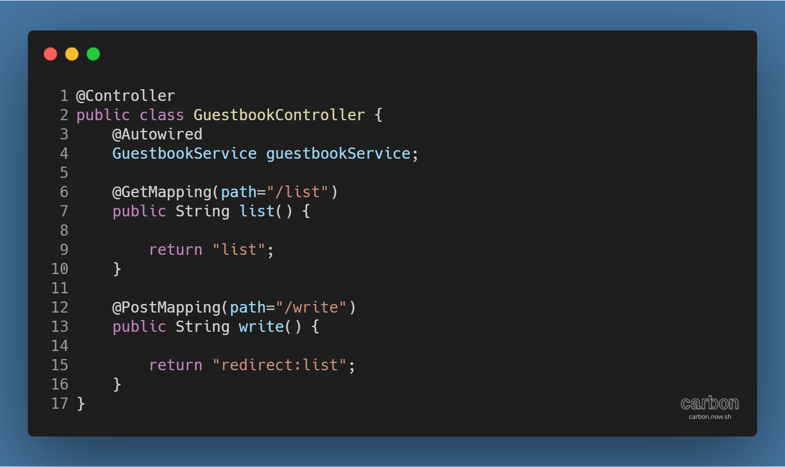
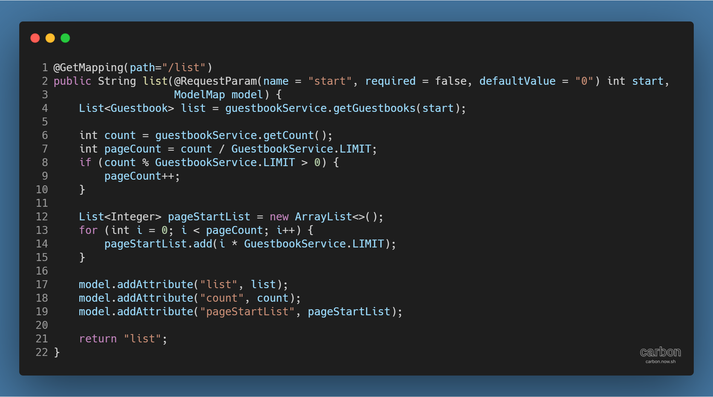
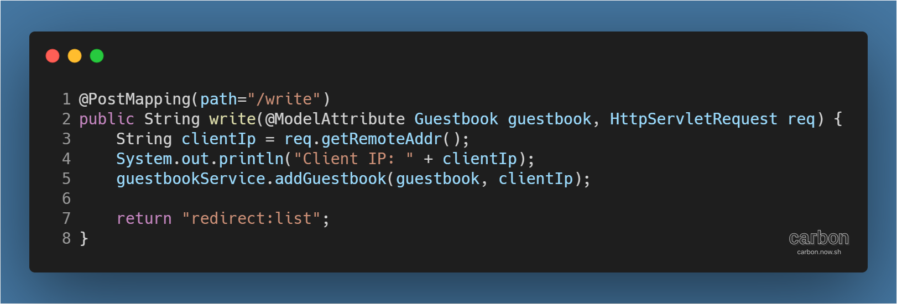
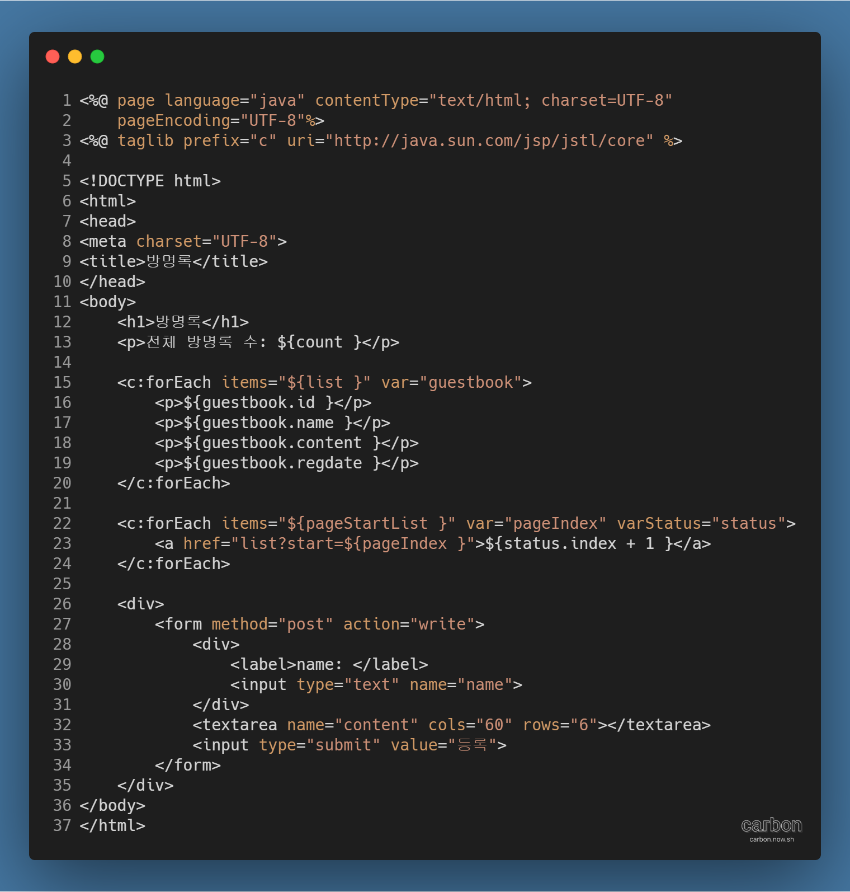

강의: [\[edwith 부스트코스\] 웹 프로그래밍](https://www.edwith.org/boostcourse-web/) 챕터 3, 웹 앱 개발: 예약서비스 1/4

학습일: 2020년 5월 6일

---

## 10\. 레이어드 아키텍쳐 (Layered Architecture) - BE

#### 방명록 만들기 실습 - 컨트롤러 생성

이제 URL 요청을 View와 연결해주는 컨트롤러를 만들 차례이다.

언제나와 같이 컨트롤러를 모아놓을 패키지를 먼저 만들어주도록 한다

> 프로젝트 > Java Resources > src/main/java 우클릭  
> → kr.or.connect.guestbook.controller 패키지 생성

다음으로 GuestbookController 클래스를 생성한다.

> 프로젝트 > Java Resources > src/main/java > kr.or.connect.guestbook.controller 우클릭  
> → GuestbookController 클래스 생성
> 
> → ComponentScan이 Bean을 찾을 수 있도록 @Controller를 입력  
> → 컨트롤러가 사용하는 GuestbookService를 @Autowired를 붙여 선언  
> → GuestbookService를 사용해 URL 요청에 대응하는 메서드를 생성

만들어야 하는 메서드는 두 개이다. URL 요청이 두 가지이기 때문이다.

첫 번째는 GET 방식의 /list URL 요청에 대응하는 list 메서드이다. 아래 코드를 보자.

우선 @RequestParam으로 start란 name을 가진 매개변수의 값을 저장한다. 값이 없을 경우엔 0으로 설정한다. ([Spring MVC (Back End) ... Part 4](https://til-devsong.tistory.com/70?category=772389) plus( ) 메서드 참고)

guestbookService의 getGuestbooks( ) 메서드를 실행해 방명록 정보를, getCount( ) 메서드로 방명록 건수를 얻어온다. 그 후, 전체 방명록 건수를 LIMIT 값으로 나눠 총 페이지 수를 구하고, 페이지 링크를 사용할 수 있도록 페이지 수에 상응하는 start 값을 list에 담는다. 그리고 이 값들을 JSP 파일에서 사용할 수 있도록 modelMap에 저장한다.

마지막으로 View 이름으로 쓰일 "list" 문자열을 반환한다.

두 번째는 POST 방식의 /write URL 요청에 대응하는 write 메서드이다. 코드를 보자.

이번에는 @ModelAttribute로 DTO를 지정하고, IP 정보를 얻기 위해 HttpServletRequest를 불러온다. ([Spring MVC (Back End) ... Part 4 regist( ) 메서드, getGoodsById( )](https://til-devsong.tistory.com/70?category=772389) 메서드 참고)

HttpServletRequest의 getRemoteAddr( ) 메서드를 실행해 사용자의 IP 정보를 불러와 콘솔에 출력한다.

생성된 방명록 정보를 갖고 있는 Guestbook 객체 (각주: @ModelAttribute로 지정됐으므로, path가 넘겨주는 값 중 DTO와 동일한 name을 가진 값을 인식해 자동으로 생성된다.)와 사용자의 IP로 guestbookService의 addGuestbook( ) 메서드를 실행한다.

마지막으로 /list URL로 리다이렉트를 실행한다.

#### 방명록 만들기 실습 - 뷰 생성

최종적으로 앞의 모든 내용을 화면에 출력할 뷰를 만들 순간이다.

> 프로젝트 > src > main > webapp > WEB-INF > views 우클릭  
> → list.jsp JSP 파일 생성 (각주의 코드 (각주:
>
> > 
> > ) 참고)  
> > → JSTL을 정상적으로 인식하도록 지시자 입력 ([EL과 JSTL (Back End)](https://til-devsong.tistory.com/29?category=772389) JSTL 사용 방법 참고)  
> > → 변수를 EL 표기법을 사용해 표기 ([EL과 JSTL (Back End)](https://til-devsong.tistory.com/29?category=772389) EL의 사용방법 참고)  
> > → 조회한 방명록 정보를 JSTL forEach 태그로 나열해서 표시 ([EL과 JSTL (Back End)](https://til-devsong.tistory.com/29?category=772389) forEach 참고)  
> > → 방명록 페이지 번호 링크를 JSTL forEach 태그와 varStatus 속성 (각주: 참고자료: [\[JSP/JSTL\] JSTL, forEach에서의 varStatus 속성 이용](https://postitforhooney.tistory.com/entry/JSPJSTL-JSTL-foreach%EC%97%90%EC%84%9C%EC%9D%98-varStatus-%EC%86%8D%EC%84%B1-%EC%9D%B4%EC%9A%A9))을 이용해 표시  
> > → 사용자가 방명록 정보를 입력하고 POST 방식 /write URL 요청을 보낼 수 있는 form 생성

프로젝트를 Run As > Run on Server로 실행했을 때 list 페이지가 표시되고, 방명록을 작성해 등록했을 때 갱신된 list 페이지로 리다이렉트되면 정상적으로 실행된 것이다.

---
