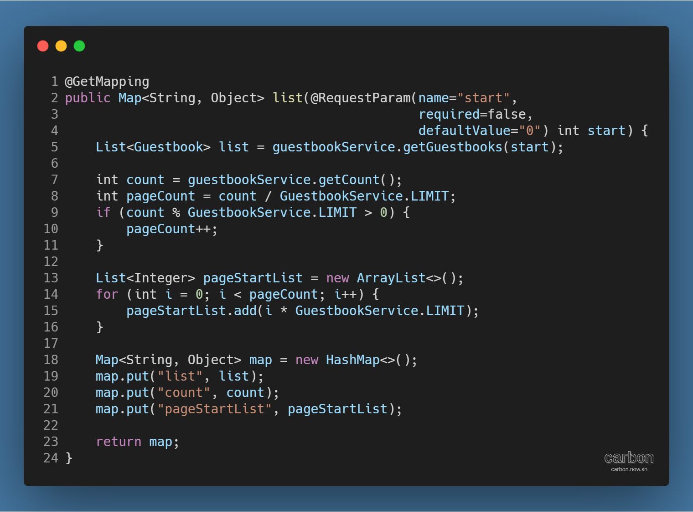
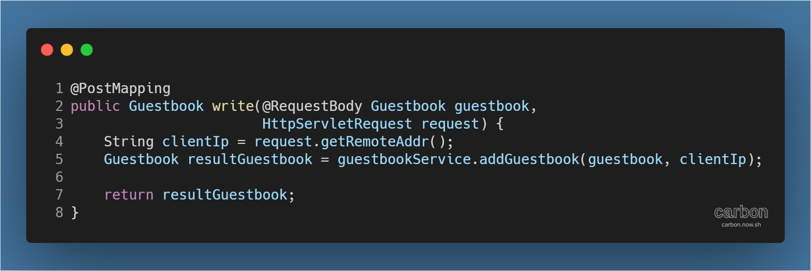
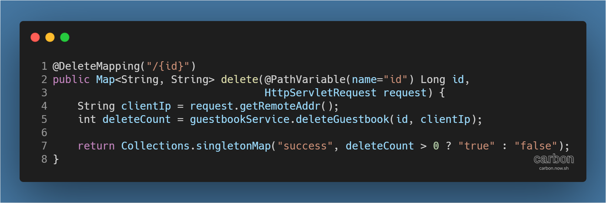

강의: [\[edwith 부스트코스\] 웹 프로그래밍](https://www.edwith.org/boostcourse-web/) 챕터 3, 웹 앱 개발: 예약서비스 1/4

학습일: 2020년 5월 6일

---

## 11\. Controller - BE

#### Web API 작성 실습 - 프로젝트 초기 설정

@RestController를 사용해 guestbook 프로젝트에 Web API를 추가해보자.

우선, MessageConverter가 사용할 jackson 라이브러리를 추가해야 하는데, guestbook 프로젝트에는 이미 추가되어 있어 생략 (각주: 새로 추가해야 할 경우, [Web API (Back End) ... Part 2](https://til-devsong.tistory.com/34) pom.xml 변경을 참고하라.)한다.

#### Web API 작성 실습 - 컨트롤러 생성

이제 API 요청을 받는 컨트롤러를 만들어야 한다. GuestbookApiController 클래스를 생성한다.

> 프로젝트 > Java Resources > src/main/java > kr.or.connect.guestbook.controller 우클릭  
> → @RestController 입력  
> → 클래스 전체가 /guestbooks URL에 대응 (각주: 해당 URL으로 Content-type이 application/json인 요청이 들어오면 클래스가 실행된다.)하도록 @RequestMapping(path="/guestbooks") 입력  
> → 컨트롤러가 사용하는 GuestbookService를 @Autowired를 붙여 입력  
> → GuestbookService를 사용해 요청 방식별로 대응하는 메서드를 생성

만들어야 하는 메서드는 3개이다. GET, POST, DELETE 방식의 요청으로 나뉘기 때문이다.

첫 번째는 GET 방식의 요청에 대응하는 list 메서드이다. 아래 코드를 보자.

@GetMapping은 붙어있으나 앞의 @RequestMapping에서 URL을 지정했으므로 path를 따로 지정하지 않아도 된다.

전체적인 구조는 GuestbookController의 list 메서드와 유사하나, View의 이름이 아닌 Map을 반환 (각주: DispatcherServlet가 내부적으로 jsonMessageConvert를 사용해 Map을 JSON으로 변환해 전송하게 된다.)하는 점이 다르다.

두 번째는 POST 방식의 요청에 대응하는 write 메서드이다.

POST 방식으로 요청한 JSON 데이터는 @RequestBody를 통해 Guestbook 객체로 변환된다.

변환된 Guestbook 객체를 사용해 HttpServletRequest의 getRemoteAddr( ) 메서드로 불러온 사용자의 IP 정보와 함께 guestbookService의 addGuestbookService( ) 메서드를 실행한다.

메서드는 Guestbook 객체를 반환하는데, 이 객체는 클라이언트에게 응답하는 과정에서 다시 JSON으로 변환된다.

마지막은 DELETE 방식의 요청하는 delete 메서드이다. 아래 코드를 보자.

GET, POST 방식과 달리 @DeleteMapping 뒤 추가적인 path 정보가 있으므로 /guestbooks/{id} URL 요청에 대응하게 된다. 여기서 id란 이름으로 전달될 값은 @PathVariable을 입력해 변수로 사용 (각주: 참고자료: [Spring MVC (Back End) ... Part 4](https://til-devsong.tistory.com/70) getGoodsById( ) 메서드)할 수 있다.

넘겨받은 id 값과 사용자의 IP 정보로 guestbookService의 deleteGuestbook( ) 메서드를 실행해 성공할 경우 1을, 실패할 경우 0을 저장한다.

이 값에 의해 true 또는 false를 가지는 Map을 반환하는데, 이 Map 또한 클라이언트에게 응답하는 과정에서 다시 JSON으로 변환된다.

#### Web API 작성 실습 - API 테스트

API를 테스트하기 위해선 클라이언트가 필요하다. 강의에서는 Google Chrome 확장 프로그램인 [Talend API Tester](https://chrome.google.com/webstore/detail/talend-api-tester-free-ed/aejoelaoggembcahagimdiliamlcdmfm)를 사용한다.

우선 테스트를 위해 프로젝트를 Run As > Run on Server로 실행한다.

첫 번째로 GET 방식의 요청을 테스트해보자.

> 1\. Project (각주: 이름은 원하는 대로 설정할 수 있다.) 생성  
> 2\. Request (각주: 이름은 원하는 대로 설정할 수 있다.) 생성  
> 3\. GET 메서드 지정  
> 4\. URI에 http://localhost:8080/guestbook/guestbooks 입력  
> 5\. HEADERS에 Content-type : application/json 입력  
> 6\. Send 실행

하단의 Response에 200 상태 코드와 BODY에 방명록 정보 목록이 표시되었다면 정상적으로 실행된 것이다.

두 번째로 POST 방식의 요청을 테스트해보자.

> 1\. Project 생성  
> 2\. Request 생성  
> 3\. POST 메서드 지정  
> 4\. URI에 http://localhost:8080/guestbook/guestbooks 입력  
> 5\. HEADERS에 Content-type : application/json 입력  
> 6\. BODY에 방명록 정보를 JSON 형식으로 입력  
> 7\. Send 실행

하단의 Response에 200 상태 코드와 BODY에 등록한 방명록 정보가 표시되었다면 정상적으로 실행된 것이다.

마지막으로 DELETE 방식의 요청을 테스트해보자.

> 1\. Project 생성  
> 2\. Request 생성  
> 3\. DELETE 메서드 지정  
> 4\. URI에 http://localhost:8080/guestbook/guestbooks/{id} (각주: 삭제하고 싶은 id를 입력한다.) 입력  
> 5\. Headers에 Content-type : application/json 입력  
> 6\. Send 실행

하단의 Response에 200 상태 코드와 BODY에 "true" 값을 가진 success 속성이 표시되고, 데이터베이스를 조회했을 때 해당 id를 가진 데이터가 삭제되었다면 정상적으로 실행된 것이다.

---

#### 생각해보기

> POST 방식의 요청에 대응하는 write 메서드를 보면, JSON 형식의 데이터를 Java 객체로 변환하고, Java 객체를 다시 JSON 형식으로 변환하는 과정이 자동으로 이루어진다. Servlet을 이용해 개발하는 경우라면, 이 부분을 어떻게 구현해야 하는가?

Servlet을 이용해 개발할 경우, Gson (각주: 참고자료: [Java - Json과 Gson 이란?](https://galid1.tistory.com/501)) 등의 별도의 라이브러리를 사용해 Java 객체에서 JSON으로, JSON에서 Java 객체로 변환하는 코드를 추가로 입력해줘야 한다. Spring MVC의 장점은 이런 추가적인 코드를 생략할 수 있어 편의성과 생산성이 높아진다는 것이다.

---

#Java #웹 프로그래밍 #backend #백엔드 #내용 정리 #rest api #RestController #edwith #부스트코스
