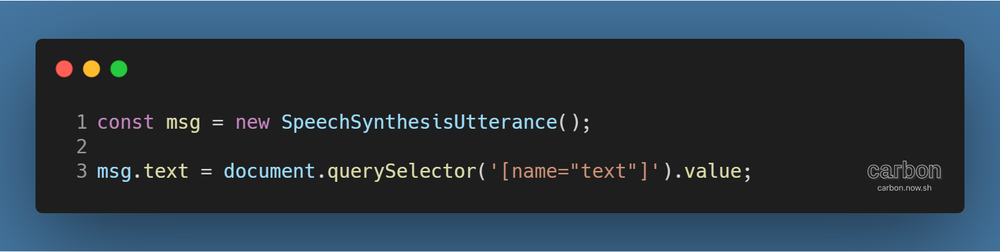
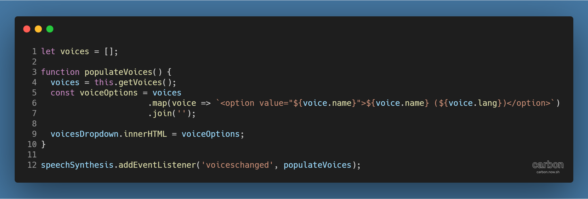
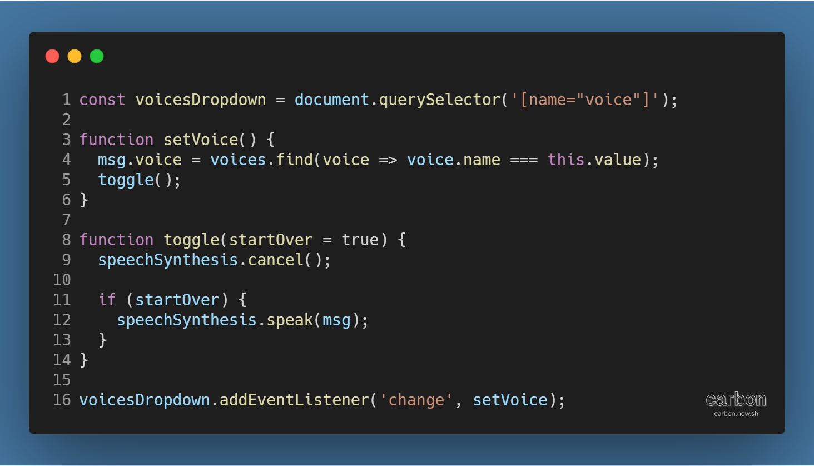
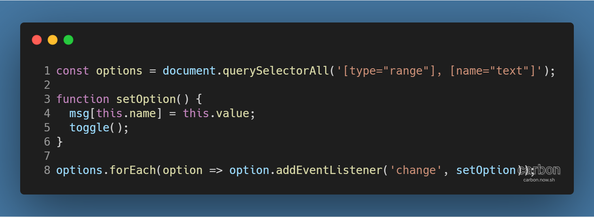
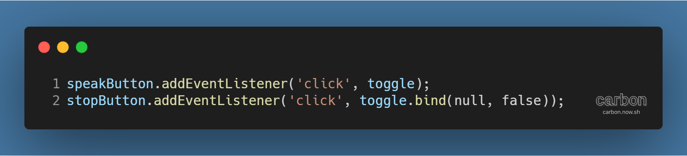

튜토리얼 출처: [JavaScript30](https://javascript30.com/)

튜토리얼 이름: Day 23 - Speech Synthesis

튜토리얼 분류: JavaScript

튜토리얼 설명: 브라우저에 내장된 음성 합성기를 이용해 텍스트 입력 음성으로 변환하기

진행기간: 2020년 5월 7일

---

대부분의 최신 브라우저는 음성 합성 인터페이스를 지원한다. 입력한 텍스트를 지정한 스타일의 음성으로 변환해주는 기본적인 음성 합성기를 만들어보자.

## 음성으로 합성될 메시지 지정하기

SpeechSynthesisUtterance는 (각주: 참고자료: [SpeechSynthesisUtterance - Web APIs | MDN](https://developer.mozilla.org/en-US/docs/Web/API/SpeechSynthesisUtterance))는 합성될 음성이 어떤 내용을 읽을지, 그리고 어떻게 읽을지 (각주: 언어, 말의 높낮이, 말하는 속도 등이 이에 해당된다.)에 대한 정보를 갖는 인터페이스이다.

먼저 생성자를 통해 SpeechSynthesisUtterance 객체를 만들고, 텍스트상자에 입력된 내용을 객체의 text 속성에 지정한다. 이 때의 값은 합성된 음성이 읽을 내용이 된다.

## 음성 종류 불러와 표시하기

SpeechSynthesis 인터페이스 (각주: 참고자료: [SpeechSynthesis - Web APIs | MDN](https://developer.mozilla.org/ko/docs/Web/API/SpeechSynthesis))를 사용하면 합성할 수 있는 음성의 종류를 확인할 수 있다. 다음의 코드를 보자.

voiceschanged 이벤트가 발생하면, populateVoices( ) 메서드가 실행된다. 이 메서드는 다음과 같은 순서로 동작한다.

> 1\. SpeechSynthesis 인터페이스의 getVoices( ) 메서드 (각주: 참고자료: [SpeechSynthesis.getVoices() - Web APIs | MDN](https://developer.mozilla.org/en-US/docs/Web/API/SpeechSynthesis/getVoices))로 현재 디바이스에서 사용 가능한 음성 스타일 목록 반환  
> 2\. 음성 스타일 목록을 map( )과 join( ) 메서드를 사용해 option 태그로 변환 (각주: map( ) 전 filter( )를 사용해 특정 언어의 음성만 조회할 수도 있다.)한 뒤 HTML 문자열로 결합  
> 3\. HTML 문자열을 드롭다운 요소의 내용으로 삽입

## 목소리 종류 변경 시 자동으로 재생하기

드롭다운 목록에서 목소리를 변경하면 변경된 목소리가 자동으로 재생되도록 할 수 있다.

드롭다운 목록에서 change 이벤트가 발생하면 setVoice( ) 메서드를 실행한다. setVoice( ) 메서드는 목소리 종류 중 선택한 종류를 찾아 SpeechSynthesisUtterance 객체의 voice 속성에 지정한다.

toggle( ) 메서드를 추가로 활용해서 만약 음성이 재생 중이라면 취소한 뒤, 새로운 음성을 재생 (각주: startOver 매개변수 자리에 false를 입력하면 자동으로 재생되지 않는다. 기본값은 true이다.)한다.

## 높낮이, 속도 등 목소리 옵션 설정하기

슬라이더로 입력받은 값을 활용해 목소리의 높낮이와 속도를 조절할 수 있다. 아래의 코드를 보자.

option 각각에 change 이벤트가 발생할 때 setOption( ) 메서드가 실행되도록 연동되어 있다.

setOption( ) 메서드는 변경된 option의 name과 value에 기반해 SpeechSynthesisUtterance 객체 속성의 값을 바꾼다.

## 인자를 넣은 함수를 addEventListener의 이벤트 핸들러로 사용하기

addEventListener의 이벤트 핸들러에 인자를 넣은 함수를 사용하면 이벤트가 등록되는 시점에만 해당 함수가 실행되고, 이후의 이벤트에는 실행되지 않는다. 대신 익명 함수, 또는 bind( ) 메서드를 사용하면 이 문제를 해결할 수 있다.

Function.prototype.bind( ) 메서드 (각주: 참고자료: [Function.prototype.bind() - JavaScript | MDN](https://developer.mozilla.org/en-US/docs/Web/JavaScript/Reference/Global_Objects/Function/bind))는 특정 함수가 사용할 this 키워드를 명확히 지정해주는 역할을 한다.

사실, 예시의 toggle( ) 메서드는 this 키워드를 쓰지 않기 때문에 첫 번째 인자는 크게 중요하지 않다. 그러므로 this 키워드에 어떤 값이 지정되더라도 문제는 없다. 일단은 null 값을 지정한다.

두 번째 인자부터 bind( )를 사용한 메서드에 전달되므로, toggle.bind(null, false)는 this 키워드가 null로 동작하는 toggle(false)와 실질적으로 동일하게 동작한다.

하지만 addEventListener에 바로 사용할 수 없는 toggle(false)와 달리, toggle.bind(null, false)는 익명 함수와 동일하게 작동하는 만큼 이벤트가 일어날 때마다 정상적으로 작동한다.

---

[GitHub 저장소 링크](https://github.com/dev-song/_home/tree/master/projects/JavaScript30/Day%2023/tutorial-Speech-Synthesis)

---

