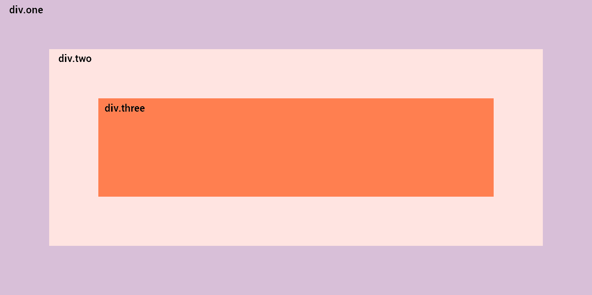
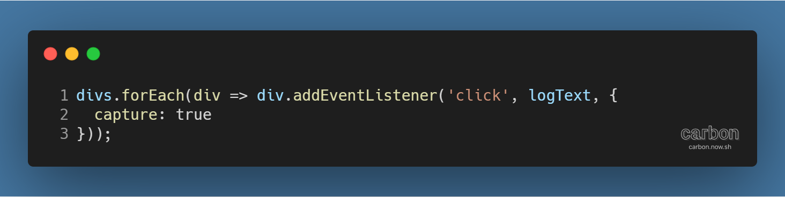
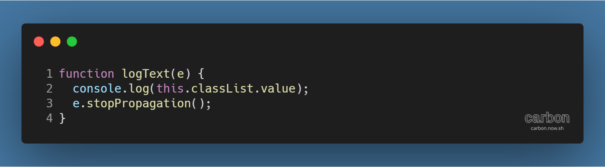
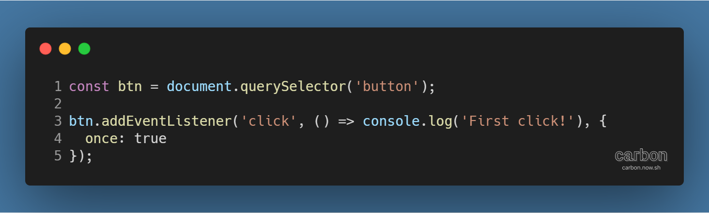

튜토리얼 출처: [JavaScript30](https://javascript30.com/)

튜토리얼 이름: Day 25 - Event Capture, Propagation, Bubbling and Once

튜토리얼 분류: JavaScript

튜토리얼 설명: JavaScript 이벤트의 전파(Propagation)과 전파 방식 두 가지, 이벤트 버블링과 이벤트 캡쳐

진행기간: 2020년 5월 9일

---

웹페이지의 DOM 요소 (각주: 참고자료: [DOM은 정확히 무엇일까? | WIT블로그](https://wit.nts-corp.com/2019/02/14/5522))를 어떤 이벤트에 반응하게 하고 싶다면, 일반적으로 JavaScript의 addEventListener( ) 메서드를 활용해 해당 요소에 이벤트 리스너를 등록한다.

그런데 DOM 요소의 배치와 이벤트리스너가 등록된 상황에 따라 예상하지 못한 방식으로 동작할 수 있다.

## 중첩된 DOM 요소와 이벤트의 작동 방식

위처럼 여러 DOM 요소가 중첩되고 모든 요소에 이벤트 리스너가 등록되었을 경우, 특정 요소에 이벤트가 실행되면 그 요소에 등록된 이벤트 리스너만 실행되지 않는다. 아래처럼 코드를 입력하고 div.three 요소를 클릭하면 어떻게 될까.

상식적으로는 콘솔에 three만 출력되어야하겠지만, 실제로는 three → two → one이 순차적으로 출력된다.

이는 이벤트 버블링(Event Bubbling)이라는 특성 때문이다.

#### 이벤트 버블링 (Event Bubbling)

특정 DOM 요소에 이벤트가 발생하면, 해당 요소에서만 이벤트 리스너가 실행되는 것이 아니라 최상위 요소에 도달할 때까지 상위 요소로 계속 올라가면서 이벤트 리스너를 찾고 실행시키는 특성이다.

그렇기 때문에 예시 코드에서는 div.three를 클릭했음에도 div.two, div.one의 이벤트 리스너도 실행된 것이다. 만약 body 태그에 click 이벤트에 대한 이벤트 리스너가 있었다면 그것 또한 실행되었을 것이다.

#### 이벤트 캡처 (Event Capture)

이벤트 버블링은 하위 요소의 이벤트 리스너부터 실행시킨다. 이벤트 캡처를 활용하면 이 방향을 반대로 바꿀 수 있다. 즉, 상위 요소부터 실행할 수 있다. 아래의 코드를 보자.

세 번째 인자의 capture 속성을 true로 해서 이벤트 리스너를 등록하면 이벤트 캡처 방식으로 동작한다.

div.three를 클릭하면 one → two → three의 순서로 콘솔에 출력된다.

## 이벤트 전파 (Event Propagation) 중지시키기

이벤트 버블링, 이벤트 캡쳐 둘 다 이벤트가 발생한 요소의 주변으로 '퍼져 나가는' 방식이다. 이를 이벤트 전파라고 한다. 기본 설정은 실행되는 것이지만, 실행을 막는 방법도 있다.

stopPropagation( ) 메서드 (각주: 참고자료: [Event.stopPropagation() - Web API | MDN](https://developer.mozilla.org/ko/docs/Web/API/Event/stopPropagation))를 사용해 이벤트 전파를 막고 있다. 이렇게 설정하면 이벤트 버블링의 경우 최하위 요소의 이벤트 리스너만, 이벤트 캡쳐의 경우 최상위 요소의 이벤트 리스너만 실행된다.

## 이벤트 리스너 한 번만 실행시키기

이벤트 전파 방식을 버블링과 캡처로 설정할 수 있듯이, addEventListener의 세 번째 인자를 활용해 이벤트가 단 한 번만 실행되도록 할 수 있다. 아래의 코드를 보자.

버튼을 처음 클릭했을 때만 콘솔에 First click!이 출력된다. 첫 번째 클릭 이후 removeEventListener( ) 메서드를 사용해 이벤트 리스너를 해제해주는 것과 동일한 효과이며, 더 간단하다.

---

[GitHub 저장소 링크](https://github.com/dev-song/_home/tree/master/projects/JavaScript30/Day%2025/tutorial-Event-Capture-Propagation-Bubbling-and-Once)

---

#자바스크립트 #javascript #Once #튜토리얼 #이벤트 버블링 #이벤트 전파 #javascript30 #이벤트 캡처 #DOM 요소
