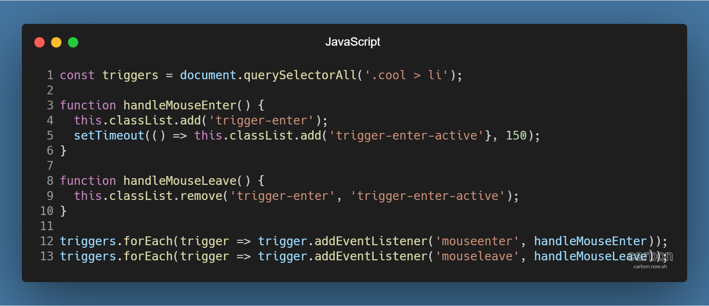
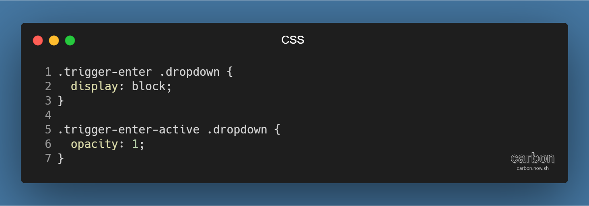
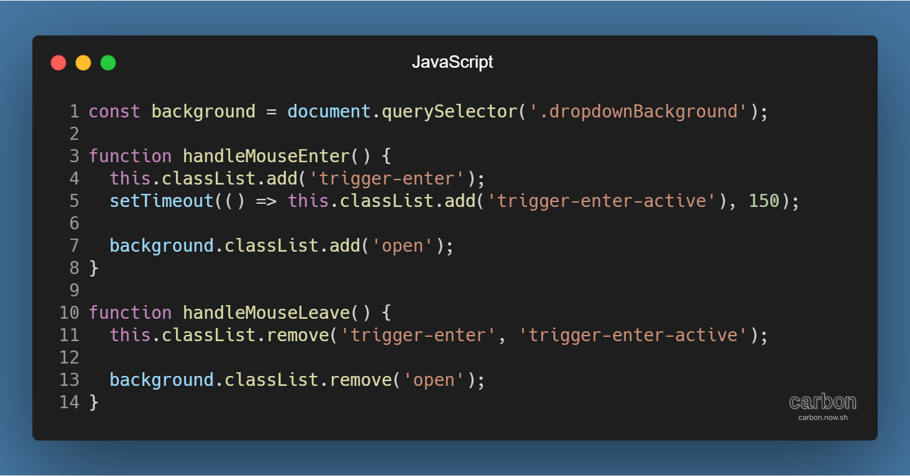
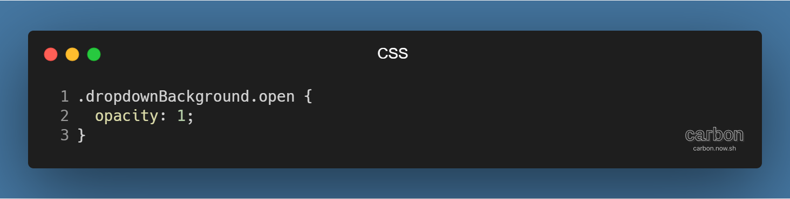
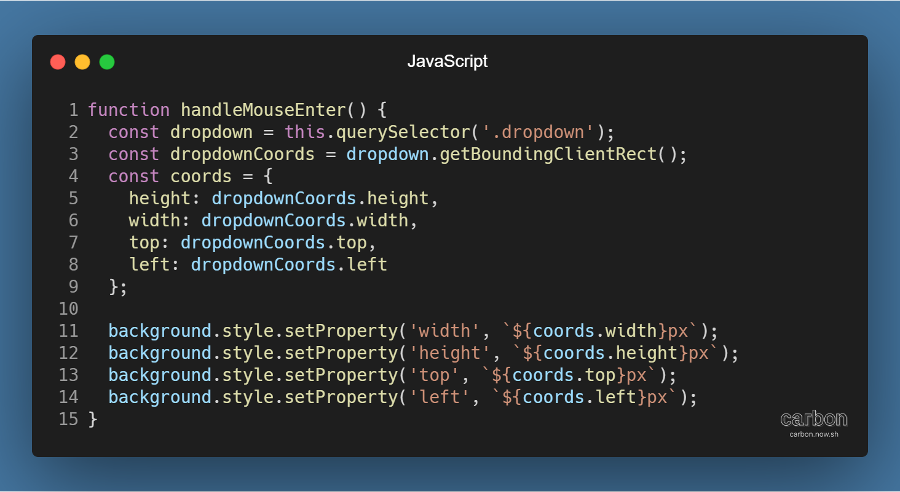
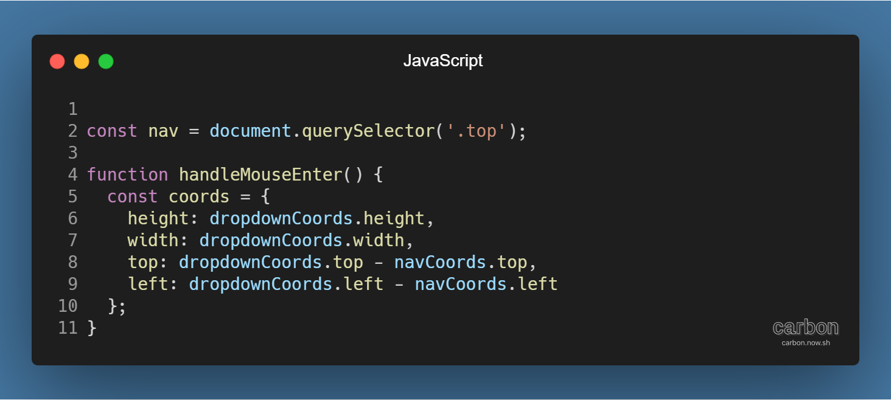
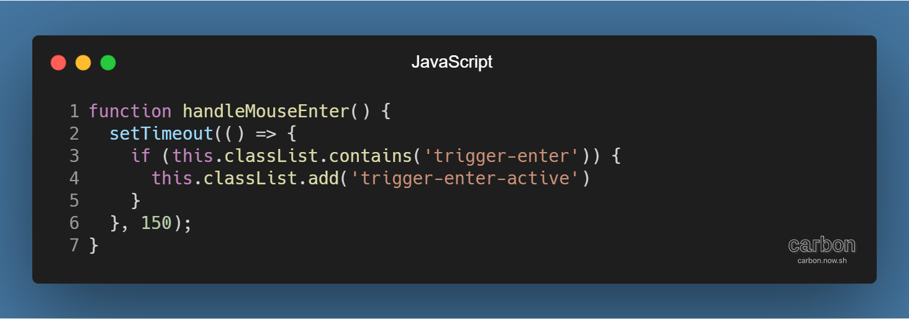

튜토리얼 출처: [JavaScript30](https://javascript30.com/)

튜토리얼 이름: Day 26 - Stripe Follow Along Nav

튜토리얼 분류: JavaScript

튜토리얼 설명: 내비게이션 바의 드롭다운 메뉴의 나타나고 사라지는 효과 자연스럽게 이어지도록 하기

진행기간: 2020년 5월 10일

---

내비게이션 바 항목에 하위 링크를 연결하고 싶을 때 사용하는 드롭다운 메뉴. 가장 기본적인 드롭다운 메뉴는 링크에 마우스 커서를 올리면 나타나고, 마우스 커서를 떼면 사라진다.

이 드롭다운 메뉴를 좀 더 시각적으로 자연스럽게 보이도록, 링크 사이에서 이어지듯이 나타나고 사라지게 해보자.

## 드롭다운 메뉴 나타나고 사라지게 하기

우선 마우스를 올리면 나타나고, 떼면 사라지도록 만들어야 한다. 아래의 코드를 보자.

내비게이션 바의 모든 링크를 triggers로 지정하고, 각 링크에 mouseenter 이벤트와 mouseleave 이벤트에 클래스를 추가하고 지우는 handleMouseEnter( ) 메서드와 handleMouseLeave( ) 메서드를 연동시켰다.

handleMouseEnter( ) 메서드의 작동방식은 다음과 같다.

> 1\. this (각주: 여기에선 이벤트가 작동한 DOM 요소를 의미한다.)에 trigger-enter 클래스 추가  
> 2\. 150ms 후 (각주: setTimeout( ) 메서드를 활용해서 구현한다.) this (각주: 화살표 함수 방식으로 익명 함수를 입력해야 this 값을 상속받는다. 함수 선언식으로 익명 함수를 입력할 경우엔 정상적으로 작동하지 않는다.)에 trigger-enter-active 클래스 추가

※ trigger-enter, trigger-enter-active 클래스의 추가 시점을 다르게 하는 이유

자연스러운 시각 효과를 위해서이다. React나 Angular의 animation과 transition의 작동 방식과 유사하다.

## 배경 요소 나타나고 사라지게 하기

본 드롭다운 메뉴가 나타나고 사라지는 동작은 구현했으니 배경 요소를 나타나고 사라지게 할 차례이다.

handleMouseEnter( ) 메서드와 handleMouseLeave( ) 메서드를 아래처럼 수정한다.

링크에 마우스를 올리면 배경 요소에 open 클래스를 추가하고 마우스를 떼면 지우게 된다. open 클래스에는 다음과 같은 스타일이 적용된다.

## 배경 요소와 드롭다운 메뉴 위치 및 크기 같게 하기

이제 배경 요소가 배경의 역할을 할 수 있도록 드롭다운 메뉴의 위치로 이동해야 한다. 크기도 같아져야 한다. 아래의 코드를 보자.

getBoundingClientRect( ) 메서드 (각주: DOM 요소의 크기와 위치 정보를 담은 DOMRect 객체를 반환하는 메서드이다. 참고자료: [마우스 커서 하이라이트 이어지듯이 전환하기](https://til-devsong.tistory.com/81?category=775075#footnote_link_81_4) 대상 요소와 하이라이트 효과의 위치와 크기 같게 하기)로 드롭다운 요소의 크기와 위치 정보를 얻어내 객체에 저장한다.

그리고 style 속성의 setProperty( ) 메서드를 이용해 배경 요소의 크기와 위치 정보를 드롭다운 메뉴의 정보와 같게 만든다.

## 다른 요소가 추가될 때의 위치 변경 예방하기

내비게이션 바의 위치가 계속 페이지 좌상단 끝으로 유지되면 괜찮지만, 내비게이션 바의 위쪽이나 왼쪽에 요소가 새로 추가된다면 드롭다운 메뉴와 배경이 일치하지 않는 문제가 생긴다.

드롭다운 메뉴의 position 속성이 absolute이므로 top과 left 값이 고정되어 발생하는 문제이다. 다음의 코드를 사용해 해결할 수 있다.

## 빠른 커서 이동으로 인한 오작동 방지하기

커서를 링크 사이에서 빠르게 움직이면 (각주: 예시에선 setTimeout의 delay로 설정한 150ms 미만의 시간 간격에 해당한다.) trigger-enter-active 클래스가 추가되기 전 다른 드롭다운에 trigger-enter 클래스가 추가되어 어긋나게 작동하는 경우가 발생한다. 간단한 방식으로 해결할 수 있다. 아래의 코드를 보자. 

150ms 후 trigger-enter-active 클래스가 추가되는 순간 trigger-enter 클래스가 존재해야만, 즉 마우스 커서가 해당 드롭다운 메뉴에 있어야만 드롭다운 메뉴가 작동하도록 하는 방식이다.

---

[GitHub 저장소 링크](https://github.com/dev-song/_home/tree/master/projects/JavaScript30/Day%2026/tutorial-Stripe-Follow-Along-Nav)

---

#자바스크립트 #javascript #튜토리얼 #dropdown #드롭다운 #mouseleave #MouseEnter #javascript30 #getBoundingClientRect
