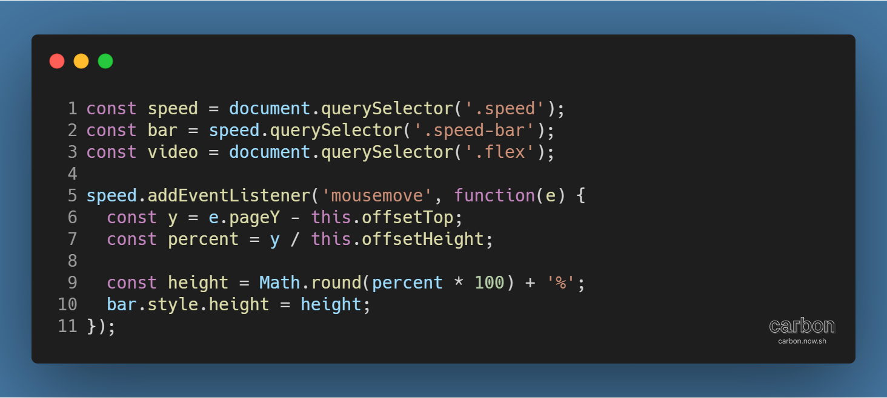
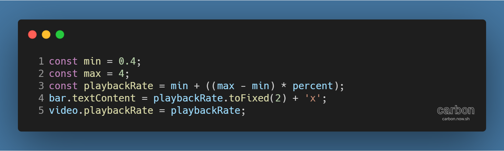

튜토리얼 출처: [JavaScript30](https://javascript30.com/)

튜토리얼 이름: Day 28 - Video Speed Scrubber

튜토리얼 분류: JavaScript

튜토리얼 설명: 영상 속도를 실시간으로 조절하고 보여주는 슬라이더 만들기

진행기간: 2020년 5월 13일

---

HTML Video 태그로 웹페이지에 삽입된 영상은 JavaScript를 사용해 속성을 다양하게 변경할 수 있다. 커서 위치에 반응하는 슬라이더를 만들어 영상 재생 속도를 실시간으로 조절해보자.

## 커서 위치에 따라 슬라이더의 높이 변경하기

우선, 현재 재생 속도를 시각적으로 나타내야 한다. 다음의 코드를 보자.

speed는 슬라이더의 배경, bar는 슬라이더에 해당하는 DOM 요소이다. 슬라이더를 마우스 커서와 연동하려면 mousemove 이벤트에 이벤트 리스너를 등록해야 한다.

마우스 커서의 y 좌표 (각주: 슬라이더 안에서의 상대적인 위치이므로 윗쪽 여백은 빼야한다.)를 구하고, 이를 % 단위로 환산해 슬라이더의 높이로 지정한다.

이러면 슬라이더의 높낮이가 마우스 커서에 따라 조절되게 된다.

## 영상 재생 속도를 슬라이더의 높낮이에 연동시키기

슬라이더의 높낮이를 마우스 커서 위치와 연동시켰으니, 이를 영상 재생 속도에도 적용하면 된다.

재생속도 최저/최고치를 정하고, 슬라이더의 높낮이인 percent를 사용해 재생 속도를 구한다.

숫자로 보여주기 위해 슬라이더의 textContent 값에 재생 속도를 입력 (각주: toFixed(n) 메서드를 사용하면 소수점 n번째 자리까지 반올림할 수 있다.)한 뒤, 영상의 재생 속도를 지정하면 된다.

#### ※ 슬라이더가 마우스 드래그에만 반응하게 하기

[마우스 드래그로 스크롤하기](https://til-devsong.tistory.com/88?category=775075) 튜토리얼의 마우스 이벤트와 슬라이더 연동시키기를 참고하면 된다.

---

[GitHub 저장소 링크](https://github.com/dev-song/_home/tree/master/projects/JavaScript30/Day%2028/tutorial-Video-Speed-Controller)

---

