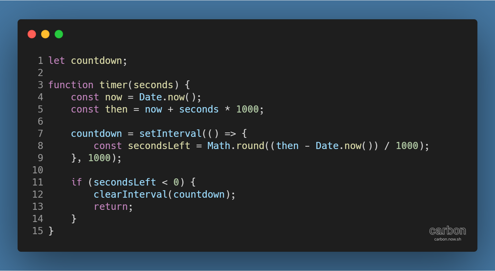
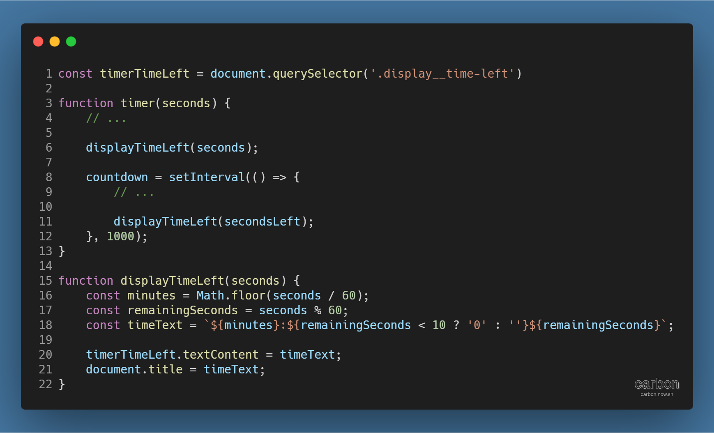
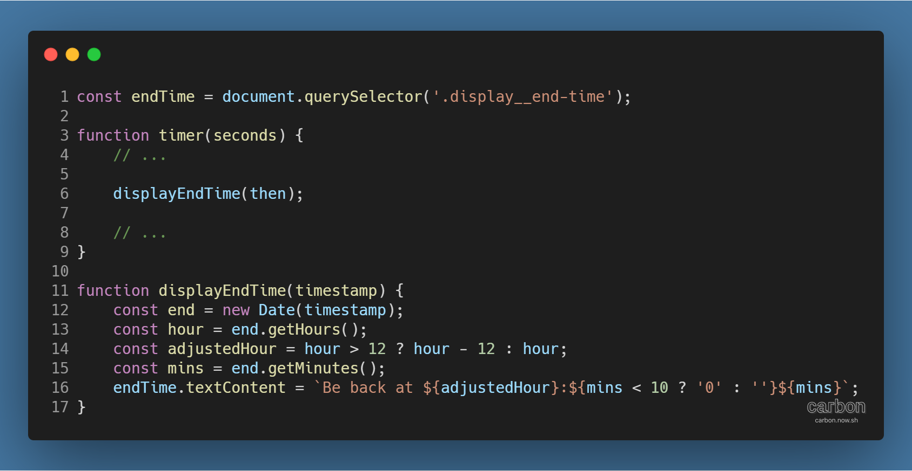
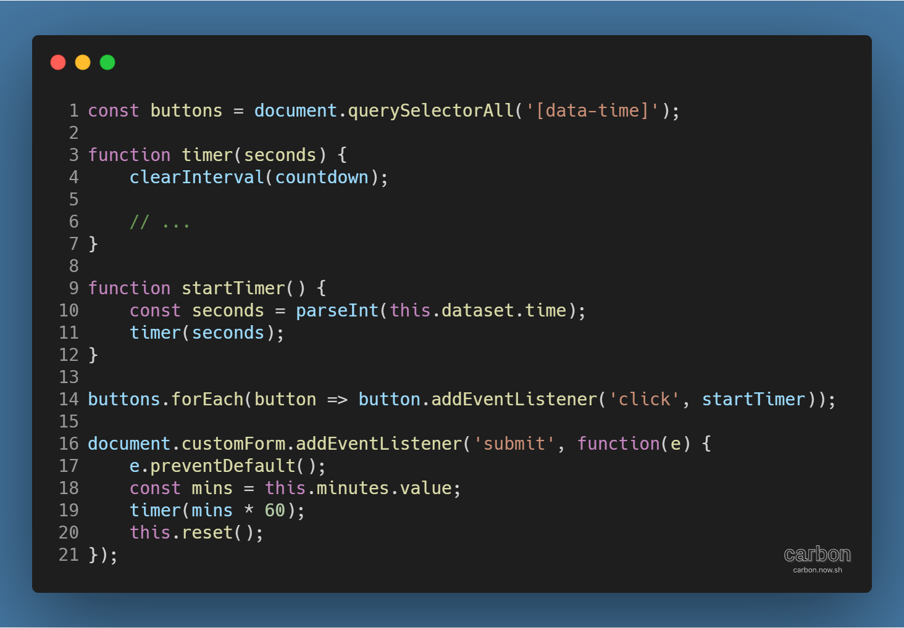

튜토리얼 출처: [JavaScript30](https://javascript30.com/)

튜토리얼 이름: Day 29 - Countdown Timer

튜토리얼 분류: JavaScript

튜토리얼 설명: 지정된 시간과 직접 입력한 시간 동안 카운트다운되는 타이머 만들기

진행기간: 2020년 5월 14일

---

JavaScript를 사용해 현재 시간으로부터 일정 시간 뒤까지 카운트다운을 실행하는 타이머를 만들 수 있다. 사전에 지정한 시간 동안 작동하게 할 수도 있고, 직접 입력한 시간 동안 작동하게 할 수도 있다.

## 카운트다운 시간 계산하기

우선, 카운트다운 시간을 계산하기 위해 현재 시각과 종료 시각이 필요하다. 아래 timer 함수의 코드를 보자.

Date.now( ) 메서드 (각주: 참고자료: Date.now() - JavaScript | MDN)를 통해 현재 시각을 계산하고, 현재 시각에 인자로 넘겨받은 seconds를 더해 (각주: 현재 시각인 now는 밀리초(ms) 단위, 인자로 받은 seconds는 초(s) 단위이므로 seconds에 1000을 곱해 밀리초로 단위를 통일해야 한다.) 종료 시각을 계산한다. 그리고 1000ms, 즉 1초 단위로 주기를 설정한 setInterval( ) 메서드 (각주: 참고자료: WindowOrWorkerGlobalScope.clearInterval() - Web APIs | MDN)로 매 주기마다 종료 시각까지의 시간을 계산하고 secondsLeft에 저장하도록 한다. 이 변수들은 카운트다운 타이머를 화면에 표시하는 데 쓰이게 된다.

종료 시각이 되어 secondsLeft가 0 미만이 되면 setInterval() 메서드를 중지 (각주: clearInterval( ) 메서드를 통해 setInterval( ) 메서드를 중지시킬 수 있다. 다만 이 때 중지시킬 setInterval( ) 메서드를 특정할 수 있어야 하므로, 변수에 저장한 뒤 clearInterval( ) 메서드를 실행해야 된다.)하고 timer() 함수의 실행을 멈춘다.

## 카운트다운 시간 웹페이지에 표시하기

다음은 변수에 저장한 카운트다운과 관련된 시간, 시각을 화면에 표시할 차례이다.

시간을 분초 단위로 환산해 보여주는 displayTimeLeft( ) 함수를 만들고, 매 주기마다 실행되도록 setInterval( ) 메서드에 추가한다. displayTimeLeft( ) 함수의 작동 방식은 다음과 같다.

> 1\. 초 단위의 시간을 입력받아 분초 단위로 환산  
> 2\. 시간 중 초 단위 시간이 10 미만이 되면 서식에 0을 붙여 문자열을 생성  
> 3\. 웹페이지 DOM 요소의 textContent 속성에 시간 문자열을 지정

## 종료 시간 웹페이지에 표시하기

카운트다운 시간이 길어지면 언제 종료되는지도 알려줄 필요가 있다. 아래의 코드를 사용해 종료 시간을 표시할 수 있다.

종료 시각이 계산된 후 화면에 표시되도록 timer( ) 함수에 displayEndTime( ) 함수를 추가한다. displayEndTime( ) 함수의 작동 방식은 다음과 같다.

> 1\. 시간을 입력받아 Date 객체를 생성 (각주: 생성된 Date 객체에 getDate, getHours, getMinutes 등의 메서드를 사용해 상세 시간 정보를 얻어낼 수 있다.)  
> 2\. 시간에서 시간과 분을 얻어내 별도 저장  
> 3\. 분리한 시간과 분을 이용해 종료 시각을 나타내는 문자열 생성  
> 4\. 웹페이지 DOM 요소의 textContent 속성에 종료 시각 문자열을 지정

## 타이머 시작 기능 및 시간 직접 입력 기능 추가하기

시간을 입력받아 카운트다운을 실행하는 타이머 기능은 준비되었다. 이제 클릭하면 지정된 시간으로 타이머를 시작하는 기능과, 원하는 시간을 직접 입력해 타이머를 시작하는 기능을 추가해 완성해보자.

우선, 타이머를 시작할 때 기존 타이머가 실행되고 있다면 이를 초기화시켜줘야 하므로 clearInterval( ) 메서드를 timer( ) 함수에 추가한다.

그 후 지정된 시각으로 타이머를 실행하기 위해, 해당 요소들에 startTimer( ) 함수를 마우스 클릭 이벤트와 연결시킨다.

startTimer( ) 함수의 작동 방식은 다음과 같다.

> 1\. DOM 요소의 data-time 속성 값을 정수로 변환  
> 2\. 정수로 변환한 값을 인자로 timer( ) 함수를 실행

여기에 더해 사용자가 직접 시간을 입력하게 하고 싶다면 입력 폼 (각주: HTML form 태그와 input 태그는 'document.요소의 name 속성 값'의 형태로도 호출될 수 있다.)의 submit 이벤트에 함수를 연결해주면 된다. 예시에 표현된 익명 함수의 작동 방식은 다음과 같다.

> 1\. preventDefault( ) 메서드를 통해 이벤트의 기본 동작이 실행되지 않게 방지 (각주: submit 이벤트는 웹페이지를 자동으로 새로고침하는 기본 동작이 있다.)  
> 2\. DOM 요소의 값을 변수 mins에 저장  
> 3\. mins를 초 단위로 환산하여 timer( ) 함수를 실행  
> 4\. 입력 폼을 초기화

이렇게 하면 JavaScript를 이용한 기초적인 타이머가 완성된다.

---

#### ↓ HTML 포함 전체 코드

[GitHub 저장소 링크](https://github.com/dev-song/_home/tree/master/projects/JavaScript30/Day%2029/tutorial-Countdown-Timer)

---

