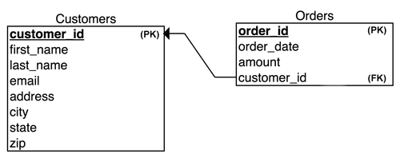

SQL Join 명령문에 대해 간단하게 설명한 [SQL Joins Explained](http://www.sql-join.com/)를 번역한 글입니다.

* * *

## SQL 명령문, Join이 대체 무엇인가요?

SQL (각주: Structured Query Language(구조화 쿼리 언어)의 약자)의 Join은 두 개의 데이터 모음으로부터 데이터를 조합하는 명령문입니다. SQL Join에 대해 자세히 알아보기 전에 SQL이 무엇인지, 왜 Join이란 명령문을 쓰는지 짧게 알아보겠습니다.

SQL은 RDBMS (각주: Relational DataBase Management System(관계형 데이터베이스 관리 체계)의 약자)의 정보 관리라는 특수한 목적으로 만들어진 프로그래밍 언어입니다. 여기서 핵심은 '관계형'이란 단어입니다. 데이터베이스의 구조가 데이터 모음 사이에 명시적인 관계가 있도록 구성되어 있다는 것을 알려주기 때문입니다.

일반적으로 SQL 명령문을 써서 RDBMS를 다루기 전에, 먼저 RDBMS에 추출한 데이터를 변형, 입력해야 합니다.

## 관계형 데이터베이스 예제

상점 주인이 고객들과 주문 내역에 대한 정보를 기록하고자 하는 상황을 상상해봅시다.

관계형 데이터베이스를 사용하면, 고객과 주문내역이라는 서로 다른 독립된 정보 개체를 두 개의 테이블 (각주: 하나의 데이터 모음을 테이블이라고 부릅니다. 표 형태로 나타낼 수 있습니다.)에 나눠 저장할 수 있습니다.

#### 고객 / Customers

customer\_id

first\_name

last\_name

email

address

city

state

ZIP

1

George

Washington

gwashington@usa.gov

3200 Mt Vernon Hwy

Mount Vernon

VA

22121

2

John

Adams

jadams@usa.gov

1250 Hancock St

Quincy

MA

02169

3

Thomas

Jefferson

tjefferson@usa.gov

931 Thomas Jefferson Pkwy

Charlottesville

VA

22902

4

James

Madison

jmadison@usa.gov

11350 Constitution Hwy

Orange

VA

22960

5

James

Monroe

jmonroe@usa.gov

2050 James Monroe Pkwy

Charlottesville

VA

22902

고객 테이블의 각 행은 고객 각각에 대한 정보를 저장하고 있습니다. 행의 각 열은 고객 이름과 이메일, 주소 등 더 세세한 정보 분류를 나타냅니다. 여기에 더해 기본키(Primary Key)라고 하는 고유한 고객 번호 (각주: 고객 테이블의 기본키는 customer\_id이다.)가 고객 각각에 붙어 있다는 점을 참고하세요. 

#### 주문내역 / Orders

order\_id

order\_date

amount

customer\_id

1

07/04/1776

$234.56

1

2

03/14/1760

$78.50

3

3

05/23/1784

$124.00

2

4

09/03/1790

$65.50

3

5

07/21/1795

$25.50

10

6

11/27/1787

$14.40

9

주문내역 테이블도 마찬가지로, 각 행은 주문 각각에 대한 정보를 저장하고 있습니다. 각각의 주문에도 고유한 확인 번호 (각주: 주문내역 테이블의 기본키는 order\_id이다.)가 붙어 있습니다.

#### 관계형 모형

아마 이 글을 읽는 분들께선 비슷한 형태의 정보가 두 예제에서 동시에 보인다는 것을 이미 눈치채셨을수도 있습니다. 아래의 다이어그램은 테이블 정보 사이의 관계성을 간단하게 보여줍니다.



주문내역 테이블에 키(고유 번호)가 두 개 있다는 것에 주목하세요. 하나는 주문에 대한 키이고, 다른 하나는 그 주문을 낸 고객에 대한 키입니다. 테이블에 여러 키가 있을 때, 테이블이 묘사하는 정보에 대한 키를 기본키(PK, Primary Key)로, 다른 키를 외래키(FK, Foreign Key)로 부릅니다.

그러므로 order\_id는 주문내역 테이블의 기본키이고, customer\_id는 고객 테이블의 기본키이면서 주문내역 테이블의 외래키입니다.

기본키와 외래키는 테이블 간의 관계를 설명할 때 핵심적인 개념이기 때문에, SQL Join 명령문을 실행하는 데 있어서도 마찬가지로 중요합니다.

## SQL Join 명령문 예제

상점 주인의 사례로 돌아가, 주문 내역 중 특정 고객이 주문한 내역만 찾고 싶은 상황을 상상해봅시다.

고객과 주문내역 테이블을 customer\_id 키 관계로 Join (각주: '합치다, 연결하다'라는 뜻 그대로의 기능을 수행합니다.)함으로써 위 문제를 해결할 수 있습니다.

```
select order_date, order_amount
from customers
join orders
   on customers.customer_id = orders.customer_id
where customer_id = 3

-- all-orders-placed-by-a-customer hosted with ❤ by GitHub
-- https://gist.github.com/dan81989/08d3d24302611c452e8d13b9c5b26ea8#file-all-orders-placed-by-a-customer
```

Join 키워드를 이용해 연결할 두 테이블을 지정하고, Join 구문 뒤의 On 키워드로 각 테이블의 어떤 키를 사용해 연결할 지도 지정해야 합니다.

위의 SQL 쿼리를 실행하면 아래의 결과가 나옵니다. Thomas Jefferson (각주: customer\_id가 3인 고객입니다.)이 주문한 내역 2개를 보여줍니다.

order\_id

order\_date

order\_amount

2

3/14/1760

$78.50

4

9/03/1790

$65.50

지금까지 설명한 Join 명령문은 실제로 "Inner" Join의 예제입니다.

어떻게 데이터를 분석하고 싶은지에 따라, 다른 방식으로 데이터를 연결하고 싶을 수도 있습니다. 그런 경우를 위해 실제로 다양한 Join 방식이 있으며, 사용자가 어떻게 응용하는 지에 따라 다른 결과를 보여줍니다.

다음 글에선 Join의 4가지 방식, 즉 inner, left, right, full 방식에 대해 설명하고, 위 테이블의 데이터를 사용해 각 방식을 예시와 함께 설명하겠습니다.

* * *

