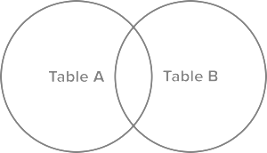
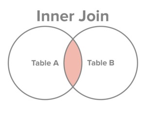
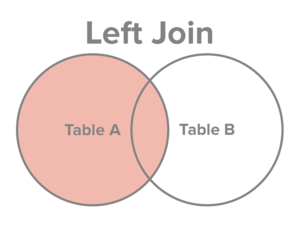
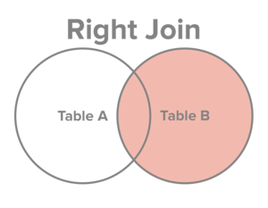
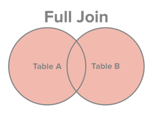

SQL Join 명령문에 대해 간단하게 설명한 [SQL Joins Explained](https://www.sql-join.com/sql-join-types)를 번역한 글입니다.

---

## SQL Join의 4가지 기본 유형

SQL Join의 가장 기본적인 유형 4가지는 Inner, Left, Right, Full Join입니다. 이 네 유형의 차이를 가장 쉽고 직관적으로 설명하기 위해서, 모든 데이터 모음 간 논리 관계를 보여줄 수 있는 벤 다이어그램을 활용합니다.

다시 한 번 말씀드리지만, 어떤 Join 유형을 사용하든 간에 그 전에 관계형 데이터베이스에 추출한 데이터를 집어넣어줘야 합니다. 데이터를 집어넣는 작업은 직접 하거나, 외부의 자동화된 서비스를 이용하면 됩니다.

데이터베이스에 데이터를 집어넣었다면, 두 개의 데이터 모음인 테이블 A와 B가 있다고 가정해봅시다. 두 테이블은 기본키와 외래키를 통해 특정 관계로 이어져 있습니다.  두 테이블을 Join한 결과를 시각적으로 표현하면 아래의 벤 다이어그램과 같습니다.



강조된 부분의 크기는 테이블 A와 B의 데이터가 얼마나 많이 겹치는지에 의해 결정됩니다. 데이터 모음의 어떤 부분 집합을 보고 싶은지에 따라 네 가지 Join 유형의 실행 결과가 달라집니다. 아래의 벤 다이어그램은 각 유형별 실행 결과를 시각적으로 표현하고 있습니다.



Inner Join은 테이블 A와 테이블 B의 데이터 중 조건을 만족하는 모든 데이터를 선택합니다.



Left Join은 테이블 A의 모든 데이터와, 테이블 B의 데이터 중 조건을 만족하는 데이터를 선택합니다.



Right Join은 테이블 B의 모든 데이터와, 테이블 A의 데이터 중 조건을 만족하는 데이터를 선택합니다.



Full Join은 테이블 A와 테이블 B의 데이터를 조건을 만족하는 지와 상관없이 모두 선택합니다.

## Join의 유형별 예시

앞의 'Join이 뭔가요?' 글에서 사용했던 테이블을 다시 가져오겠습니다. 고객 테이블과 주문내역 테이블의 관계는 고객 테이블의 기본키면서 주문내역 테이블의 외래키인 customer_id 키를 통해 형성됩니다.

| customer_id | first_name | last_name | email | address | city | state | zipcode |
| --- | --- | --- | --- | --- | --- | --- | --- |
| 1 | George | Washington | gwashington@usa.gov | 3200 Mt Vernon Hwy | Mount Vernon | VA | 22121 |
| 2 | John | Adams | jadams@usa.gov | 1250 Hancock St | Quincy | MA | 02169 |
| 3 | Thomas | Jefferson | tjefferson@usa.gov | 931 Thomas Jefferson Pkwy | Charlottesville | VA | 22902 |
| 4 | James | Madison | jmadison@usa.gov | 11350 Constitution Hwy | Orange | VA | 22960 |
| 5 | James | Monroe | jmonroe@usa.gov | 2050 James Monroe Parkway | Charlottesville | VA | 22902 |

| order_id | order_date | amount | customer_id |
| --- | --- | --- | --- |
| 1 | 07/04/1776 | $234.56 | 1 |
| 2 | 03/14/1760 | $78.50 | 3 |
| 3 | 05/23/1784 | $124.00 | 2 |
| 4 | 09/03/1790 | $65.50 | 3 |
| 5 | 07/21/1795 | $25.50 | 10 |
| 6 | 11/27/1787 | $14.40 | 9 |

위 테이블을 보면서 몇 가지 주의해야 할 점이 있는데요, 1) 고객 테이블의 모든 고객이 주문을 하지는 않았다는 것과 2) 주문내역 테이블의 모든 내역에 주문을 한 고객에 대한 정보가 존재하지는 않는다는 점입니다.

#### Inner Join 예시

주문을 한 고객의 목록과 그 상세 주문내역을 알고 싶습니다. 이런 경우 Inner Join이 가장 적합한 방식인데요, Inner Join은 두 테이블이 교차하는 데이터을 보여주기 때문입니다.

```
select first_name, last_name, order_date, order_amount
from customers c
inner join orders o
on c.customer_id = o.customer_id

-- inner-join.sql hosted with ❤ by GitHub
-- https://gist.github.com/dan81989/aaeef78733287143f43446a29a1f62b1#file-inner-join-sql
```

| first_name | last_name | order_date | order_amount |
| --- | --- | --- | --- |
| George | Washington | 07/4/1776 | $234.56 |
| John | Adams | 05/23/1784 | $124.00 |
| Thomas | Jefferson | 03/14/1760 | $78.50 |
| Thomas | Jefferson | 09/03/1790 | $65.50 |

George Washington, John Adams, Thomas Jefferson만 주문을 했고, 이 중 Thomas Jefferson은 3/14/1760과 9/03/1790에 두 번 주문했다는 점을 주의하세요.

#### Left Join 예시

만약 고객이 주문을 했는지와 상관없이 단순히 고객 테이블에 주문내역 정보를 덧붙이고 싶은 경우엔 Left Join을 쓰면 됩니다. 테이블 A의 모든 정보와 그에 대응하는 테이블 B의 정보를 보여주기 때문입니다.

```
select first_name, last_name, order_date, order_amount
from customers c
left join orders o
on c.customer_id = o.customer_id

-- left-join.sql hosted with ❤ by GitHub
-- https://gist.github.com/dan81989/cf6bde6540bb49780d75ba20f837e13d#file-left-join-sql
```

| first_name | last_name | order_date | order_amount |
| --- | --- | --- | --- |
| George | Washington | 07/04/1776 | $234.56 |
| John | Adams | 05/23/1784 | $124.00 |
| Thomas | Jefferson | 03/14/1760 | $78.50 |
| Thomas | Jefferson | 09/03/1790 | $65.50 |
| James | Madison | NULL | NULL |
| James | Monroe | NULL | NULL |

James Madison과 James Monroe에 해당하는 정보가 주문내역 테이블에 없기 때문에 order_date와 order_amount가 '정보가 없음'을 의미하는 NULL로 나타난다는 점을 주의하세요.

그래서 이게 왜 유용할까요? 기존 SQL 쿼리에 "WHERE order_date is NULL" 구문을 한 줄 추가하는 것만으로, 주문하지 않은 고객들의 목록을 한 번에 확인할 수 있기 때문입니다.

```
select first_name, last_name, order_date, order_amount
from customers c
left join orders o
on c.customer_id = o.customer_id
where order_date is NULL

-- left-join-alt.sql hosted with ❤ by GitHub
-- https://gist.github.com/dan81989/41de34784f09c5296df3765f981c805a#file-left-join-alt-sql
```

#### Right Join 예시

Right Join은 Left Join의 거울 버전입니다. 모든 주문내역 목록을 나타내며, 대응하는 고객 정보가 있을 경우 함께 표시합니다.

```
select first_name, last_name, order_date, order_amount
from customers c
right join orders o
on c.customer_id = o.customer_id

-- right-join.sql hosted with ❤ by GitHub
-- https://gist.github.com/dan81989/9d8858796184fdfc375b9d21fa3147f8#file-right-join-sql
```

| first_name | last_name | order_date | order_amount |
| --- | --- | --- | --- |
| George | Washington | 07/04/1776 | $234.56 |
| Thomas | Jefferson | 03/14/1760 | $78.50 |
| John | Adams | 05/23/1784 | $124.00 |
| Thomas | Jefferson | 09/03/1790 | $65.50 |
| NULL | NULL | 07/21/1795 | $25.50 |
| NULL | NULL | 11/27/1787 | $14.40 |

1795년과 1787년 사이의 주문내역에 대응하는 고객 데이터가 없기 때문에, first_name과 last_name 항목은 NULL로 나타나는 점을 주의하세요.

또한 테이블이 Join된 순서도 중요합니다. 우리는 주문내역 테이블을 고객 테이블에 Right Join하고 있습니다. 만약 우리가 거꾸로 고객 테이블을 주문내역 테이블에 Right Join한다면 결과는 고객 테이블에 주문내역 테이블을 Left Join하는 것과 동일할 것입니다.

이건 어떤 때 유용할까요? "where first_name is NULL" 구문을 SQL 쿼리에 한 줄만 추가하면 주문내역 중 고객 정보가 없는 주문내역 목록만 찾아볼 수 있습니다.

```
select first_name, last_name, order_date, order_amount
from customers c
right join orders o
on c.customer_id = o.customer_id
where first_name is NULL

-- right-join-alt.sql hosted with ❤ by GitHub
-- https://gist.github.com/dan81989/f058077a5cf311370b975320b6feae35#file-right-join-alt-sql
```

#### Full Join 예시

마지막은 두 테이블의 모든 정보를 보여주는 Full Join입니다.

```
select first_name, last_name, order_date, order_amount
from customers c
full join orders o
on c.customer_id = o.customer_id

-- full-join.sql hosted with ❤ by GitHub
-- https://gist.github.com/dan81989/e75f33b8c43765dd3194cea2f4cacdca#file-full-join-sql
```

| first_name | last_name | order_date | order_amount |
| --- | --- | --- | --- |
| George | Washington | 07/04/1776 | $234.56 |
| Thomas | Jefferson | 03/14/1760 | $78.50 |
| John | Adams | 05/23/1784 | $124.00 |
| Thomas | Jefferson | 09/03/1790 | $65.50 |
| NULL | NULL | 07/21/1795 | $25.50 |
| NULL | NULL | 11/27/1787 | $14.40 |
| James | Madison | NULL | NULL |
| James | Monroe | NULL | NULL |

위의 SQL Join 기본 유형 4가지는 서로 다른 데이터 모음을 연결할 수 있게 합니다. 이를 통해 더 어렵고 복잡한 데이터를 요청하고 응답할 수 있습니다.

---

