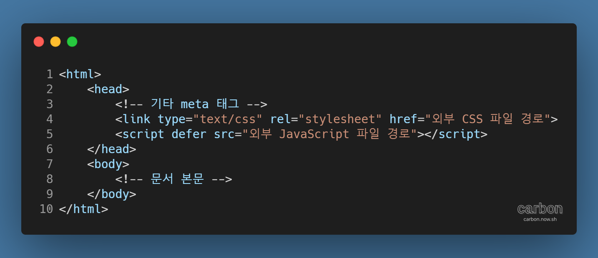

HTML 문서를 작성할 때 약방의 감초마냥 함께 등장하는 것들이 있다. 바로 CSS와 JavaScript이다.

간단한 HTML 문서에서 직접 CSS 스타일과 JavaScript 코드를 작성하는 경우를 제외하면, 대부분의 경우 외부에서 css, js 파일을 불러와 사용하게 된다. 이 때, 외부 css 파일은 head 태그 안[^1]에서, js 파일은 body 태그가 끝나기 직전[^2]에 불러오는 방식을 관용적으로 사용한다. CSS는 문서가 어떻게 보일지를 규정하므로 본문 전의 head 태그에서 미리 불러오고, JavaScript는 문서의 모든 요소를 문제 없이 인식해야 하기 때문에 본문을 다 불러온 후에 불러오는 것이다.

오랫동안 사용된 이 방식은 지금도 여전히 유효하다. 하지만 웹의 복잡성이 증가하고 새로운 기술과 트렌드가 나타나면서, JavaScript의 역할은 급격히 커지게 되었다. 자연스레 조금이라도 웹사이트, 웹 앱의 기능이 많아질 경우 HTML 파일보다 JavaScript 파일이 커지고 무거워지는 상황이 자주 발생하게 되었다. 그러자 그 전엔 크게 인식하지 못했던 문제가 생겼는데, 바로 문서가 화면에 나타나기까지의 시간이 너무 길어지게 된 것이다.

이 문제는 `<script>` 태그의 실행 방식 때문에 발생한다.

브라우저는 HTML 문서의 구문을 분석[^3]하다가 외부 js 파일을 불러오는 `<script>` 태그를 만나면 모두 불러오기 전까지 분석을 멈춘다. 그렇기 때문에, 외부 js 파일의 용량이 커질수록 인터넷 연결 속도가 빠르지 않다면[^4] 사용자가 하얀 여백의 미를 감상하는 시간이 길어지는 문제가 발생한다. 이 감상 시간은 사용자의 고객 경험, 더 나아가 상용 서비스에선 매출과 직결[^5]되기 때문에 문제가 된다.

그렇다면 외부 js 파일을 조금이라도 빨리 불러오는 방법이 없을까? 바로 여기에서 제목에서 언급한 defer 속성이 등장한다.

`<script>` 태그에 defer 속성을 함께 사용[^6]하면, 외부 js 파일을 HTML 구문 분석과 동시에 불러온 뒤, 구문 분석이 끝나면 JavaScript 코드를 실행한다. 그렇기 때문에 HTML 문서가 화면에 표시되는 시간도 줄이면서, JavaScript 코드가 문서의 요소를 인식하지 못하는 문제도 발생하지 않는다.

이처럼 유용한 속성인데, 인터넷 익스플로러를 포함하는 모든 주요 브라우저가 지원하기 때문에 호환성 문제도 거의[^7] 없다. 여러모로 사용하지 않을 이유가 없다.

defer 속성의 script 태그를 사용한 예시 HTML 문서 레이아웃으로, 글을 마친다.

---

#### 참고자료

- [script의 async와 defer 속성](https://blog.asamaru.net/2017/05/04/script-async-defer/)[^8] - 이 세상에 하나는 남기고 가자
- [Scripts: async, defer](https://javascript.info/script-async-defer) - The Modern JavaScript Tutorial
- [`<script>`: The Script element](https://developer.mozilla.org/en-US/docs/Web/HTML/Element/script) - MDN web docs
- ["웹 로딩 속도 1초에 아마존 매출 68억 달러 달렸다"](https://zdnet.co.kr/view/?no=20190418142445) - ZDNet Korea

[^1]: link 태그를 사용한다.

[^2]: script 태그를 사용한다.

[^3]: 파싱(parsing)이라고도 한다.

[^4]: 빨리빨리 공화국인 대한민국에서 많이 언급되지는 않는 이유이다.

[^5]: Amazon의 자료에 따르면, 로딩 속도 1초는 매출 1%의 증감과 연결된다.

[^6]: 다만, src 속성 없이 defer 속성을 사용하는 것은 권장되지 않는다.

[^7]: IE 9 이전 버전에서는 부분적으로만 지원한다.

[^8]: script 태그의 실행 방식에 대해 자세하게 설명하는 글이다.
