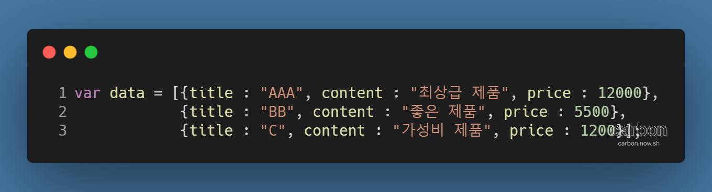
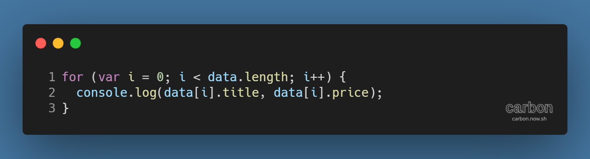
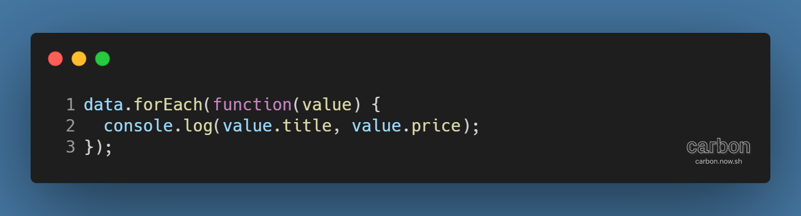
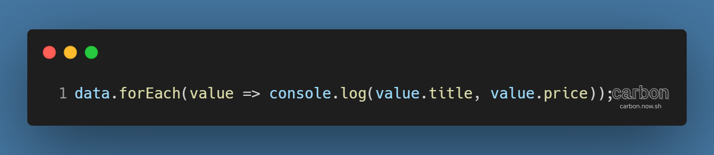
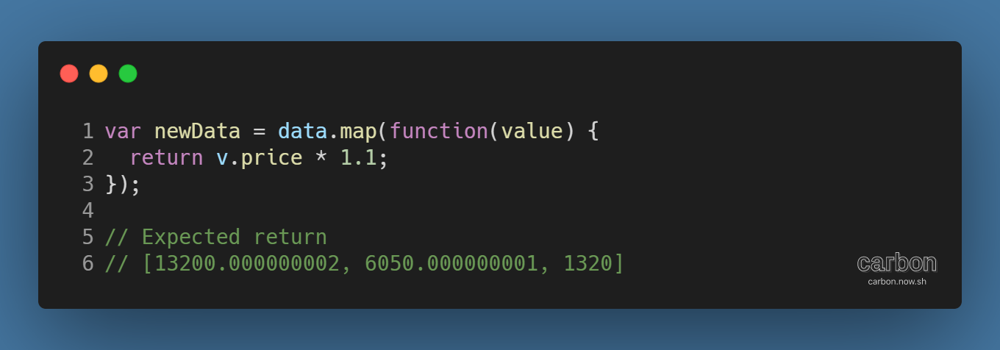
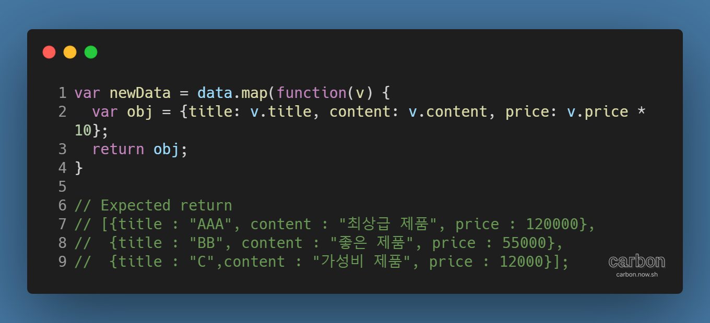
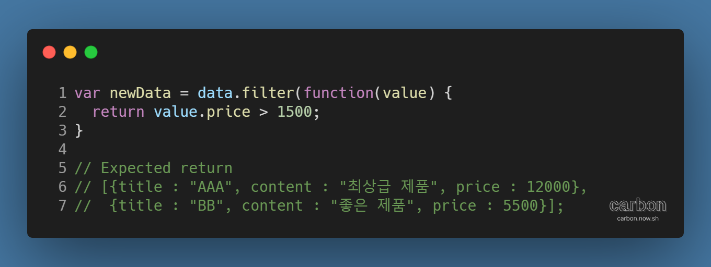
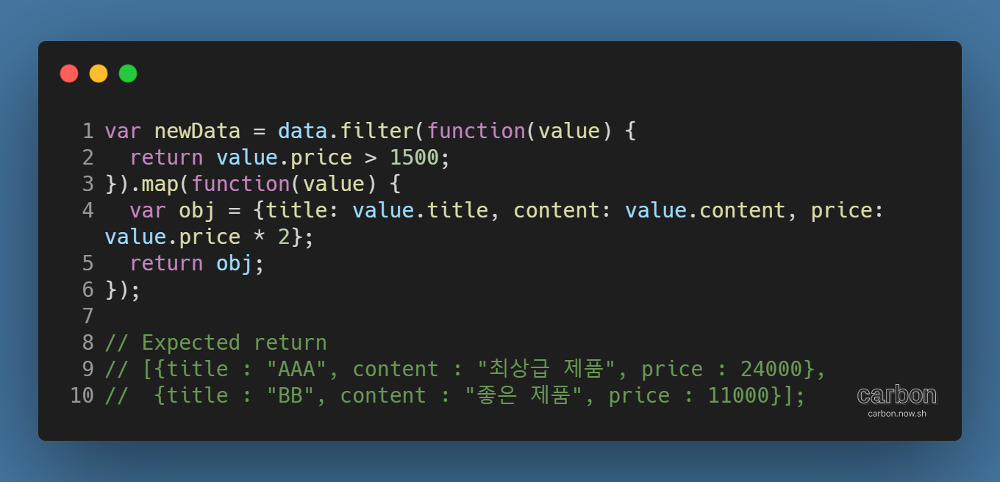

강의: [\[edwith 부스트코스\] 웹 프로그래밍](https://www.edwith.org/boostcourse-web/) 챕터 4, 웹 앱 개발: 예약서비스 2/4

학습일: 2020년 6월 16일

---

## 0\. 챕터 소개

이번 챕터에서는 Back End 부분은 잠시 쉬고, Front End 위주로 학습하게 된다. 핵심 키워드는 아래와 같다.

> \- JQuery  
> \- Handlebars  
> \- forEach  
> \- Map  
> \- Filter  
> \- 클린 코드

## 1\. 객체지향 JavaScript 구현 - FE

### JavaScript 배열의 함수형 메소드

#### Front End에서의 데이터 처리의 중요성

예전과 달리, 데이터 처리는 더 이상 Back End만의 일이 아니다. 이는 Front End에서 데이터 조작을 해야 하는 경우가 많아졌기 때문이다. 특히 SPA(Single Page Application)의 등장이 이런 변화를 앞당겼다.

특정 부분의 값을 추출하거나, 혹은 전체 데이터 중 일부의 타입을 바꾸는 등 배열의 데이터를 다룰 때는 배열 전체를 돌면서 특정한 작업을 수행하는 iterator 방식을 활용하게 된다.

데이터 처리를 위해 JavaScript가 지원하는 forEach, map, filter 등 배열에 대한 다양한 표준 메서드를 알아보자.

#### JavaScript 메서드와 함수형 프로그래밍

JavaScript는 인자로 함수를 받고 또 함수를 반환할 수 있기 때문에 함수형으로 프로그래밍을 할 수 있다.

#### for와 forEach

다음의 예시 배열을 보자. 각 데이터의 제목과 가격을 출력하려면 어떻게 해야 할까?

우선, 기본적인 반복문인 for을 활용하는 방법이 있다.

이번에는 JavaScript 메서드인 forEach를 활용한 코드를 살펴보자.

기존 for 문에서는 변수 i를 초기화한 뒤 매 반복마다 증가시키는 방식을 취하고 있다. 짝수 번째만을 대상으로 하는 등 일부에만 코드가 작동된다면 이와 같은 방식이 필요하지만, 전체를 반복하는 경우는 forEach 메서드를 활용하면 효율적이다. i 등 별도의 변수를 설정하지 않아도 되어 실수를 줄일 수 있고, 보기 좋게 코드를 작성할 수 있기 때문이다.

특히, forEach 메서드는 인자로 함수를 전달받기 때문에 활용도가 높다. 예시처럼 직접 익명함수를 입력하거나, 외부에 선언된 함수를 사용하면 된다.

참고로, ES6의 화살표 함수 (각주: 참고자료: [화살표 함수 - JavaScript | MDN](https://developer.mozilla.org/ko/docs/Web/JavaScript/Reference/Functions/%EC%95%A0%EB%A1%9C%EC%9A%B0_%ED%8E%91%EC%85%98))를 활용하면 더 간결하게 아래처럼 작성할 수 있다.

#### map과 filter

또 다른 JavaScript 메서드인 map은 모든 원소를 전달받은 함수로 가공해 새로운 배열을 반환한다.

위의 data 배열로 돌아가, 각 데이터에서 가격을 일괄적으로 10%씩 인상하고, 인상한 뒤의 가격을 알고 싶은 상황을 가정하자. 이럴 때 map 메서드를 사용하면 된다.

map 메서드를 사용하면 원본인 data 배열은 그대로 둔 채, 새로운 배열을 반환한다.

원본 데이터와 동일하게 객체 형태로 데이터를 반환하고 싶다면, 아래처럼 코드를 작성하면 된다.

**※ 처음의 map 예시에서 소수점이 붙어 정확한 값이 계산되지 않는 문제는 프로그래밍 전반에서 일반적인 문제** (각주: 참고자료: [부동소수점 산물: 문제점 및 한계](https://docs.python.org/ko/3/tutorial/floatingpoint.html))**이다.**

유사한 방식으로 작동하는 메서드로, filter가 있다. filter는 전달받은 함수의 조건에 부합하는 원소만을 추출한 새로운 배열을 반환한다. 가격이 1500 이상인 데이터만 추출하는 아래 예시를 보자.

원본 배열의 모든 원소에 대해 전달받은 함수를 적용하고, true가 반환된 원소만을 추출해 새로운 배열을 만들어준다.

이에 더해, map과 filter 메서드를 복합적으로 활용할 수도 있다.

가격이 1500 이상인 제품의 가격을 2배로 인상하고 싶은 상황을 가정해보자. map과 filter 메서드를 아래처럼 복합적으로 사용하면 된다. 이를 메서드 체이닝 (각주: 참고자료: [JavaScript - method, this, 메서드체이닝](https://velog.io/@bigbrothershin/Javascript-method%EC%99%80-this))이라고 한다.

역시나 원본 데이터를 유지한 채로 새로 가공된 배열을 출력한다.

#### 불변성 (immutable)

원본 데이터를 함부로 변경하면 변경 이력이나 변경된 원인을 추적하기 어려워진다. 또한 나중에 값을 되돌리고 싶을 때도 곤란한 상황을 맞닥뜨리게 된다. 그렇기 때문에 원본 데이터를 원본 그대로, 즉 변하지 않도록 보존하는 것이 중요하다. 이를 불변성 (각주: 참고자료: [Immutability - PoiemaWeb](https://poiemaweb.com/js-immutability))이라고 한다.

위에서 배운 map과 filter는 객체의 불변성을 구현하는 방법 중 하나이다.

---

### 더 생각해보기

> 다른 JavaScript 메서드 중 immutable 속성인 것은?

기존 배열에 추가로 배열이나 값을 합친 새로운 배열을 반환하는 concat (각주: 참고자료: [Array.prototype.concat() - JavaScript | MDN](https://developer.mozilla.org/ko/docs/Web/JavaScript/Reference/Global_Objects/Array/concat)), 기존 배열을 복사한 새로운 배열을 반환하는 slice (각주: 참고자료: [Array.prototype.slice() - JavaScript | MDN](https://developer.mozilla.org/ko/docs/Web/JavaScript/Reference/Global_Objects/Array/slice))가 대표적이다.

---

#javascript #Filter #map #foreach #front end #immutable #함수형 프로그래밍
