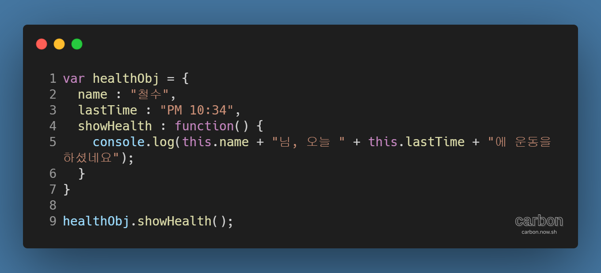
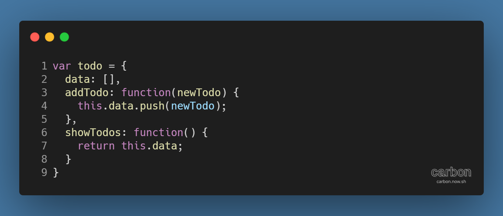
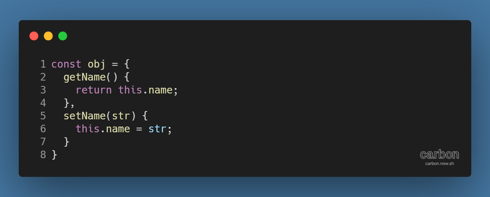
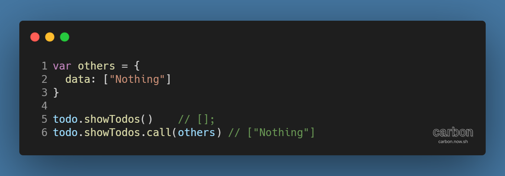

강의: [\[edwith 부스트코스\] 웹 프로그래밍](https://www.edwith.org/boostcourse-web/) 챕터 4, 웹 앱 개발: 예약서비스 2/4

학습일: 2020년 6월 17일

---

## 1\. 객체지향 JavaScript 구현 - FE

### 객체 리터럴과 this

#### 객체지향 프로그래밍과 JavaScript 객체

프로그래밍을 배우다보면 객체지향 프로그래밍이란 용어를 자주 접하게 될 것이다. 객체지향 프로그래밍을 간략하게 설명하면, '객체를 중심으로 속성을 설정하고, 그 속성을 다루는 방식의 프로그래밍 방식'이다. 객체지향 방식으로 프로그래밍을 하면 복잡하게 얽힌 많은 작업들을 일관성 있게 관리할 수 있다. 큰 분류에 따라 객체로 나눈 뒤, 각 객체의 데이터에 맞는 메서드를 입력하고, 객체 사이의 상호작용을 통해 속성에 접근하거나 값을 수정하는 등의 작업에 적합하기 때문이다.

JavaScript에서도 객체를 사용해 객체지향 프로그래밍을 할 수 있다. JavaScript 객체는 key와 value로 이루어진 Hash Map 형태 (각주: Dictionary라고도 한다.)를 띈다. 객체에 Key와 Value를 할당하면 외부에서 접근할 수 있게 된다.

객체 리터럴 (각주: 참고자료: [객체 초기자 - JavaScript | MDN](https://developer.mozilla.org/ko/docs/Web/JavaScript/Reference/Operators/Object_initializer))로 만든 아래의 JavaScript 객체 예시를 보자.

healthObj 객체가 있고, key가 name인 value는 "달리기", lastTime은 "PM 10:34", showHealth는 함수인 상황이다. 예시와 같이 value는 숫자, 배열, 객체 등 다양한 타입을 값으로 가질 수 있기 때문에 중첩 구조 또한 가능하다.

객체 안의 값에는 '객체.xxx'의 형태로 접근할 수 있는데, 여기의 '.'은 일반적으로 JavaScript의 객체를 의미 (각주: 그러므로 console.log() 메서드의 console은 console 객체를 나타낸다. 하지만 '.'이 언제나 반드시 객체를 의미하는 것은 아니다. 일례로, function(){}.bind()와 같은 표현식에서는 '.' 앞의 함수가 객체가 아닌 함수 타입이다. 그러나 이런 경우에도 객체처럼 동작하는 것은 동일하다.)한다.

#### this 키워드

JavaScript가 지원하는 this 키워드를 활용하면 메서드를 좀 더 유연하게 쓸 수 있다. this는 함수가 실행되는 시점의 context (각주: 함수가 참조하고 있는 객체를 의미한다.)를 알려준다. 예시에서 showHealth()는 healthObj 안에서 불렸기 때문에, this는 healthObj를 가리키게 된다. 이처럼 this를 활용해서 객체 속성에 간편하게 접근할 수 있고, 값 또한 직접 수정 (각주: 객체 속성은 가능하면 메서드를 통해 접근하는 것이 권장된다.)할 수 있다.

#### JavaScript 객체 활용법

위 예시를 보자. 특정 데이터가 있을 때, 그 데이터에 접근하고 수정하는 등의 관련 코드는 하나의 객체로 묶어주는 것이 좋다. (각주: 코드 사이에 연관성이 없는데도 무조건 묶을 필요는 없다.) JavaScript 객체는 싱글턴 패턴이므로, 객체 리터럴은 하나의 객체만을 반환한다.

**※ ES6에서는 메서드를 선언할 때 function 키워드 없이 간략하게 작성하는 것이 가능** (각주:

)**하다.**

#### this 키워드 심화 - 참조하는 객체 바꾸기

JavaScript의 전역 스크립트나 함수가 실행될 때, 실행 영역(Execution Context)이 생성된다. 실제 실행은 stack 공간에 올라가서 실행된다.

모든 context에는 참조하고 있는 객체 (각주: thisBinding이라고 한다.)가 있는데, 현재 참조하는 객체를 알려면 this를 사용하면 된다. 즉, 함수가 실행될 때 this 키워드를 출력하면 context가 참조하고 있는 객체가 출력된다.

그런데 참조하고 있는 객체를 바꾸는 방법이 있다. 아래의 코드를 살펴보자.

기존의 todo 외 others란 객체가 추가된 상황이다. 여기서 todo 객체의 showTodos 메서드를 실행하면 기존과 동일하게 todo 객체의 data를 출력한다.

하지만 여기서 call 메서드를 사용해 others 객체를 연결하면 todo 객체의 data가 아니라 others 객체의 data를 출력할 수 있다.

메서드를 작성할 때 객체 이름을 직접 입력하는 것보다는 this 키워드를 활용하면 좋은 이유가 여기에 있다. 객체 이름을 직접 입력할 경우 해당 객체 전용 메서드가 되지만, this를 입력하면 예시의 call 메서드 등으로 참조하는 객체를 바꾸며 범용적으로 활용할 수 있기 때문이다.

---

#javascript #This #Call #객체지향 #front end #객체 리터럴
