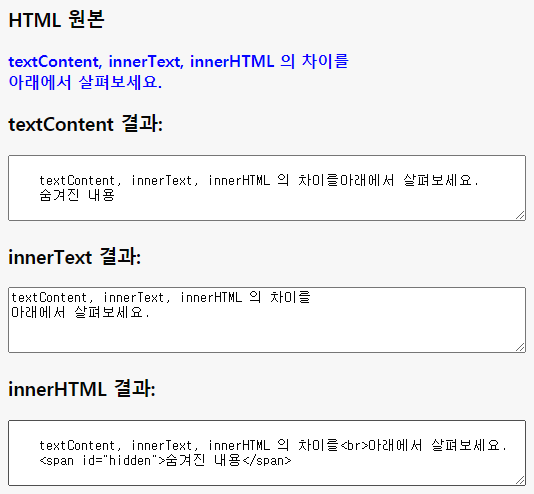

## 웹페이지 텍스트에 접근할 수 있는 3가지 속성과 그 차이

JavaScript를 사용해 웹페이지 요소의 텍스트에 접근할 때 Node.textContent, Node.innerText, Element.innerHTML의 3가지 속성을 쓸 수 있다. 이 셋은 비슷하면서도 약간씩 차이가 있다.

이 셋이 id가 source인 HTML 요소의 텍스트를 어떻게 표현하는지 살펴보자.

```
<h3>HTML 원본</h3>
<p id="source">
  textContent, innerText, innerHTML 의 차이를<br>아래에서 살펴보세요.
  <span id="hidden">숨겨진 내용</span>
</p>
<h3>textContent 결과:</h3>
<textarea id="textContentOutput" rows="4" cols="30" readonly>...</textarea>
<h3>innerText 결과:</h3>
<textarea id="innerTextOutput" rows="4" cols="30" readonly>...</textarea>
<h3>innerHTML 결과:</h3>
<textarea id="innerHtmlOutput" rows="4" cols="30" readonly>...</textarea>
```



세 속성이 다른 결과를 보여준다는 것을 시각적으로 확인할 수 있을 것이다. 시각적인 결과의 차이뿐 아니라, 성능 상의 차이도 존재한다. 차이점을 요약하면 다음의 표와 같다.

 

**성능**

**결과물의 형태**

**textContent**

좋음

원시 텍스트 (raw text)

**innerText**

보통 (각주: IE 환경에서는 좋다. IE 8 이전 버전에서는 textContent가 지원되지 않았으므로 태생적으로 IE 엔진에 적합하게 만들어졌기 때문이다.)

화면에 렌더링 (각주: 숨겨진 내용, 줄 바꿈 등의 스타일링이 반영되어 있다.)된 텍스트

**innerHTML**

나쁨

HTML 문자열

하지만 실제 성능 상의 차이는 미미하기 때문에, innerText나 innerHTML 속성을 사용한다고 해서 textContent 속성에 비해 성능이 어마어마한 수준으로 저하되는 문제가 생기지는 않는다.

## innerHTML 속성을 주의해야 하는 이유

그렇다면 제목에서 굳이 innerHTML 속성을 콕 짚어 '주의해야 하는 속성'이라고 언급한 이유는 무엇일까?

innerHTML은 크로스 사이트 스크립팅 (각주: Cross-site scripting, 줄여서 XSS라고 불린다. 웹사이트 관리자가 아닌 사람이 웹페이지에 악성 스크립트를 삽입하는 공격 방식을 의미한다.) 공격에 취약하다는 보안상의 허점이 있기 때문이다. innerHTML 속성은 문자열 자체를 수정할 수 있기 때문에, 악의를 가진 해커가 <script> 태그를 사용해 JavaScript 코드를 작성한 뒤 실행되도록 만들 수 있다.

이를 보완하기 위해 HTML5에서는 innerHTML 속성을 통해 삽입된 문자열에 <script> 태그가 있을 경우 실행되지 않도록 처리했지만, 다른 우회적인 경로는 여전히 열려 있다. innerHTML 속성을 사용하는 경우, 다양한 우회 공격 경로를 방어할 수 있도록 처리해놓아야 한다.

이런 내재적인 취약점 때문에 innerHTML을 사용한 프로젝트는 보안성 검사에서 통과되지 않을 가능성이 높다. 예를 들면, Firefox의 확장 프로그램 심사 절차는 innerHTML이 포함된 코드를 통과시키지 않는다.

## innerHTML 속성의 대안

innerHTML 속성은 HTML 문자열을 그대로 붙였다 뗐다 할 수 있다는 점에서 사용 범위가 넓고, 강력한 기능이다. 하지만 그 범용성과 강력함이 역으로 보안 취약점으로 작용한다는 점은 아이러니라 할 것이다.

웹페이지 요소의 텍스트 내용만 바꿀 경우는 textContent 속성을, 요소 자체를 삽입하는 경우는 Element.insertAdjacentHTML() 메서드 (각주: insertAdjacentHTML() 메서드는 성능 면에서도 innerHTML 속성보다 우월하다.)를 innerHTML 속성의 대안으로 사용하면 된다.

* * *

#### **참고자료**

[당신이 innerHTML을 쓰면 안되는 이유](https://velog.io/@raram2/%EB%8B%B9%EC%8B%A0%EC%9D%B4-innerHTML%EC%9D%84-%EC%93%B0%EB%A9%B4-%EC%95%88%EB%90%98%EB%8A%94-%EC%9D%B4%EC%9C%A0) - velog

[Node.textContent](https://developer.mozilla.org/ko/docs/Web/API/Node/textContent) - MDN web docs

[Node.innerText](https://developer.mozilla.org/ko/docs/Web/API/Node/innerText) \- MDN web docs

[Element.innerHTML](https://developer.mozilla.org/ko/docs/Web/API/Element/innerHTML) - MDN web docs

[Element.insertAdjacentHTML()](https://developer.mozilla.org/ko/docs/Web/API/Element/insertAdjacentHTML) - MDN web docs

[사이트 간 스크립팅](https://ko.wikipedia.org/wiki/%EC%82%AC%EC%9D%B4%ED%8A%B8_%EA%B0%84_%EC%8A%A4%ED%81%AC%EB%A6%BD%ED%8C%85) - 위키백과

[XSS](https://namu.wiki/w/XSS) - 나무위키

* * *

  

#HTML #javascript #XSS #innerText #textContent #innerHTML #보안 취약점 #insertAdjacentHTML