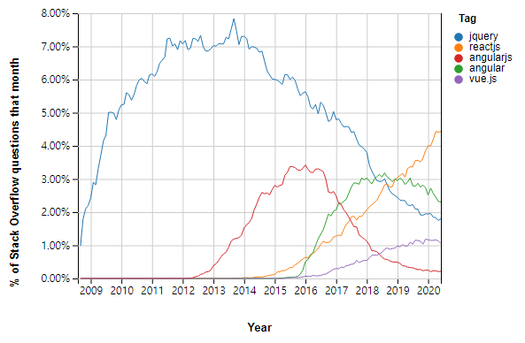

강의: [\[edwith 부스트코스\] 웹 프로그래밍](https://www.edwith.org/boostcourse-web/) 챕터 4, 웹 앱 개발: 예약서비스 2/4

학습일: 2020년 7월 7일

* * *

## 2\. 라이브러리 활용과 클린 코드 - FE

### JavaScript 라이브러리와 프레임워크

#### 최근 10년 간의 트렌드

2010년 이후로, 대표적인 JavaScript 라이브러리 (각주: 특정 기능을 구현하는 함수나 메서드를 묶어놓은 것이라고 할 수 있습니다.)의 이름을 거론할 땐 jQuery가 빠지지 않습니다. 심지어 'JavaScript가 아닌 실무에서 쓰이는 jQuery를 중점적으로 배워야 한다'는 글도 있었을 정도로 광범위하게 바닐라 (각주: 외부 라이브러리 등 별도의 사용자 설정 없이 언어 자체적으로 포함된 기능만을 의미합니다.) JavaScript를 대체하며 사용되었던 라이브러리가 jQuery입니다.

하지만 시간이 흐르고 웹의 대세가 웹 앱이 되면서 jQuery의 중요성은 떨어지고, 더 큰 규모의 도구인 프레임워크들이 관심을 이어받게 되었습니다.

그렇다면 jQuery는 더 이상 몰라도 되느냐, 하면 꼭 그렇지는 않습니다. 아직도 수많은 레거시 코드 (각주: 예전에 작성된 코드를 말합니다.)가 jQuery로 작성되어 있고, 이런 코드를 유지보수해야 하는 상황은 여전히 존재하기 때문입니다.

#### 2010년대 중반까지 시장을 지배한 jQuery

2010년대를 전후해서, jQuery는 급격히 시장을 지배하기 시작합니다. 아래의 표를 보면 jQuery가 어느 정도의 위상을 가졌었는지 짐작하실 수 있을 것입니다. 프로그래밍 전용 질문/답변 사이트인 Stack Overflow의 모든 질문 중 7%가 jQuery 관련 질문이던 시기가 그렇게 오래 전이 아닙니다.



jQuery가 이처럼 인기 있었던 이유는 무엇일까요.

> 웹 브라우저 간의 오차를 줄여준다

지금은 잘 실감이 되지 않지만, 인터넷 익스플로러가 브라우저 시장에서 절대적인 점유율을 자랑하던 시기 (각주: 우리나라에서는 특히 그 시기가 길었습니다.)가 있었습니다. 지금도 인터넷 익스플로러는 웹 표준을 지키지 않는 것으로 악명이 높죠. 특정 기능을 구현하고자 할 때, 표준대로 작성하면 예상대로 동작하는 다른 브라우저와 달리 인터넷 익스플로러는 추가적인 처리를 해줘야만 하는 경우가 꽤나 있습니다. 최신 버전인 IE 11에서도 이런데, 옛 버전들에서는 이런 경우가 훨씬 더 많았습니다.

이런 문제들을 통틀어 브라우저 호환성 이슈 (각주: 말 그대로, 브라우저끼리 호환되지 않아 발생하는 문제를 의미합니다.)라고 하는데, jQuery는 이런 호환성 이슈를 해결해줍니다. 매번 특정 기능이 호환되는지 안 되는지를 알고 있어야 하거나, 아니면 검색할 필요가 없는 것이죠.

> DOM을 더 쉽게 조작하게 해준다

바닐라 JavaScript만 사용해서 DOM을 조작하는 것은 간단한 일이 아닙니다.

'sample이라는 id를 가진 요소를 찾아 배경을 파란색으로 바꾸고 2초간 위쪽으로 옮기는 코드'를 예시로 들어보죠.

```
const sample = document.getElementById('sample');
sample.style.background = 'blue';

function slideUp(elm, duration) {
	// duration 동안 elm을 위쪽으로 움직이는 코드
}

slideUp(sample, 2000);
```

'sample' id를 가진 요소를 찾아 변수에 저장하고, 변수를 활용해 배경 스타일을 바꾸고, 위쪽으로 옮기는 동작을 하는 slideUp이란 함수를 정의한 뒤 그 함수를 사용해 요소를 이동시켜야 합니다. 실제 코드는 함수의 동작까지 정의해줘야 하므로 더 길어지겠죠.

반면, jQuery를 사용하면 단 한 줄의 코드만으로 똑같은 동작을 구현할 수 있습니다.

```
$('#sample').css('background', 'blue').slideUp(2000);
```

자세히 보지 않아도 훨씬 간결하다는 것을 알 수 있습니다. 또한 코드의 구조가 프로그래머의 사고의 흐름과 유사한 구조로 이루어집니다. 그렇기 때문에 작성하기도, 해석하기도 쉽습니다.

이는 jQuery가 메서드 체이닝(Method chaining) 방식 (각주: 메서드가 항상 this를 반환하게 하여 연속으로 메서드를 사용할 수 있게 하는 방식을 말합니다.)을 사용하고 있기 때문입니다.

#### JavaScript 생태계의 변화와 jQuery의 쇠락

하지만 현재, jQuery의 위상은 더 이상 예전같지 않습니다. jQuery의 여러 장점이 더 이상 jQuery만의 것이 아니게 되었기 때문입니다.

> 바닐라 JavaScript가 편리해졌다

2015년에 나온 JavaScript의 개선 버전인 ECMAScript6 (각주: 주로 약어인 ES6, 또는 2015년에 나온 것을 의미하는 ES2015라는 명칭으로 불립니다.)에서부터, jQuery가 지원하던 다양한 메서드와 함수를 바닐라 JavaScript에서도 지원하기 시작했습니다. 이 중 상당수가 jQuery에서만 제공되던 것이었는데, 그런 장점이 사라진 것이죠.

> jQuery보다 더 높은 수준의 추상화를 지원하는 도구가 등장했다

프로그래밍과 관련해 자주 언급되는 '추상화'는, 핵심적인 개념 또는 기능을 간추린 것을 의미합니다.

jQuery는 DOM에 접근하는 방식을 추상화한 메서드를 제공했고, 이를 통해 좀 더 간편하고 직관적인 방법으로 DOM에 접근할 수 있었습니다.

그런데 그 후 등장한 도구들은 이런 기본적인 추상화는 물론이고, 다른 기능까지 추가로 지원합니다. 예를 들자면, 특정 부분의 데이터가 바뀌면 화면을 자동으로 다시 그려주는 (각주: '렌더링한다'는 표현이 자주 쓰입니다.) 등의 기능 말이죠. 대표적으로 [React](https://reactjs.org/), [Angular](https://angular.io/), [Vue](https://vuejs.org/) 등의 JavaScript 프레임워크가 이런 심화 기능을 제공합니다.

> 다른 라이브러리도 메서드 체이닝 방식을 도입했다

'사고의 흐름' 방식으로 간편하게 코드를 작성할 수 있게 해줬던 메서드 체이닝 또한, 다른 라이브러리들도 도입하게 되면서 jQuery만의 장점이 아니게 되었습니다.

#### JavaScript 프레임워크의 등장

2020년 현재 기준, 웹 개발에서 빼놓을 수 없는 것이 바로 프레임워크입니다. 그렇다면 프레임워크는 대체 무엇일까요?

프레임워크, 영문으로는 Framework의 뜻을 네이버 사전에서 찾아보면 '(건축물의) 뼈대, 골조' (각주: 구글 영어사전에서는 'An essential supporting structure of a building, vehicle, or object', 즉 '건축물, 차량, 또는 특정 물체의 핵심 구조'라는 뜻이 조회됩니다.)라고 나옵니다. 사전적 의미 그대로, 개발 과정에서 뼈대 역할을 하는 기본적이고 필수적인 기능들을 묶어놓은 프로그램이 바로 프레임워크입니다.

그렇다면 프레임워크는 왜 등장하고, 또 주목받게 된 것일까요?

JavaScript를 사용한 개발 규모가 점점 커졌기 때문입니다.

건축을 예시로 들어볼까요. 자그마한 모래성을 만들 땐 별도의 사전 작업이 필요하지 않습니다. 맨 땅에 혼자 손으로 해도 뚝딱 만들 수 있죠. 하지만 집을 만들려면 이야기가 달라집니다. 지반을 다듬고 토대를 닦은 뒤, 여럿이 투입되어 자재를 나르고, 설계도에 따라 각각의 구역에 적절한 시공을 해야 합니다. 그렇게 하지 않으면 효율적이지도 않을 뿐더러 무엇보다도 안정적이지가 않습니다.

프레임워크는 여기에서 주택의 토대, 그리고 각각의 구역을 구분한 설계도와 같습니다. 웹사이트, 웹 어플리케이션이 계속 커지고 복잡해지면서 프레임워크가 필수적인 도구로 자리잡게 된 것입니다. 대표적인 형태인 SPA (각주: Single Page Application의 약자로, 하나의 페이지에서 모든 기능이 실행되는 어플리케이션을 말합니다. 페이지 전체가 아닌 갱신에 필요한 데이터만을 바꾸므로 기존 link 태그 방식보다 효율적이며, 트래픽을 줄일 수 있습니다.)의 작동방식을 살펴보면, 한 페이지 안에서 다른 페이지로의 이동 없이 AJAX 등의 방식을 통해 데이터를 바꾸거나 routing을 처리하는 등의 작업이 수시로 일어납니다. 프레임워크 없이 이런 작업을 일일이 처리해주는 것은 엄청난 노력을 필요로 하죠.

#### 향후 JavaScript 라이브러리의 입지

JavaScript를 사용한 프로젝트들의 규모는 지속적으로 커지는 추세이기 때문에, 앞으로도 개발 현장에서 프레임워크의 필요성은 계속 커질 것입니다. 그리고 프레임워크끼리 경쟁을 통해 더 가벼우면서도 생산적인 프레임워크가 시장을 주도하는 형태가 될 것입니다.

이런 환경에서 라이브러리의 유용성은 얼마나 많은 기능을 범용적으로 제공하는지보다, 특정 프레임워크에 사용되는지, 그리고 그 프레임워크와 잘 어울리는지에 의해 결정될 것입니다. 예를 들어, [Redux](https://redux.js.org/)나 [Immutable.js](https://immutable-js.github.io/immutable-js/)는 React 프레임워크에 최적화된 기능을 제공하는 라이브러리입니다.

물론 프레임워크와 관련 없이 독자적으로 쓰이는 라이브러리도 있지만, 많지는 않습니다. 리액티브 프로그래밍을 위해 개발된 [RxJS](https://rxjs-dev.firebaseapp.com/), 데이터 처리를 쉽게 해주는 [Lodash](https://lodash.com/) 정도가 있습니다.

#### 마치며

개발자라면 특정 라이브러리와 프레임워크가 어떤 목적을 가지고 있는지에 대해서 틈틈이 관심을 기울일 필요가 있습니다. 무조건 라이브러리와 프레임워크를 사용한다고 좋은 것이 아니기 때문입니다.

프로젝트의 규모와 목적에 맞게 적절한 수준으로 라이브러리나 프레임워크를 활용하면서, 오버 엔지니어링, 즉 '닭 잡는 데 소 잡는 칼을 쓰는 상황'은 피하는 것이 현명하게 개발하는 방법 중 하나입니다.

* * *

#### ※ jQuery가 사용된 레거시 코드를 유지보수할 때 주의점

jQuery가 사용된 레거시 코드를 유지보수할 땐 주의해야 할 점이 몇 있습니다.

우선, jQuery의 버전을 확인해야 합니다. 버전에 따라 메서드가 달라질 수 있으므로, 하위 호환성 이슈가 발생할 수 있기 때문입니다. 일반적으로 소프트웨어 버전의 맨 앞 숫자가 동일하다면, 하위 호환성이 유지됩니다.

또한 한 페이지에 여러 버전의 jQuery가 사용되지 않아야 합니다. 특정 메서드가 두 개 이상의 jQuery 버전에 함께 존재할 때, 어떤 버전의 메서드가 사용되어야 하는지와 관련해 문제가 발생할 수 있습니다.

그리고 JavaScript ECMAScript 버전이 갱신되면서 도입된 메서드가 jQuery의 기능을 대체할 수 있다면 내장 메서드로 바꿔주는 것이 좋습니다. jQuery 의존도를 줄이면서 유지보수 또한 쉽게 만들 수 있습니다.

마지막으로 무조건 피해야 되는 것은, jQuery 라이브러리를 직접적으로 수정하는 것입니다. 라이브러리를 직접적으로 수정했다는 사실이 확실하게 전달되지 않는다면, 유지보수에 있어 상당한 어려움을 초래할 수 있습니다.

* * *

#### 참고자료

[The Rise & Fall of jQuery](https://www.evolutionjobs.com/uk/media/the-rise-and-fall-of-jquery-117981/)

[Chaining Pattern of JavaScript](https://webclub.tistory.com/528)

[객체 지향 프로그래밍의 추상화](https://webclub.tistory.com/137)

[오버 엔지니어링과 기술 부채](https://seokjun.kim/over-engineering-vs-techincal-debt/)

* * *

  

#javascript #jQuery #Framework #Library #라이브러리 #프레임워크 #front end #VUE #React #angular