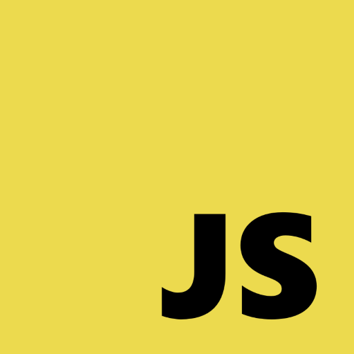

강의: [\[edwith 부스트코스\] 웹 프로그래밍](https://www.edwith.org/boostcourse-web/) 챕터 4, 웹 앱 개발: 예약서비스 2/4

학습일: 2020년 7월 9일

* * *

## 2\. 라이브러리 활용과 클린 코드 - FE

### 클린 코드

#### 클린 코드의 중요성

클린 코드(Clean Code)는 '깨끗한 코드', 즉 '읽기 편한 코드'를 의미합니다. 프로그래밍을 공부하다 보면 클린 코드의 중요성을 심심치 않게 들을 수 있는데요, 그렇다면 클린 코드가 왜 중요한 것일까요?

프로그램은 '이해하기 쉬워야 하기 때문'입니다. 일상적 언어로 작성된 글도 문장 구조나 논리 전개가 어긋나면 글쓴이의 의도가 제대로 전달되지 않는 경우가 부지기수인데, 다양한 수식과 기호가 포함된 프로그래밍 언어로 작성된 코드는 '깨끗하지 않다면' 이해하는 것이 급격하게 힘들어집니다.

특히 클린 코드는 협업과 유지보수 상황에서 빛을 발합니다. 대규모 프로그램 개발 상황에서 동료 프로그래머끼리 서로의 코드에 대해 매번 코드 한 줄 한 줄의 의미를 물어보는 것은 불가능하고, 추후 기능을 추가, 수정하거나 지워야 하는 경우 (각주: 이런 경우는 항상 있습니다. 프로그램을 사용하는 사람이 한 손에 꼽을 정도가 아니라면요.)가 생겼을 때, 프로그램의 코드를 이해하는 것이 어렵다면 효율이 굉장히 떨어질 수 밖에 없습니다.

#### 적절한 이름 짓기

프로그래머들의 농담 중에는, 이름 짓기의 어려움에 대한 내용이 빠지지가 않습니다.

이름 몇 개 짓는 게 대수냐고 생각하기 쉽지만, 변수나 함수의 역할이 아주 미세하게 다를 때 이를 글자수가 적으면서도 한 번에 이해할 수 있는 단어를 골라 이름을 짓는 것은 정말 까다로운 일입니다. 프로그래밍을 공부하면서 영어 공부를 할 때보다 영한/영영 사전을 더 많이 뒤적거리는 것 같네요.

이름 짓기는 쉽지 않은 문제이지만, 보편적인 몇 가지 팁이 있습니다.

> 1\. 함수의 이름은 목적과 부합하게 짓기  
> 2\. 함수의 로직은 이름과 일치하도록 작성하기  
> 3\. 함수의 이름은 로직을 동사 + 명사의 형태 (각주: 예를 들어, 온도 정보를 가져오는 함수의 이름은 temperature, temperatureGet보다는 getTemperature()가 적합합니다.)로 나타내기  
> 4\. 카멜 표기법 또는 \_를 사용해 이름을 구성하는 단어를 구분하기  
> 5\. 변수의 이름은 명사의 형태로 작성하기  
> 6\. 잘 알려지지 않은 축약어 쓰지 않기 (각주: 오히려 글자수가 조금 많더라도 단어 전체를 사용하는 게 가독성이 더 좋을 가능성이 높습니다.)

#### 의도가 드러나는 구현패턴

코드를 읽으면서 이 코드가 왜 작성되었는지 작성자의 의도를 알 수 있어야 합니다. 별도의 설명 없이도 코드 안에 들어간 함수, 변수, 수치가 왜 사용되었는지를 파악할 수 있어야 한다는 것이죠. 글만으로는 잘 이해가 되지 않을 수 있습니다. 아래 시험점수로 Pass/Fail을 결정하는 두 함수를 보세요.

```
// 나쁜 예시: 의미가 드러나지 않는 코드
function getGrade(examScore) {
  if (examScore >= 50) return "Pass";
  else return "Fail";
}

// 좋은 예시: 의미가 드러나는 코드
function getGrade(examScore) {
  const passStandardScore = 50;
  
  if (examScore >= passStandardScore) return "Pass";
  else return "Fail";
}
```

두 함수 모두 시험점수가 50점을 넘으면 Pass, 못 넘으면 Fail을 반환합니다.

두 번째 함수의 경우 Pass를 결정하는 기준 점수가 50점이고, 이 점수를 넘어야 Pass라는 것을 바로 알 수 있습니다. 반면, 첫 번째 함수는 50점을 넘으면 Pass인 것은 알겠는데, 왜 50점인지는 따로 명시되지 않았습니다.

추후 기준 점수가 바뀌거나, 점수 등급이 더 세분화되어 숫자가 많아질 경우 첫 번째 함수는 급격하게 이해하기 어려워질 가능성이 높습니다.

#### 불필요한 전역변수 줄이기

불필요한 전역변수를 최소화해야 합니다. 변수를 여러 함수가 공통으로 쓰는 것이 아니라면 전역변수여야 할 이유가 없습니다. 전역변수가 많아질수록 협업 과정에서 이름이 겹칠 가능성이 올라가며, 그로 인해 향후 유지보수에서 예상하지 못한 버그를 만날 가능성도 높아집니다.

```
// 나쁜 예시: 불필요한 전역변수 사용
const helloInKorean = "안녕하세요.";

function sayHelloInKorean(name) {
  console.log(`${helloInKorean} 저는 ${name}입니다.`);
}

// 좋은 예시: 불필요한 전역변수 제거
function sayHelloInKorean(name) {
  const helloInKorean = "안녕하세요.";
  console.log(`${helloInKorean} 저는 ${name}입니다.`);
}
```

위 예시 코드에서, helloInKorean 변수는 sayHelloInKorean 함수에서만 사용됩니다. 이럴 땐 굳이 변수가 전역변수일 필요가 없으므로, 함수 안으로 넣어주는 것이 좋습니다.

#### 조건문 중첩 최소화하기

if, else, else if 키워드를 사용한 조건문은 굉장히 유용한 기능이지만, 여러 겹 중첩될수록 가독성이 급격하게 떨어진다는 단점이 있습니다. 값을 반환하고 함수의 실행을 종료하는 return 키워드를 적극적으로 활용하면 조건문의 중첩을 최대한 줄일 수 있습니다.

```
// 나쁜 예시: 중첩된 조건문
function getAgeCategory(age) {
  if (age > 20) return "adult";
  else {
    if (age > 10) return "teenager";
    else return "child";
  }
}

// 좋은 예시: 조건문이 중첩되지 않음
function getAgeCategory(age) {  
  if (age > 20) return "adult";
  if (age > 10) return "teenager";
  return "child";
}
```

* * *

#### 참고자료

\[도서\] [클린 코드](https://book.naver.com/bookdb/book_detail.nhn?bid=7390287)

\[도서\] [읽기 좋은 코드가 좋은 코드다](https://book.naver.com/bookdb/book_detail.nhn?bid=6871807)

[AirBnB JavaScript Style Guide](https://github.com/airbnb/javascript)

* * *

  

#javascript #Return #함수 이름 #변수 이름 #clean code #클린 코드 #naming convention #Code Convention