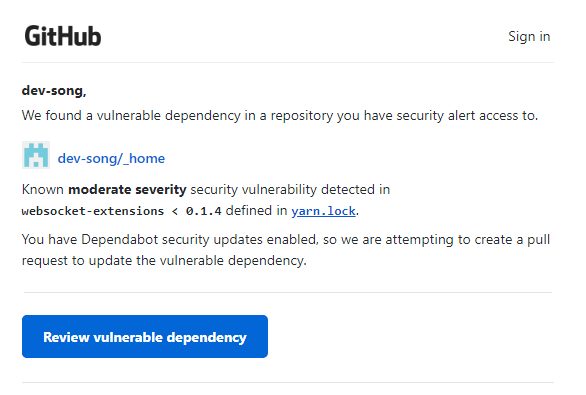
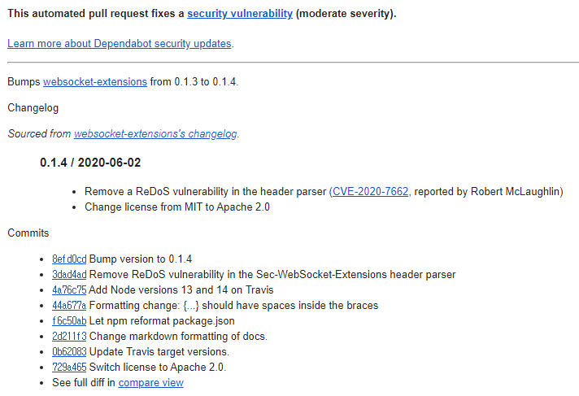
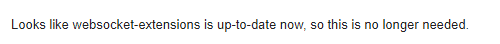

### 요약

#### 취약점 발생 모듈

websocket-extensions

#### 취약점 발생 원인

yarn 패키지 매니저로 create-react-app을 설치할 경우, 의존 모듈인 websocket-extensions (각주: 세부적으로는 websocket-extension < websocket-driver < sockjs < webpack-dev-server < react-scripts (create-react-app)의 순서로 의존 관계가 이루어집니다.)가 0.1.3 버전으로 설치됩니다.

0.1.4 버전 미만의 websocket-extensions 라이브러리는 ReDoS 보안 취약점이 있습니다.

#### 취약점 해결 방법

아래 두 가지 방법으로 해결할 수 있습니다.

- websocket-extensions 라이브러리의 버전을 직접 0.1.4로 업데이트
- GitHub dependabot이 보안 취약점을 해결한 pull request를 merge

---

## GitHub의 경고, '보안 취약점을 발견했어요!'

어제 GitHub의 dependabot이란 친구가 두 장의 메일을 보내왔습니다. 이런 메일을 받은 게 처음이라 당황했습니다.

며칠 동안 ESLint가 정상적으로 작동하지 않아 온갖 삽질을 거듭 (각주: 결국은 해결했습니다. 정상적으로 작동하지 않았던 원인은 [이 글](https://til-devsong.tistory.com/106)에 있습니다.)했던 터라 설마 그 과정에 문제가 있었나, 다 지우고 다시 돌아가야 하나하고 무작정 머릿속을 헤집으며 순식간에 멘붕 상태로 접어들다가... 디버깅의 가장 기본조차 안 하고 있었다는 것을 퍼뜩 깨달았습니다.

#### 디버깅의 기본, 에러 메시지 차근차근 읽기

문제를 찾으려면 가장 기본적인 단서인 에러 메시지 (각주: 여기에서는 메일의 내용이 되겠네요.)부터 읽어봐야 합니다.

첫 메일을 살펴보니 yarn.lock 파일에 정의된 websocket-extensions < 0.1.4 부분에서 보안 취약점이 감지되었다고 합니다. 엄청 심각한 것은 아니지만, 그렇다고 가볍지는 않은(moderate) 수준인 것 같네요. 그러면 어떤 취약점인데? 하고 두 번째 메일을 열었더니, 무엇인지를 직접적으로 알려주진 않고 있습니다.

하지만 내용에 포함된 websocket-extensions의 업데이트 로그를 살펴보니 아마도 ReDoS란 보안 취약점인 듯 합니다. 0.1.4 업데이트가 보안 취약점을 제거하는 내용이니 이전 버전 까지는 해당 보안 취약점이 있었다는 뜻이겠죠.

그렇다면 내 프로젝트의 websocket-extensions는 그 이전 버전인가보네? 하고 프로젝트의 yarn.lock 파일을 열어 확인 (각주: CLI 환경에 익숙하다면, yarn list '패키지명'라는 명령어를 사용하는 것으로도 버전을 확인할 수 있습니다.)해보니 역시나, 제 websocket-extensions의 버전은 0.1.3이네요.

#### yarn으로 라이브러리 업데이트하기

그래서 websocket-extensions를 0.1.4로 업데이트해줬습니다. yarn 명령어, '[yarn upgrade](https://classic.yarnpkg.com/en/docs/cli/upgrade) websocket-extensions@0.1.4'를 사용했고요.

버전명인 '@0.1.4' 없이 upgrade 명령어를 실행하면 0.1.4로 업그레이드되지 않고 0.1.3에 머물더라구요. yarn.lock에 0.1.3 버전으로 입력되어있어 이를 수정하지 않으면 업데이트 시 0.1.3 버전으로만 업데이트되는 것 같습니다. (각주: 나중에 알게 된 사실이지만, GitHub dependabot이 자동으로 생성한 pull request를 merge해도 됩니다. pull request의 내용이 yarn.lock의 websocket-extensions의 version 부분을 0.1.4로 수정한 것입니다.)

버전 업데이트 뒤 yarn.lock을 확인해보니 websocket-extensions 항목의 버전에 0.1.4가 추가되었습니다. 바뀐 yarn.lock을 GitHub에 push하니 바로 이런 메일이 날라오네요.

GitHub 저장소를 확인하니 dependabot이 이 문제를 고치기 위해 요청했던 pull request도 자동으로 닫혔습니다. (각주: Security 탭의 Dependabot alerts는 자동으로 닫히지 않아 수동으로 Dismiss 처리해줬습니다.)

순간 당황했지만 큰 문제가 아니어서 다행입니다. GitHub에 프로젝트 모듈의 보안 검사를 도와주는 기능이 있다는 유용한 사실도 알게 되었습니다.

---

#### ReDoS 보안 취약점이란?

[ReDoS, Regular Expression Denial of Service](https://en.wikipedia.org/wiki/ReDoS)는 정규식 표현을 활용한 검증 절차에 대한 공격입니다.

주민등록번호나 전화번호 등 데이터를 검증할 때, 데이터가 정해진 양식에 따라 입력되었는지 확인하기 위해 정규표현식을 활용하게 됩니다.

공격자들은 이 부분을 파고듭니다. 데이터가 특정한 형태일 경우, 확인에 굉장히 오랜 시간이 걸린다는 내재적 특성이 있거든요. ReDoS 공격을 받으면 프로그램이 느려지거나, 심하면 작동이 아예 정지될 수 있습니다.

---

#### 참고자료

[Regular Expression Denial of Service in websocket-extensions (NPM package)](https://github.com/advisories/GHSA-g78m-2chm-r7qv)

[ReDoS](https://en.wikipedia.org/wiki/ReDoS) - Wikipedia

[\[취약성\] ReDoS (정규식을 이용한 서비스 거부)](https://namocom.tistory.com/706)

---

#Vulnerability #yarn #github #보안 취약점 #create-react-app #ReDoS #regular expression denial of service #dependabot #websocket-extensions
